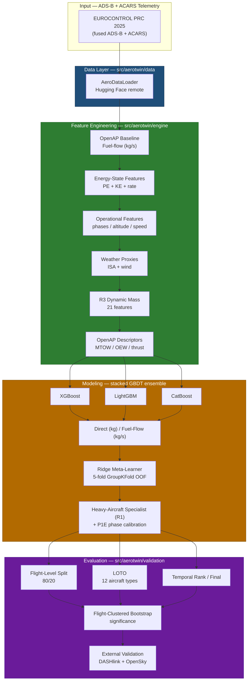

<div align="center">

# AeroFlux

**An Aviation Physics-Informed Machine Learning Framework for Fuel-Flow Prediction**

</div>

---

## Overview

**AeroFlux** predicts interval-level aircraft fuel burn from real-world, fused ADS-B and ACARS telemetry (EUROCONTROL PRC 2025 challenge data). It tests a **hybrid physics + machine-learning** approach:

```text
predicted_fuel_kg = f(trajectory, aircraft, route, physics_fuel_kg, engineered_features)
```

- **Physics baseline.** [OpenAP](https://github.com/junzis/openap) provides an interpretable fuel-flow estimate from aircraft type, inferred true airspeed, altitude, vertical rate, and reference mass.
- **Residual learning.** Gradient-boosted models (XGBoost, LightGBM, CatBoost) learn the structure remaining in operational data — sparse telemetry, missing air-data, and unknown aircraft mass.
- **Leakage-safe evaluation.** Flight-level train/test splits prevent interval leakage; flight-clustered bootstrap tests quantify significance.
- **External validation.** A second-dataset audit pipeline (NASA DASHlink + OpenSky) checks whether findings replicate outside the training distribution.

**Best ensemble (R3, dynamic mass, held-out): 221.33 kg Combined RMSE**, roughly 20 kg above the top competition entry on the same metric (~201 kg). A separate "Final" held-out score (213.62 kg, student-parity setting) uses a different scoring scope than "Combined" — see [`docs/`](docs/) for the exact definitions and how the two are computed.

---

## Why This Project Exists

This project tests whether combining a first-principles physics baseline (OpenAP) with gradient-boosted residual models improves fuel-burn prediction accuracy over either approach alone, using real operational telemetry.

Aviation fuel burn is hard to predict at the interval (segment) level because operational telemetry — ADS-B and ACARS — is sparse, noisy, and incomplete. Aircraft mass is often unknown, air-data fields are frequently missing, and flights are subject to weather and routing variability that physics theory alone does not capture. The approach here uses the physics model to account for the interpretable bulk of fuel consumption, and trains ML models to learn whatever remains unexplained — the residual structure in real flight data.

## What the Project Does

At a high level, the project:

1. **Loads real telemetry** — fused ADS-B and ACARS data from the PRC 2025 challenge, covering flights, aircraft, routes, and fuel labels.
2. **Builds physics baselines** — computes an interpretable fuel-flow estimate using OpenAP, given aircraft type, inferred true airspeed, altitude, vertical rate, and reference mass.
3. **Engineers features** — derives energy-state, operational, weather-proxy, and dynamic-mass features intended to explain fuel burn beyond basic physics.
4. **Trains hybrid models** — gradient-boosted models (XGBoost, LightGBM, CatBoost) learn direct fuel predictions and fuel-flow residuals, assembled into a stacked ensemble with a ridge meta-learner.
5. **Guards against leakage** — splits data by flight and uses flight-clustered bootstrap testing so reported metrics reflect generalization rather than incidental information leakage.
6. **Validates externally** — an independent audit pipeline on NASA DASHlink and OpenSky data checks whether learned patterns replicate outside the training set.
7. **Distills into smaller students** — the frozen teacher ensemble's soft labels train smaller neural students (MLP and FT-Transformer) intended for lower-latency inference.
8. **Provides a deployment path** — students are exportable to the open ONNX format and can be served by a compiled Rust binary without a Python runtime at inference time.

## Key Results

- **Best ensemble (R3, dynamic mass):** 221.33 kg Combined RMSE on held-out data.
- **Deployment baseline:** a large MLP student reaches 225.95 kg Combined RMSE with 0.26 ms CPU inference latency, versus 221.33 kg for the full R3 teacher ensemble — a modest accuracy cost for a large latency reduction.
- **Cross-dataset validation** (NASA DASHlink + OpenSky) shows the hybrid approach outperforms the physics-only baseline. The improvement attributable to energy-state features and fuel-flow modeling reaches statistical significance under the flight-clustered bootstrap test; see [`docs/`](docs/) for effect sizes and test details.

## Limitations

- **Dataset scope.** Results are based on the EUROCONTROL PRC 2025 challenge dataset and two external audit datasets (DASHlink, OpenSky). Coverage across aircraft types, routes, and operating conditions is limited to what those datasets contain, and generalization beyond them is untested.
- **Gap to state of the art.** The best model here (221.33 kg Combined RMSE) remains ~20 kg behind the top result on the same challenge leaderboard; the hybrid approach narrows but does not close that gap.
- **Combined vs. Final scoring.** These are two distinct evaluation scopes reported in this repo and are not directly comparable; see `docs/` before quoting either number out of context.
- **AeroSim is a demo, not a validated tool.** The browser-based 3D simulator is a visualization/demonstration interface for the trained model. It is not a validated flight-planning or operational decision-making tool, and falls back to a physics approximation when model artifacts are unavailable.
- **Distillation trade-off.** Student models (MLP, FT-Transformer) trade a small amount of accuracy for large inference-speed gains; they inherit any blind spots present in the frozen teacher ensemble rather than being independently validated.

## Design Principles

| Principle | What it means here |
|---|---|
| **Hybrid physics–ML** | A first-principles OpenAP baseline combined with gradient-boosted residual correction. |
| **Reproducible pipelines** | Deterministic data loading, featured-dataset building, and a frozen statistical/testing protocol. |
| **Leakage-safe evaluation** | Flight-level splits and flight-clustered bootstrap significance testing. |
| **External validation** | Independent DASHlink / OpenSky audits to check generalization, not just in-sample fit. |
| **Explainability** | Native SHAP attribution for the production CatBoost hybrid. |
| **Modular & extensible** | An installable `aerotwin` package with clearly separated data, engine, models, and validation layers. |

---

## Architecture



---

## ONNX Deployment (Framework-Agnostic Inference)

Trained distillation students (e.g. the Large MLP) can be exported to the open
**ONNX** format and served by a **compiled Rust binary** — no Python, PyTorch, or
scikit-learn required at inference time. The same `.onnx` artifact runs on any
ONNX Runtime, so the models are not tied to a single language or framework and
can run on Python, Rust, web/JavaScript, C++, or edge devices.

```text
best_model.pt (PyTorch)
      │  export_onnx.py  (run once where torch is installed)
      ▼
model.onnx  +  model.preproc.json  +  model.meta.json
      │  cargo build --release
      ▼
aerotwin-onnx-serving  (native binary · axum HTTP · ONNX Runtime)
```

### Why ONNX + Rust

| Concern | Python/PyTorch inference | ONNX + Rust host |
|---|---|---|
| Runtime deps | torch, sklearn, numpy, venv | single native binary + model file |
| Latency | interpreter + tensor copies | compiled, zero-copy array input |
| Portability | platform-locked | cross-platform, framework-agnostic |
| Model durability | tied to `.pt` checkpoints | open, self-describing `.onnx` |

The Rust server also reproduces the exact training-time preprocessing (median
impute → `StandardScaler` → `OneHotEncoder`) from a side-car `*.preproc.json`,
so raw feature rows map to the same model input the student saw in training.

### Relevant paths

- **`experiments/11_onnx_deploy/export_onnx.py`** — PyTorch → ONNX exporter + preprocessing JSON.
- **`rust/aerotwin-onnx-serving/`** — compiled inference server (axum + `ort`/ONNX Runtime).
- Generated artifacts (`*.onnx`, `*.pt`, `*.pkl`, `target/`) are git-ignored.

See `rust/aerotwin-onnx-serving/README.md` for full build/run details.

### AeroSim — Interactive Web Simulator (Demo)

**`aero_sim/`** is a browser-based 3D flight simulation demo built with CesiumJS,
Three.js, and ONNX Runtime Web. It animates an aircraft flying between two
airports along a real route while predicting per-segment fuel burn from the
trained AeroTwin model in the browser. CesiumJS renders the globe, route, and
an auto-following aircraft; per-segment markers are color-coded by predicted
burn (green → red) with fuel-kg labels; and a Three.js fuel-tank overlay
animates remaining fuel as the flight progresses. A live HUD shows progress,
fuel used, fuel remaining, and distance. It reuses the same `large_mlp.onnx` +
`preproc.json` artifacts as the Rust server (placed under
`aero_sim/public/models/`); when they are absent it falls back to a physics
approximation so the demo still runs. **This is a demonstration interface, not
a validated flight-planning tool.**

See `aero_sim/README.md` for full setup details.

---

## Repository Layout

The repository is organized into focused domains:

- **`src/aerotwin/`** — the installable Python package, split into:
  - **data** — loading fused ADS-B + ACARS telemetry from Hugging Face.
  - **engine** — the core pipeline: OpenAP baseline, feature engineering, weather features, dynamic mass model, evaluation framework, statistical protocol, and the official ensemble.
  - **models** — specialized architectures including shift-aware routing, a transformer feature-token corrector, and an MLP residual regressor.
  - **validation** — cross-dataset validation and the DASHlink + OpenSky audit pipeline.
- **`experiments/`** — numbered, reproducible experiment scripts, from data exploration through ensemble building, generalization checks, gap-closing, distillation, interpretability, and advanced studies.
- **`tests/`** — unit and integration tests guarding the core logic.
- **`docs/`** — status reports, RMSE audits, benchmark-parity checks, research paper drafts, and external-validation guides.
- **`scripts/`** — build and run utilities.
- **`aero_sim/`** — browser-based 3D flight fuel-burn simulator demo (CesiumJS + Three.js + ONNX Runtime Web).

---

## License

AeroFlux is released under the [MIT License](LICENSE).
