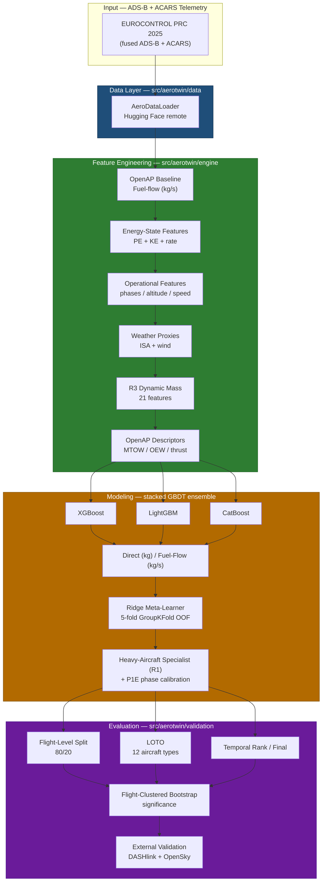

<div align="center">

# AeroFlux

**Physics Guided Aviation Fuel Prediction Framework

</div>

---

## Table of Contents

- [Overview](#overview)
- [Why AeroTwin](#why-aerotwin)
- [Architecture](#architecture)
- [Repository Structure](#repository-structure)
- [Installation](#installation)
- [Data Access](#data-access)
- [Quick Start](#quick-start)
- [Modeling Approach](#modeling-approach)
- [Results](#results)
- [Cross-Dataset Validation](#cross-dataset-validation)
- [Testing & Quality Gates](#testing--quality-gates)
- [References](#references)
- [License](#license)

---

## Overview

**AeroTwin** predicts interval-level aircraft fuel burn from real-world, fused ADS-B and ACARS telemetry (EUROCONTROL PRC 2025 challenge data). It evaluates a **hybrid physics + machine-learning** paradigm:

```text
predicted_fuel_kg = f(trajectory, aircraft, route, physics_fuel_kg, engineered_features)
```

- **Physics baseline.** [OpenAP](https://github.com/junzis/openap) provides an interpretable fuel-flow estimate from aircraft type, inferred true airspeed, altitude, vertical rate, and reference mass.
- **Residual learning.** Gradient-boosted models (XGBoost, LightGBM, CatBoost) learn the structure remaining in operational data — sparse telemetry, missing air-data, and unknown aircraft mass.
- **Rigorous evaluation.** Flight-level train/test splits prevent interval leakage; flight-clustered bootstrap tests quantify significance.
- **Credibility via external validation.** A second-dataset audit pipeline (NASA DASHlink + OpenSky) tests whether findings *replicate* outside the training distribution.

Dataset: [`aerotwin/aero-data`](https://huggingface.co/datasets/aerotwin/aero-data) on Hugging Face.

**Frozen teacher Combined RMSE: 221.33 kg** (R3 ensemble with dynamic mass; Rank 232.53 · Final 213.73). **Final held-out teacher (student parity): 213.62 kg** — do not confuse Combined with Final. Remaining Combined gap to winner (~201 kg): ~20 kg. Audit: `docs/reports/teacher_evaluation_report.md`.

**Distillation (MLP track complete):** official student baseline is **Large MLP ~3M** (α=0.1, β=0.9) — **Final 215.85 kg** · **Combined (Rank+Final) 225.95 kg** vs teacher Combined **221.33**. Reports: `docs/reports/test_evaluation.md`, `docs/reports/combined_evaluation.md`.

---

## Why AeroTwin

| Capability | Description |
|---|---|
| **Hybrid physics–ML** | Combines a first-principles OpenAP baseline with gradient-boosted residual correction. |
| **Reproducible pipelines** | Deterministic data loader, featured-dataset builder, and frozen statistical protocol. |
| **Leakage-safe evaluation** | Flight-level splits and flight-clustered bootstrap significance testing. |
| **External validation** | Independent DASHlink / OpenSky auditors to check generalization, not just in-sample fit. |
| **Explainability** | Native SHAP attribution for the production CatBoost hybrid. |
| **Modular & tested** | Installable `aerotwin` package with CI and unit tests. |

---

## Architecture



**Best result — R3 ensemble (dynamic mass):** 221.33 kg Combined RMSE.

---

## Repository Structure

```text
ZeroPing/
├── src/aerotwin/                     # Installable Python package
│   ├── data/                         # Data loading (Hugging Face)
│   ├── engine/                       # Core physics pipeline
│   │   ├── openap_baseline.py        # OpenAP interval fuel baseline
│   │   ├── feature_engineering.py    # Energy/operational features
│   │   ├── weather_features.py       # ISA/wind proxy features
│   │   ├── mass_model.py             # R3 dynamic mass (21 features)
│   │   ├── eval_framework.py         # Evaluation + bootstrap utilities
│   │   ├── statistical_protocol.py   # Frozen inference protocol
│   │   ├── gap_closing.py            # Calibrators, heavy specialist (R1)
│   │   ├── official_benchmark.py     # Official ensemble + OOF matrix
│   │   └── build_featured_dataset.py # Featured dataset builder
│   ├── models/                       # Specialized model architectures
│   │   ├── shift_aware_routing.py    # Conditional shift-aware router
│   │   ├── transformer_residual.py   # Transformer feature-token corrector
│   │   └── mlp_residual.py           # MLP residual regressor
│   └── validation/                   # Cross-dataset validation
│       ├── audit/                    # DASHlink + OpenSky audit pipeline
│       ├── external_vs_flow_eval.py
│       ├── external_energy_ablation.py
│       ├── cross_dataset_alignment.py
│       └── cross_dataset_replication.py
├── experiments/                      # Reproducible experiment scripts
│   ├── 01_data_exploration/         # Dataset overview, fuel labels, traj
│   ├── 02_feature_engineering/      # Physics baseline, V2/V3 features
│   ├── 03_baselines/                # Baseline modeling, ablation
│   ├── 04_hybrid_models/            # CatBoost, fuel-flow, optuna
│   ├── 05_ensemble/                 # Stacking, ensemble verification
│   ├── 06_loto_generalization/      # LOTO, residual matched, transfer
│   ├── 07_gap_closing/              # Official eval, R1–R3 gap close
│   ├── 08_distillation/             # Teacher soft labels → MLP students + Final eval
│   ├── 09_interpretability/         # SHAP explainability
│   └── 10_advanced/                 # Transformer residual, significance
├── tests/                            # Unit and integration tests
│   ├── unit/
│   └── integration/
├── docs/
│   ├── reports/                     # Status, RMSE audit, benchmark parity
│   │   ├── figures/                 # PRC plots, leaderboards, tables
│   │   ├── tables/                  # CSV results
│   │   └── audit/                   # External audit outputs
│   ├── paper/                       # Research paper drafts
│   └── validation/                  # External audit guides
├── scripts/                         # Build/run utilities
├── data/                            # Data artifacts (symlinks or local)
├── Dataset/                         # CMAPSS turbofan RUL (separate)
├── pyproject.toml
├── setup.cfg
└── requirements.txt
```

---

## Installation

```bash
git clone https://github.com/ArunArya-01/ZeroPing.git
cd ZeroPing

python -m venv .venv
source .venv/bin/activate

python -m pip install --upgrade pip
pip install -e .           # install aerotwin package in editable mode
pip install -r requirements.txt
```

---

## Data Access

```python
from aerotwin.data import AeroDataLoader

loader = AeroDataLoader()
flightlist = loader.get_flightlist("train")
fuel = loader.get_fuel_labels("train")
paths = loader.sample_flight_files(split="train", n=5)
```

Set `HF_TOKEN` in your environment if authentication is required.

---

## Quick Start

Build the featured dataset:

```bash
PYTHONPATH=src python src/aerotwin/engine/build_featured_dataset.py
```

Run experiments:

```bash
PYTHONPATH=src python experiments/03_baselines/05_baseline_modeling.py
PYTHONPATH=src python experiments/07_gap_closing/25_r3_dynamic_mass.py
PYTHONPATH=src python experiments/07_gap_closing/26_r3_ensemble_mass.py
```

Or use the convenience runner:

```bash
./scripts/run.sh experiments/03_baselines/05_baseline_modeling.py
```

Offline audit smoke test:

```bash
python -m aerotwin.validation.audit.run_audit_pilot --source demo --max-flights 8
```

Run tests:

```bash
python -m pytest tests/unit -q
```

---

## Modeling Approach

Three model families on interval-level fuel burn:

1. **OpenAP-only physics baseline** — interpretable, no learning.
2. **Direct hybrid** — predicts `actual_fuel_kg` with `physics_fuel_kg` as an input feature.
3. **Residual models** — predict `actual_fuel_kg − physics_fuel_kg`.

Additional studies: feature ablations (energy-state, operational, weather, mass, vertical embeddings), stacking ensembles, aircraft-type experts, leave-one-type-out (LOTO) generalization, CatBoost SHAP explainability, and R3 dynamic mass model.

---

## Results

### Official PRC2025 Benchmark (Rank + Final)

| Split | MAE (kg) | RMSE (kg) | R² |
|-------|--------:|----------:|---:|
| **Rank** (Sep 2025) | 90.89 | 239.18 | 0.904 |
| **Final** (Oct 2025) | 87.35 | 220.86 | 0.918 |
| **Combined** | 88.75 | **228.25** | 0.913 |

### Gap-Closing Campaign

| Version | Variant | Combined RMSE | Δ vs 228.25 |
|---------|---------|--------------:|------------:|
| v1.0 | Official ensemble (frozen V4) | **228.25** | reference |
| v1.1 | P1E phase affine + P2 Cat heavy specialist | **227.44** | −0.81 |
| R1 | P1E + OpenAP descriptors in heavy specialist | **226.19** | −2.06 |
| R2 | Fixed B744/B77L/A306 descriptors + R2 features | **225.25** | −3.00 |
| **R3** | **P1E + dynamic mass model (21 features)** | **221.33** | **−6.92** |

### Knowledge distillation (neural students)

Teacher is frozen (R3). Soft labels live in `distillation_dataset.parquet`.

| Step | Deliverable | Status |
|------|-------------|:------:|
| 1 | Teacher distillation dataset | ✅ |
| 2 | Baseline MLP (GT / teacher / KD) | ✅ |
| 3 | α/β weight sweep → **α=0.1, β=0.9** | ✅ |
| 4 | Capacity scaling + latency + multi-seed | ✅ |
| 5 | Official Final held-out evaluation | ✅ |
| 5b | Combined Rank+Final student evaluation | ✅ |
| 6 | FT-Transformer student | ✅ |
| 7 | Distribution shift + mechanism investigation (Phases 0–3.5) | ✅ |
| 8 | Attention routing analysis (H-Attention **rejected**) | ✅ |
| — | Paper writing | active |

**Two protocols (both retained):**

| Protocol | Metric | Purpose |
|----------|--------|---------|
| **A — Final** | Final RMSE only | Research / architecture holdout |
| **B — Combined** | RMSE(Rank ∥ Final) | Official PRC-style comparison |

**Supported student architectures** (via `build_student` / YAML `student.architecture`):

| Name | Description |
|------|-------------|
| `large_mlp` | Official deploy baseline (~2.89M) |
| `xlarge_mlp` | Capacity upper tier (~6.75M) |
| `ft_transformer` | FT-Transformer (Gorishniy et al. 2021) |

**Official baselines (students + teacher):**

| Model | Params | Rank | Final | **Combined** | CPU ms |
|-------|-------:|-----:|------:|-------------:|-------:|
| **Large MLP (deploy)** | **2.89M** | **240.66** | **215.85** | **225.95** | **0.26** |
| XLarge MLP | 6.75M | 244.40 | 218.59 | 229.10 | 0.52 |
| FT-Transformer | 1.46M | 246.88 | 224.12 | 233.35 | 9.59 |
| R3 Teacher | ensemble | 232.53 | 213.62 | **221.33** | ~52 |

Large remains the deployment / comparison baseline (FT does not beat Final or Combined). Under **type-macro**, FT ranks above Large (ranking reversal). Mechanism probes (uncertainty, physics ablation, smoothness, **attention routing**) did not establish a causal explanation — see `docs/reports/PROJECT_STATUS_REPORT.md`.

| Report | Path |
|--------|------|
| FT experiment | `docs/reports/ft_transformer_experiment.md` |
| Shift diagnosis | `docs/reports/distribution_shift_diagnosis.md` |
| Mechanism validation | `docs/reports/mechanism_validation.md` |
| Attention routing | `docs/reports/attention_routing_analysis.md` |
| Paper writing guide | `docs/reports/PAPER_WRITING_GUIDE.md` |

```bash
set PYTHONPATH=src
python experiments/08_distillation/run_distillation_experiments.py sweep
python experiments/08_distillation/run_distillation_experiments.py capacity
python experiments/08_distillation/05_test_evaluation.py --final-featured featured_dataset_final.parquet
python experiments/08_distillation/07_combined_evaluation.py
# FT-Transformer (train once; frozen thereafter)
python experiments/08_distillation/08_train_ft_transformer.py --config configs/distillation/ft_transformer.yaml
python experiments/08_distillation/09_eval_ft_transformer.py
# Attention routing (analysis-only; frozen FT)
python experiments/08_distillation/18_attention_routing_analysis.py
```

### Cross-Dataset Validation (DASHlink pilot)

| Experiment | MAE (kg) | Notes |
|---|---|---:|
| Physics-only (OpenAP) | 140.1 | Type/mass defaults |
| Direct · base + physics | 25.5 | |
| Direct · base + energy + physics | 20.7 | Energy ΔMAE −4.9 (95% CI excludes 0) |
| Flow · base + energy + physics | **18.1** | vs Direct ΔMAE −2.6 (95% CI excludes 0) |

---

## Testing & Quality Gates

GitHub Actions runs:

- Python 3.11 syntax compilation for `src/aerotwin` and `experiments/`
- Ruff linting (E9, F63, F7, F82)
- `pytest` unit tests
- Safety dependency scanning

Local checks:

```bash
python -m compileall -q src/aerotwin experiments
ruff check src/aerotwin
PYTHONPATH=src python -m pytest tests/unit -q
```

---

## References

- Dataset: [`aerotwin/aero-data`](https://huggingface.co/datasets/aerotwin/aero-data)
- OpenAP: <https://github.com/junzis/openap>
- Status report: [`docs/reports/PROJECT_STATUS_REPORT.md`](docs/reports/PROJECT_STATUS_REPORT.md)
- RMSE audit: [`docs/reports/CURRENT_MODEL_SUMMARY.md`](docs/reports/CURRENT_MODEL_SUMMARY.md)
- Benchmark parity: [`docs/reports/BENCHMARK_PARITY_AUDIT.md`](docs/reports/BENCHMARK_PARITY_AUDIT.md)
- Gap attribution: [`docs/reports/RMSE_GAP_ATTRIBUTION.md`](docs/reports/RMSE_GAP_ATTRIBUTION.md)
- Improvement backlog: [`docs/reports/RMSE_IMPROVEMENT_BACKLOG.md`](docs/reports/RMSE_IMPROVEMENT_BACKLOG.md)
- Dynamic mass model: [`src/aerotwin/engine/mass_model.py`](src/aerotwin/engine/mass_model.py)
- Research paper: [`docs/paper/research.md`](docs/paper/research.md)

---

## License

ZeroPing / AeroTwin is released under the [MIT License](LICENSE).
