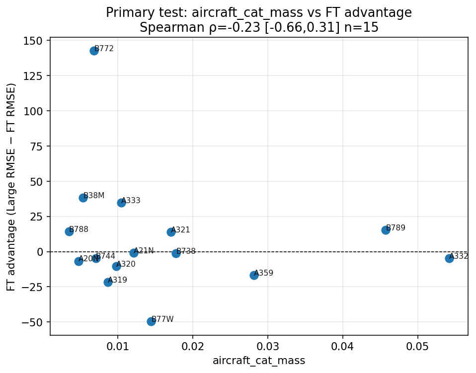
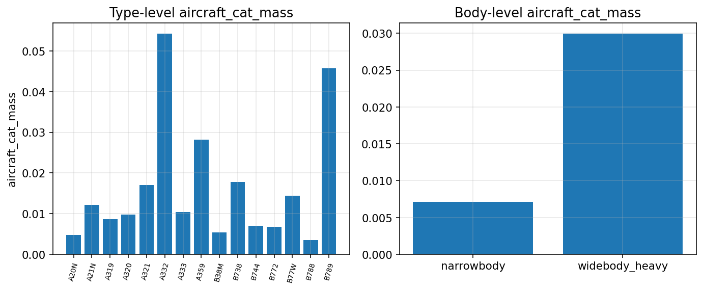
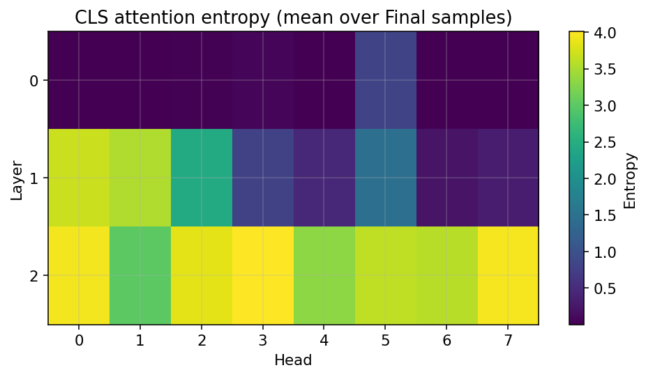
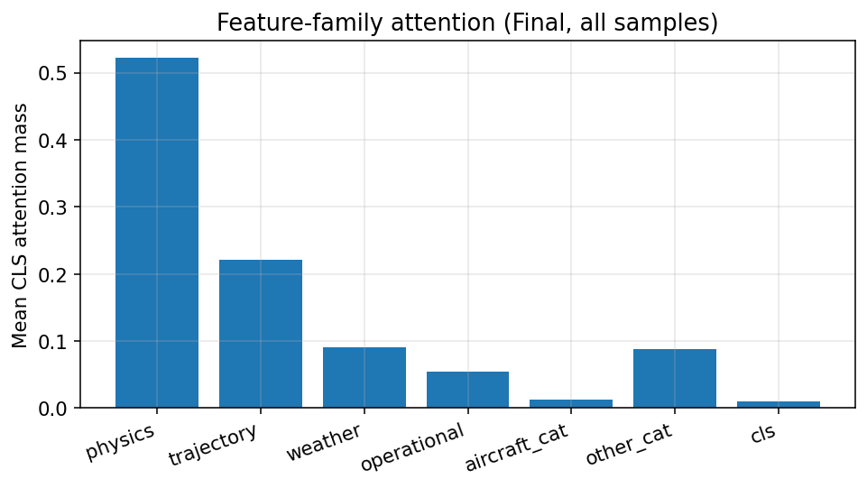
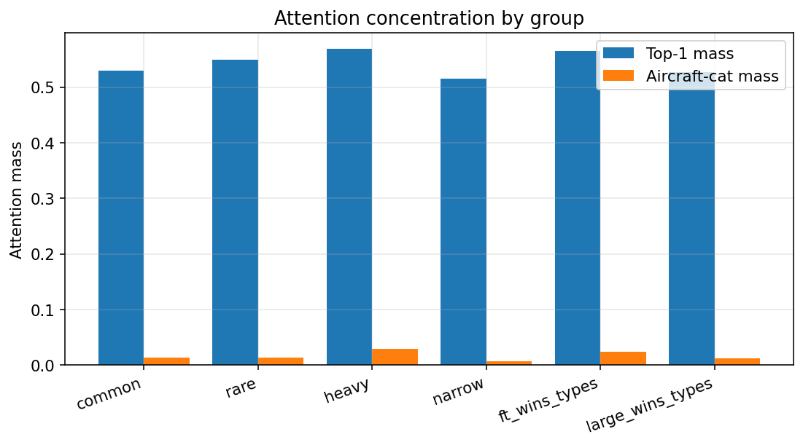

# Attention Routing Analysis

**Date:** 2026-08-09
**Status:** Complete — analysis-only (frozen FT + Large; no training)
**Decision:** `C_rejected`

---

## 1. Research question

Does **attention-based feature routing** in the FT-Transformer help explain why FT beats Large MLP under **aircraft-type macro** evaluation despite worse Flight Holdout RMSE?

---

## 2. Hypothesis

> **H-Attention:** Under aircraft-type distribution shift, FT dynamically changes how it routes information across feature tokens, allowing more effective use of features shared across aircraft types than the MLP.

We test association of attention metrics with **FT advantage** `(Large RMSE_t − FT RMSE_t)`, not merely whether attention maps look interesting.

---

## 3. Existing evidence (not reinterpreted)

| Model | Final RMSE | Type-macro RMSE |
|-------|----------:|----------------:|
| Large MLP | 215.85 | 270.61 |
| FT-Transformer | 224.12 | 261.15 |

Prior mechanisms rejected/not established: teacher uncertainty (VGKD), physics-feature reliance, representation geometry as sufficient causal account, local smoothness.

---

## 4. Experimental setup

- Frozen FT checkpoint: `results/distillation/ft_transformer/ft_transformer_kd1/`
- Frozen Large: `results/distillation/capacity_scaling/runs/Large_seed42/`
- Evaluation: `featured_dataset_final.parquet` (same pipeline as prior phases)
- Type unit: aircraft types with n≥50 on Final
- **No training**, no feature/split changes

---

## 5. Attention extraction method

- Instrument `MultiheadAttention` / `TransformerBlock` with optional `need_weights`.
- Residual path still uses the same SDPA (or fallback) output as production.
- Analytic softmax(QKᵀ/√d) weights are computed **after** the residual output for analysis only.
- Primary readout: **CLS query row** attention over tokens [CLS + 56 num + 4 cat].
- API: `FTTransformer.forward_with_attention(x) → (pred, [attn_layer…])`.

### Prediction invariance

| Check | Value |
|-------|------:|
| n | 2048 |
| max \|Δ\| | 0.000e+00 |
| mean \|Δ\| | 0.000e+00 |
| RMSE(Δ) | 0.000e+00 |

Pass criterion: max |Δ| ≤ 1e−3 (numerical noise).

---

## 6. Metrics (pre-registered primary set)

Hypothesis-driven primary metrics (not selected after fishing):

| Metric | Definition |
|--------|------------|
| `mean_cls_entropy` | Mean entropy of CLS attention over tokens (avg layers×heads) |
| `top1_mass` | Mean max attention weight (concentration) |
| `aircraft_cat_mass` | CLS mass on aircraft_type categorical token |
| `physics_mass` | CLS mass on physics/mass/energy numeric tokens |
| `trajectory_mass` | CLS mass on trajectory numeric tokens |
| `js_shift_from_common` | JS divergence of type mean CLS attention vs common-type reference |

Per-layer / per-head entropy correlations are **exploratory**.

---

## 7. Results

### 7.1 Group-level attention

| Group | n | Entropy | Top-1 | Aircraft-cat | Physics | Trajectory | FT adv (group RMSE) |
|-------|--:|--------:|------:|-------------:|--------:|-----------:|--------------------:|
| all | 37170 | 1.797 | 0.529 | 0.013 | 0.522 | 0.221 | -8.27 |
| common | 37030 | 1.797 | 0.529 | 0.013 | 0.522 | 0.221 | -8.33 |
| rare | 140 | 1.740 | 0.550 | 0.014 | 0.531 | 0.154 | -2.18 |
| heavy | 9614 | 1.704 | 0.569 | 0.030 | 0.579 | 0.185 | -13.43 |
| narrow | 27547 | 1.830 | 0.516 | 0.007 | 0.502 | 0.234 | -6.48 |
| ft_wins_types | 1838 | 1.733 | 0.565 | 0.025 | 0.570 | 0.184 | 26.08 |
| large_wins_types | 35271 | 1.801 | 0.528 | 0.012 | 0.520 | 0.223 | -10.78 |

### 7.2 Primary correlations (aircraft type = unit)

#### Attention metric ↔ FT advantage

| Metric | Spearman ρ | 95% CI | p | n |
|--------|----------:|-------:|--:|--:|
| mean_cls_entropy | -0.139 | [-0.711, 0.415] | 0.621 | 15 |
| top1_mass | 0.068 | [-0.473, 0.642] | 0.81 | 15 |
| aircraft_cat_mass | -0.229 | [-0.658, 0.313] | 0.413 | 15 |
| physics_mass | 0.096 | [-0.494, 0.690] | 0.732 | 15 |
| trajectory_mass | -0.204 | [-0.624, 0.336] | 0.467 | 15 |
| js_shift_from_common | 0.093 | [-0.491, 0.606] | 0.742 | 15 |

#### Attention metric ↔ FT absolute RMSE (critical comparison)

| Metric | Spearman ρ | 95% CI | p | n |
|--------|----------:|-------:|--:|--:|
| mean_cls_entropy | -0.789 | [-0.923, -0.463] | 0.000467 | 15 |
| top1_mass | 0.811 | [0.500, 0.914] | 0.000246 | 15 |
| aircraft_cat_mass | 0.296 | [-0.231, 0.705] | 0.283 | 15 |
| physics_mass | 0.700 | [0.297, 0.877] | 0.00367 | 15 |
| trajectory_mass | -0.318 | [-0.880, 0.322] | 0.248 | 15 |
| js_shift_from_common | 0.296 | [-0.337, 0.905] | 0.283 | 15 |

**Strongest primary vs advantage:** `aircraft_cat_mass` ρ=-0.229 CI=[-0.658,0.313] p=0.413

**Same metric vs absolute FT RMSE:** ρ=0.296 CI=[-0.231,0.705]

### Critical pattern (geometry-standard test)

Several attention metrics **do** correlate with FT’s **absolute** type RMSE (difficulty), but **not** with FT’s **relative advantage** over Large:

| Metric | ρ vs FT advantage | ρ vs FT RMSE |
|--------|------------------:|-------------:|
| mean_cls_entropy | −0.14 | **−0.79** |
| top1_mass | +0.07 | **+0.81** |
| physics_mass | +0.10 | **+0.70** |
| aircraft_cat_mass | −0.23 | +0.30 |

**Interpretation:** Attention concentration / entropy tracks **how hard a type is for FT**, not **why FT beats Large**. This mirrors the Phase 3 geometry finding (geometry ↛ advantage).

### 7.3 Body-macro negative control

| Body | n | Large RMSE | FT RMSE | FT adv | Entropy | Aircraft-cat |
|------|--:|-----------:|--------:|-------:|--------:|-------------:|
| narrowbody | 27547 | 74.49 | 80.97 | -6.48 | 1.830 | 0.007 |
| widebody_heavy | 9614 | 404.77 | 418.20 | -13.43 | 1.704 | 0.030 |

**Body-control label:** `no_ranking_reversal_at_body_level`

### 7.4 Layer / head (exploratory)

Top heads by |Spearman| vs FT advantage (exploratory; multiple comparisons):

- L0H4: ρ=-0.429 CI=[-0.848,0.298] p=0.111
- L1H7: ρ=-0.318 CI=[-0.805,0.282] p=0.248
- L1H0: ρ=0.264 CI=[-0.302,0.706] p=0.341
- L1H2: ρ=0.257 CI=[-0.293,0.725] p=0.355
- L1H3: ρ=-0.257 CI=[-0.733,0.395] p=0.355

---

## 8. Statistical analysis

- Unit of inference: aircraft type (n=15).
- Bootstrap: 2000 resamples of types for Spearman CI.
- Small n: do not treat p-values as strong confirmatory evidence.
- Primary metric set fixed before looking at advantage correlations.

---

## 9. Negative control

Body-macro does not reverse Large vs FT ranking in established results. Here body-control label = `no_ranking_reversal_at_body_level`. A mechanism that only tracks type-level FT advantage should not be required to produce body-level ranking reversal; conversely, if the same attention–advantage link appears equally under body grouping with no ranking flip, that weakens specificity to the type-macro phenomenon.

---

## 10. Interpretation

**Primary answer:** Attention behavior does **not** explain why FT beats Large under aircraft-type shift.

Evidence:

1. Pre-registered primary metrics vs FT advantage: strongest |ρ| = **0.23** (`aircraft_cat_mass`), CI includes 0, p = 0.41.
2. The same metrics can track FT **absolute** type error strongly (e.g. entropy ρ = −0.79, top-1 mass ρ = +0.81) — i.e. attention reflects **difficulty**, not **relative robustness**.
3. JS shift from common-type attention does not track FT advantage (ρ = 0.09).
4. Body-level ranking does not reverse (Large still better on body-group RMSE); attention differs by body but without type-macro-style ranking support for H-Attention.

**Language:** No causal claim. H-Attention is **rejected** as an explanation of the architecture ranking reversal under the pre-registered association tests.

---

## 11. Limitations

1. Analytic attention weights may differ slightly from fused SDPA internals (predictions verified invariant).
2. Small number of aircraft types (n≈15) limits power.
3. CLS-row attention is one readout; other query positions not exhaustively tested.
4. No causal intervention on attention in this phase.
5. Feature-family mapping uses project `classify_numeric` + categorical names; residual "other" bucket exists.
6. Per-head results are exploratory (multiple comparisons).

---

## 12. Decision

| Field | Value |
|-------|-------|
| Classification | **C_rejected** |
| Best primary metric | `aircraft_cat_mass` |
| ρ (vs FT advantage) | -0.229 |
| 95% CI | [-0.658, 0.313] |
| ρ (vs FT RMSE) | 0.296 |
| Body control | no_ranking_reversal_at_body_level |

---

## 13. Recommended next step

Record H-Attention as **rejected** (no association with relative FT advantage). Do not pursue attention-based methods. Continue **paper writing** documenting the ranking reversal and ruled-out mechanisms.

---

## Artifacts

- Results: `results/distillation/attention_routing/`
- Script: `experiments/08_distillation/18_attention_routing_analysis.py`
- Instrumentation: `src/aerotwin/distillation/models/ft_transformer.py` (`forward_with_attention`)

*Generated 2026-08-09T05:10:04.324798+00:00*