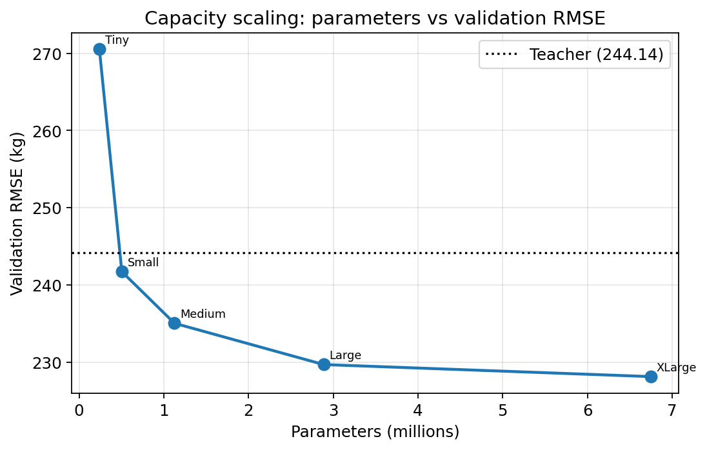
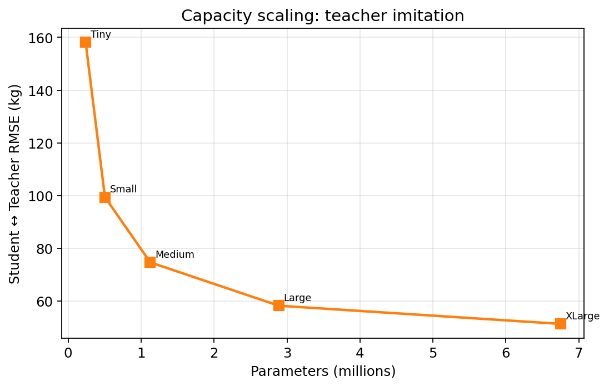
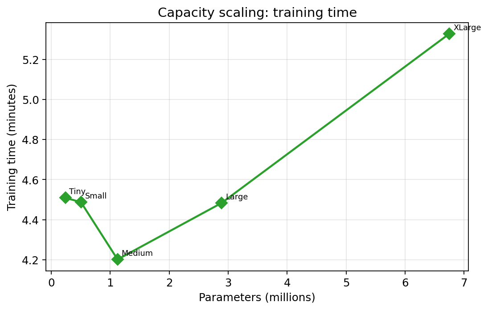
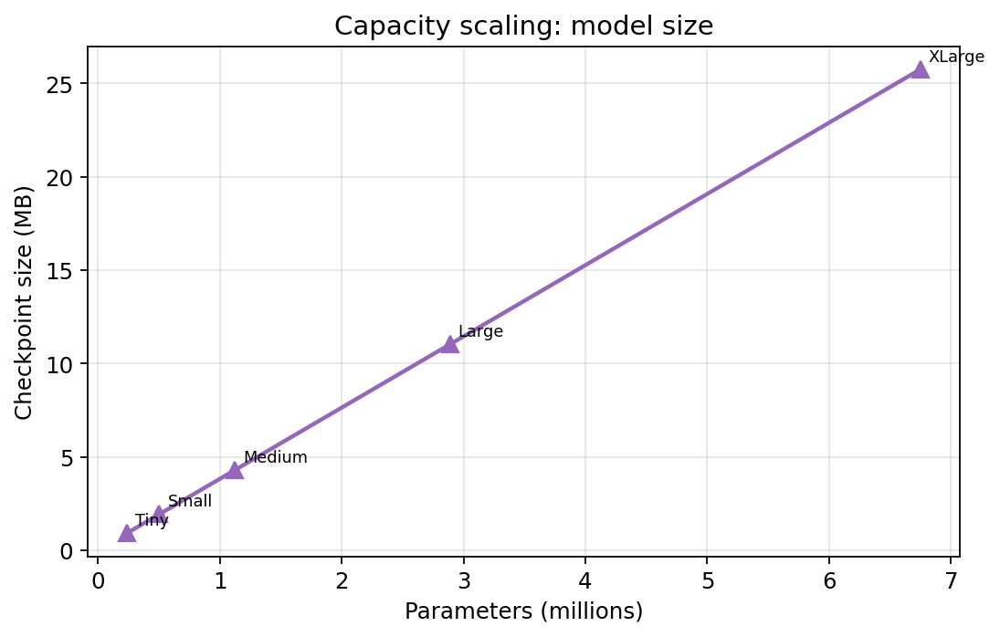
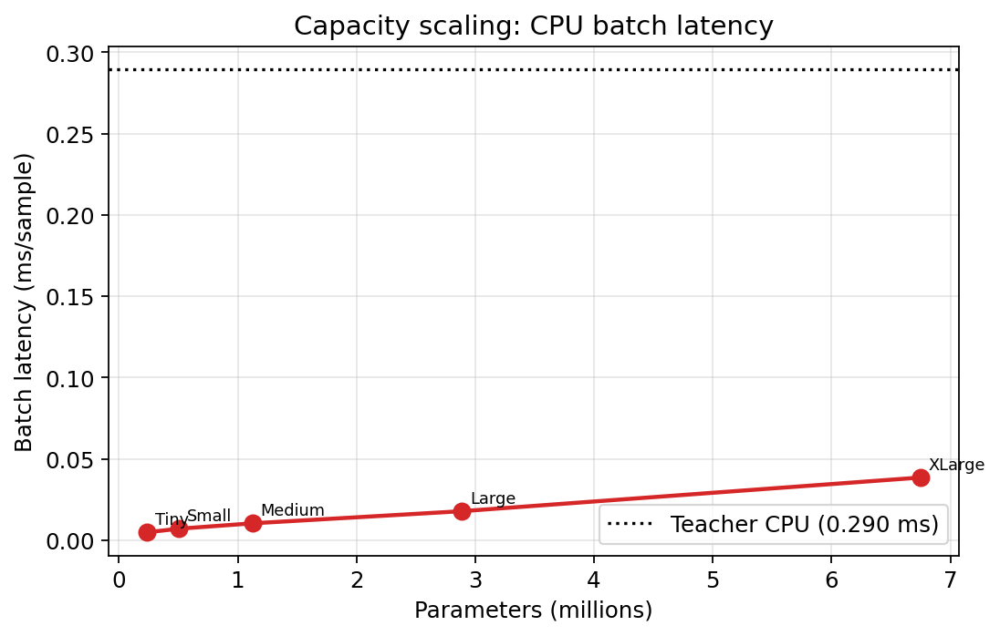
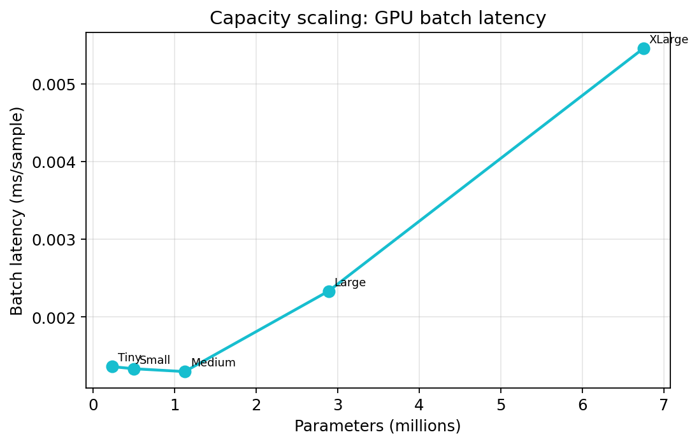
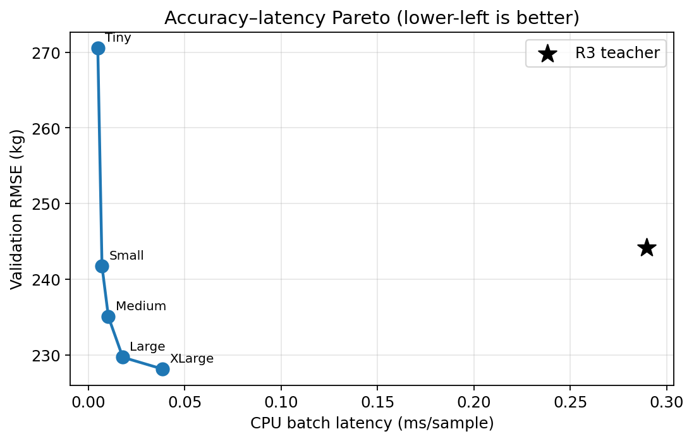
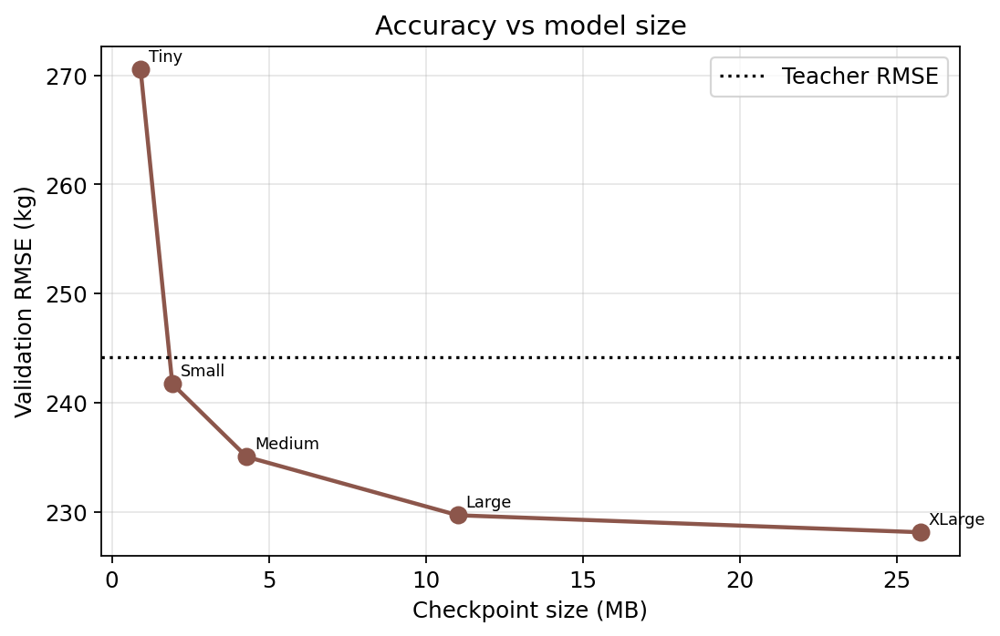
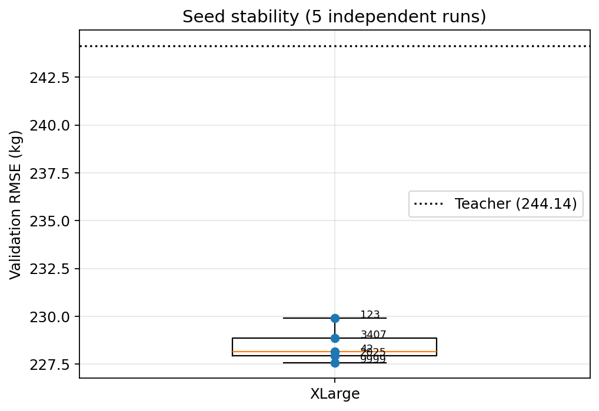

# MLP Capacity Scaling Report

**Stage:** AeroTwin Distillation - Step 4

Fixed KD supervision: **alpha=0.1, beta=0.9** (from Step 3).
Teacher, dataset, split protocol, and training loop are unchanged.

---

## Methodology

| Setting | Value |
|---------|------:|
| Dataset | `distillation_dataset.parquet` |
| Samples | 119,032 |
| Train / val rows | 95,168 / 23,864 |
| Input dim | 582 |
| alpha / beta | 0.1 / 0.9 |
| Seed (capacity) | 42 |
| Repro seeds | [42, 123, 3407, 2025, 9999] |
| Max epochs / patience | 80 / 12 |
| Optimizer | AdamW 1e-3 |
| Wall time (capacity + 4 extra seeds + bench) | ~45–50 min train + ~1 min bench |

Architecture family: Linear → ReLU → LayerNorm → Dropout (×2) → Linear head.

### Capacity tiers

| Model | Hidden | Target | Actual params |
|-------|--------|-------:|--------------:|
| Tiny | 320x160 | ~250K | 239,041 |
| Small | 576x288 | ~500K | 504,001 |
| Medium | 1024x512 | ~1M | 1,125,377 |
| Large | 1792x1024 | ~3M | 2,887,425 |
| XLarge | 2560x2048 | ~5-10M | 6,748,673 |

---

## Scaling results

| Model | Params | Val RMSE | MAE | Bias | R2 | Student-Teacher | Gap | Epochs | Train s | Size MB |
|-------|-------:|---------:|----:|-----:|---:|----------------:|----:|-------:|--------:|--------:|
| Tiny | 239,041 | 270.55 | 89.65 | -16.42 | 0.9038 | 158.22 | +26.41 | 80 | 271 | 0.92 |
| Small | 504,001 | 241.73 | 83.83 | +0.28 | 0.9232 | 99.39 | -2.42 | 80 | 269 | 1.93 |
| Medium | 1,125,377 | 235.04 | 82.46 | -1.46 | 0.9274 | 74.64 | -9.10 | 80 | 252 | 4.30 |
| Large | 2,887,425 | 229.70 | 81.70 | -4.22 | 0.9307 | 58.19 | -14.44 | 80 | 269 | 11.02 |
| XLarge | 6,748,673 | 228.14 | 81.29 | -0.17 | 0.9316 | 51.30 | -16.00 | 80 | 320 | 25.75 |

Teacher val RMSE (soft labels on this split): **244.14 kg**.

### Inference benchmarks

| Name | Device | Single ms/sample | Batch ms/sample | Single sps | Batch sps | Peak RAM MB | Peak GPU MB | Size MB |
|------|--------|-----------------:|----------------:|-----------:|----------:|------------:|------------:|--------:|
| R3_teacher | cpu | 52.4784 | 0.2896 | 19.1 | 3453.3 | 1277.28125 | None | 16.77 |
| Tiny | cpu | 0.4032 | 0.0049 | 2480.1 | 203706.1 | 1290.1875 | None | 0.92 |
| Tiny | cuda | 0.2535 | 0.0014 | 3944.4 | 734431.9 | 1372.4921875 | 11.07763671875 | 0.92 |
| Small | cpu | 0.1839 | 0.0071 | 5436.5 | 141129.6 | 1379.484375 | None | 1.93 |
| Small | cuda | 0.2513 | 0.0013 | 3980.1 | 749148.2 | 1379.5 | 12.46337890625 | 1.93 |
| Medium | cpu | 0.2492 | 0.0104 | 4012.4 | 96117.3 | 1388.03515625 | None | 4.30 |
| Medium | cuda | 0.2726 | 0.0013 | 3668.6 | 770141.0 | 1388.765625 | 15.48779296875 | 4.30 |
| Large | cpu | 0.3440 | 0.0179 | 2907.1 | 55967.5 | 1411.1953125 | None | 11.02 |
| Large | cuda | 0.5567 | 0.0023 | 1796.4 | 428741.1 | 1411.20703125 | 24.35595703125 | 11.02 |
| XLarge | cpu | 0.5210 | 0.0386 | 1919.3 | 25937.1 | 1461.50390625 | None | 25.75 |
| XLarge | cuda | 1.3756 | 0.0055 | 726.9 | 183332.8 | 1461.453125 | 40.43896484375 | 25.75 |

### Efficiency (students, CPU batch latency)

| Model | RMSE/Mparams | RMSE/MB | RMSE/ms | Speedup vs teacher |
|-------|-------------:|--------:|--------:|-------------------:|
| Tiny | 1131.82 | 295.25 | 55112.84 | 59.0x |
| Small | 479.61 | 125.44 | 34114.67 | 40.9x |
| Medium | 208.86 | 54.69 | 22591.88 | 27.8x |
| Large | 79.55 | 20.85 | 12855.61 | 16.2x |
| XLarge | 33.81 | 8.86 | 5917.28 | 7.5x |

### Figures

---

## Scaling analysis

Answers to the study questions (metrics only):

1. **How much capacity is required?** Crossing the teacher soft-label RMSE needs only **Small (~0.5M)**. Best accuracy uses **XLarge (~6.75M)**; **Large (~2.9M)** is within **2 kg** of best.
2. **Saturation?** Late gains shrink: Large→XLarge improves only **1.56 kg** while more than doubling parameters — **diminishing returns**, not a hard plateau.
3. **Reproducible?** Yes on this split: 5-seed mean **228.49 ± 0.92**, 95% CI **[227.7, 229.3]** entirely below teacher **244.14**.
4. **Accuracy–latency:** single-sample CPU students **~0.2–0.5 ms** vs teacher **~52 ms**; batch CPU still faster than teacher for all tiers.

- **Best model:** XLarge (6,748,673 params) val RMSE **228.14 kg** (gap vs teacher -16.00 kg).
- **Smallest within 1 kg of best:** XLarge (6,748,673 params, RMSE 228.14).
- **Smallest within 2 kg of best:** Large (2,887,425 params, RMSE 229.70).
- **Saturation:** Not fully — later capacity steps still move RMSE by ≥1 kg, or improvement remains material.
- **Latency vs capacity:** log-param vs log-latency correlation 0.990 (near-linear=True).
- **Best accuracy/efficiency tradeoff (min RMSE×CPU ms):** Tiny (score=1.33).

## Reproducibility (best capacity, 5 seeds)

| Stat | Value |
|------|------:|
| Tier | XLarge |
| Mean val RMSE | 228.49 |
| Std | 0.92 |
| 95% CI | [227.68, 229.29] |
| Best seed | 9999 (227.58) |
| Worst seed | 123 (229.90) |
| Teacher val RMSE | 244.14 |
| Mean gap vs teacher | -15.66 |
| All seeds better than teacher | True |
| 95% CI entirely below teacher | True |

**Conclusion:** Across five seeds, the mean student RMSE is below the teacher and the 95% CI does not include the teacher RMSE — the improvement is consistent on this flight-holdout split (not official Rank/Final).

| Seed | Val RMSE | Gap | Student-Teacher |
|-----:|---------:|----:|----------------:|
| 42 | 228.14 | -16.00 | 51.30 |
| 123 | 229.90 | -14.24 | 58.26 |
| 2025 | 227.94 | -16.20 | 50.92 |
| 3407 | 228.86 | -15.28 | 52.56 |
| 9999 | 227.58 | -16.56 | 52.41 |

---

## Discussion

1. Capacity scaling isolates neural width under fixed KD weights (0.1 / 0.9).
2. If RMSE flattens while parameters grow, the teacher soft labels are largely absorbed and further MLP capacity yields diminishing returns — a signal that architecture (e.g. transformers) may matter more than raw width.
3. Inference benchmarks compare deployable student speed/size against the multi-model R3 ensemble on CPU; GPU numbers apply to students only.
4. Student flight-holdout RMSE is **not** official Rank/Final Combined RMSE.

## Conclusions

- Best capacity under seed 42: **XLarge**.
- Minimum capacity within 1 kg of best: **XLarge**.
- Reproducibility: see seed section above.
- Proceed to FT-Transformer / TabTransformer only if capacity saturates or the accuracy–latency frontier justifies architecture change; use α=0.1, β=0.9.

## Artifacts

| Path | Content |
|------|---------|
| `results/distillation/capacity_scaling/metrics.csv` | Capacity metrics |
| `results/distillation/capacity_scaling/benchmark_results.csv` | Latency / memory |
| `results/distillation/capacity_scaling/seed_statistics.json` | Multi-seed stats |
| `results/distillation/capacity_scaling/best_model.json` | Best tier |
| `results/distillation/capacity_scaling/plots/` | Figures |

*Generated 2026-07-29 21:39:29*
