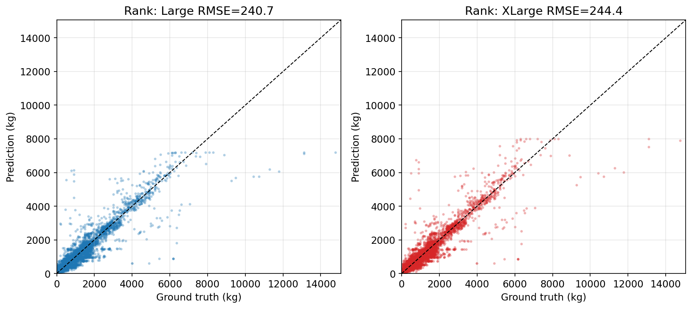
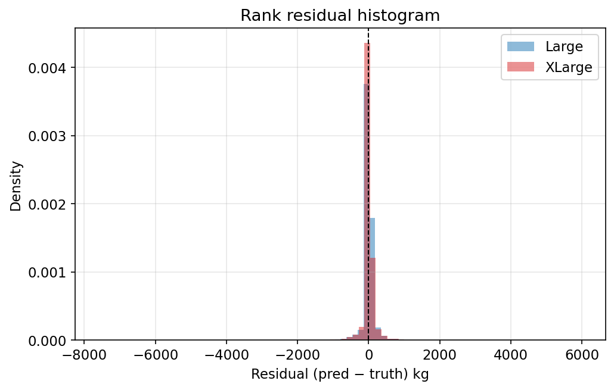
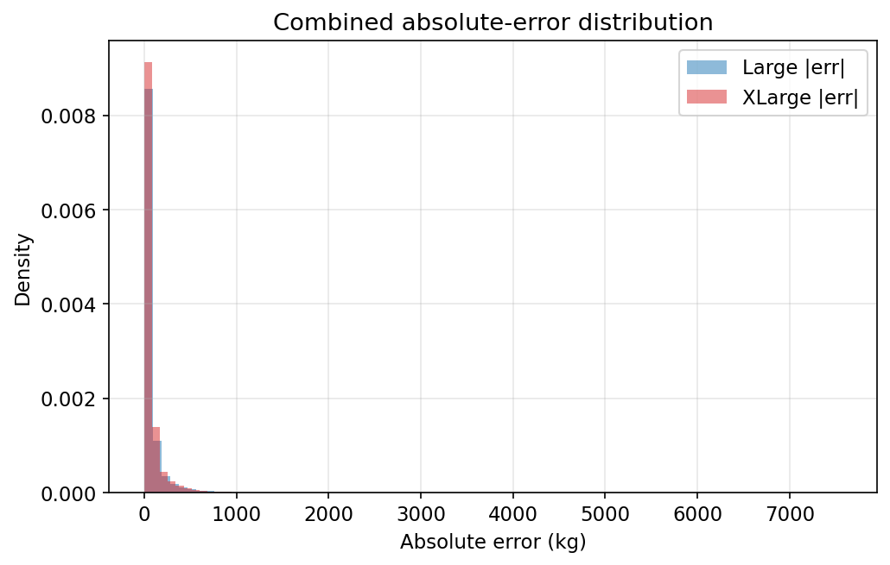
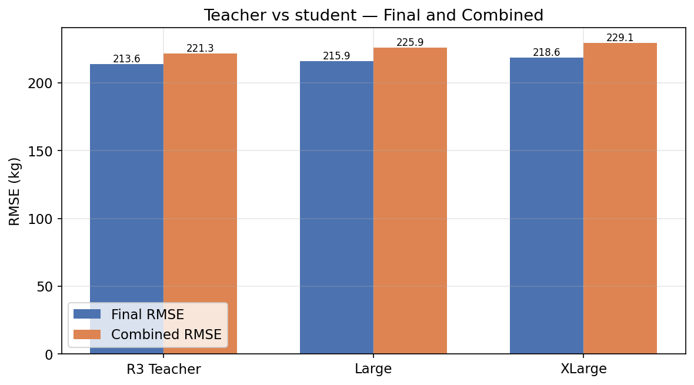
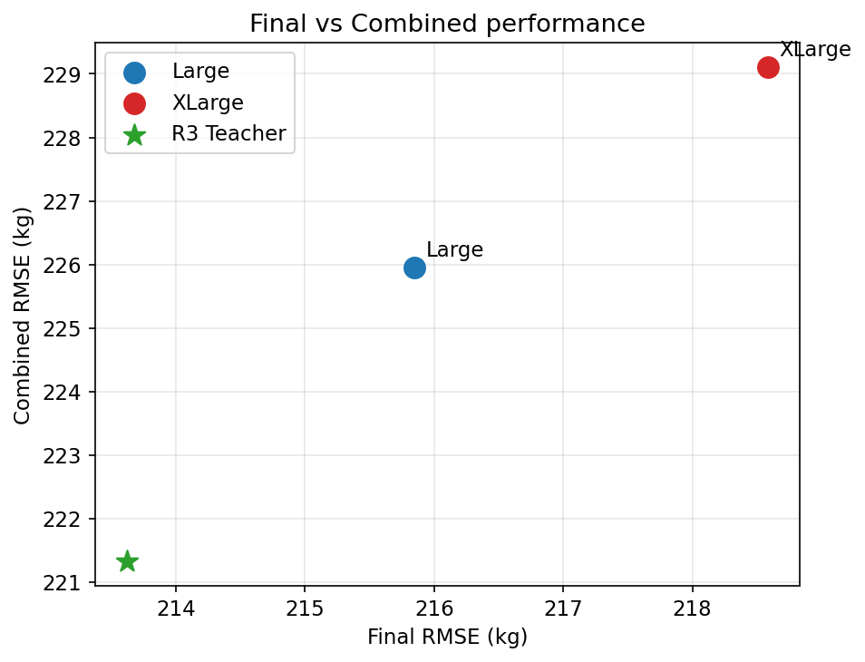
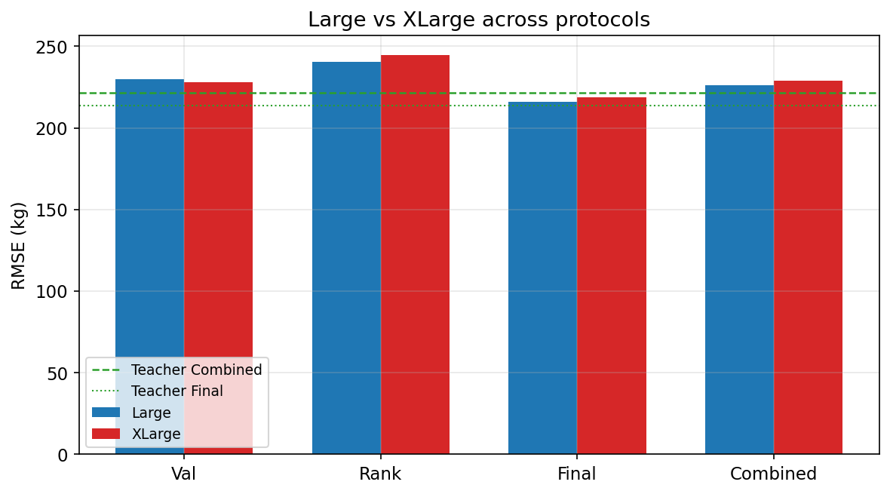

# Official Combined (Rank + Final) Student Evaluation

**Date:** 2026-07-30
**Stage:** Evaluation only — frozen Large / XLarge MLPs, α=0.1, β=0.9

No training. No checkpoint changes. Preprocessing = train-fitted transform-only.

---

## Two evaluation protocols

### Protocol A — Final

Controlled held-out evaluation on Oct 2025 Final intervals only.
Used for architecture research and student comparisons under a fixed unseen-flight holdout.

### Protocol B — Combined (Rank + Final)

Official PRC-style aggregate:

```text
combined_rmse = RMSE( concat(y_rank, y_final), concat(p_rank, p_final) )
```

Identical aggregation to `full_scorecard` / R3 teacher Combined reporting.
Used for direct comparison with the official PRC leaderboard and teacher Combined **221.33 kg**.

**Both protocols are retained** — they answer different questions.

---

## Methodology

| Item | Value |
|------|------:|
| Rank features | `<project_root>\featured_dataset_rank.parquet` |
| Rank rows / flights | 24,158 / 1881 |
| Final features | `<project_root>\featured_dataset_final.parquet` |
| Final rows / flights | 37,170 / 2824 |
| Models | Large_seed42, XLarge_seed42 |
| Final preds | Reused Step 5 when available |
| Combined formula | concat Rank then Final, single RMSE |

---

## Rank evaluation

| Model | RMSE | MAE | Bias | R² | n |
|-------|-----:|----:|-----:|---:|--:|
| Large | 240.66 | 81.31 | +3.95 | 0.9032 | 24,158 |
| XLarge | 244.40 | 81.98 | +5.59 | 0.9001 | 24,158 |
| R3 Teacher (official campaign) | 232.53 | — | — | — | — |

---

## Final evaluation (Step 5 verified)

| Model | RMSE | MAE | Bias | R² |
|-------|-----:|----:|-----:|---:|
| Large | 215.85 | 76.69 | +5.25 | 0.9220 |
| XLarge | 218.59 | 77.36 | +6.41 | 0.9201 |
| R3 Teacher (held-out audit) | 213.62 | — | — | — |

---

## Combined evaluation (Protocol B)

| Model | Combined RMSE | Combined MAE | Combined Bias | Combined R² | n |
|-------|-------------:|-------------:|--------------:|------------:|--:|
| **Large** | **225.95** | 78.51 | +4.74 | 0.9146 | 61,328 |
| XLarge | 229.10 | 79.18 | +6.09 | 0.9122 | 61,328 |
| R3 Teacher | **221.33** | — | — | — | — |

- Large gap to teacher Combined: **+4.62 kg**
- XLarge gap to teacher Combined: **+7.77 kg**

---

## Final comparison table

| Model | Rank RMSE | Final RMSE | Combined RMSE | MAE | R² | Parameters | CPU Latency (ms) |
|-------|----------:|-----------:|--------------:|----:|---:|-----------:|-----------------:|
| R3 Teacher | 232.53 | 213.62 | **221.33** | — | — | ensemble | ~52 |
| Large MLP | 240.66 | 215.85 | **225.95** | 78.51 | 0.9146 | 2,887,425 | 0.26 |
| XLarge MLP | 244.40 | 218.59 | **229.10** | 79.18 | 0.9122 | 6,748,673 | 0.52 |

Teacher MAE/R² Combined not re-derived in this student run; Rank teacher RMSE is the official R3 campaign component.

---

## Generalization analysis

| Model | Val RMSE | Rank RMSE | Final RMSE | Combined RMSE |
|-------|---------:|----------:|-----------:|--------------:|
| Large | 229.70 | 240.66 | 215.85 | 225.95 |
| XLarge | 228.14 | 244.40 | 218.59 | 229.10 |

- Best on validation: **XLarge**
- Best on Rank: **Large**
- Best on Final: **Large**
- Best on Combined: **Large**
- Final vs Combined ranking consistent: **True**
- Deployment recommendation: **Large**

---

## Teacher comparison

Canonical teacher:

- Final: **213.62 kg**
- Combined: **221.33 kg**
- Rank (official campaign): **232.53 kg**

---

## Large vs XLarge

- Combined RMSE delta (XLarge − Large): **+3.15 kg**
- Final delta (XLarge − Large): **+2.73 kg**
- Rank delta (XLarge − Large): **+3.74 kg**

---

## Figures

### rank_pred_vs_truth



### rank_residual_hist



### combined_error_dist



### teacher_vs_student



### final_vs_combined



### large_vs_xlarge_protocols



---

## Official PRC comparison

Published winner Combined ≈ **201 kg**. Teacher Combined **221.33**. Best student Combined **225.95** (Large).

---

## Deployment recommendation

**Large** remains preferred unless XLarge improves Combined by >2 kg (measured Combined delta XLarge−Large = +3.15 kg).

---

## Final conclusions (evidence only)

1. **Large Combined RMSE:** **225.95 kg**
2. **XLarge Combined RMSE:** **229.10 kg**
3. **Closest to teacher under PRC Combined:** **Large** (gap +4.62 kg)
4. **Preferred deployment model:** **Large**
5. **Ranking change Final→Combined?** No
6. **Future transformers should report both protocols:** Final (research holdout) **and** Combined (PRC parity).

## Artifacts

`results/distillation/combined_evaluation/` — metrics, rank/combined predictions, plots, metadata.

*Generated 2026-07-30T01:43:49.771320+00:00*
