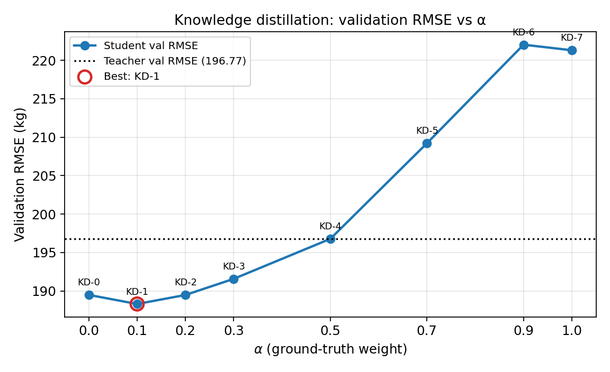
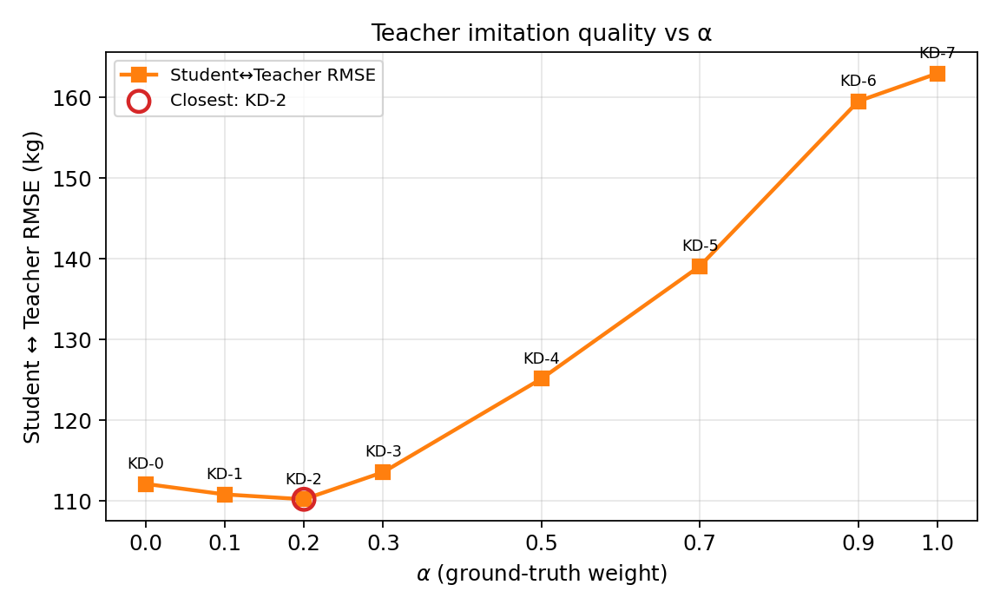
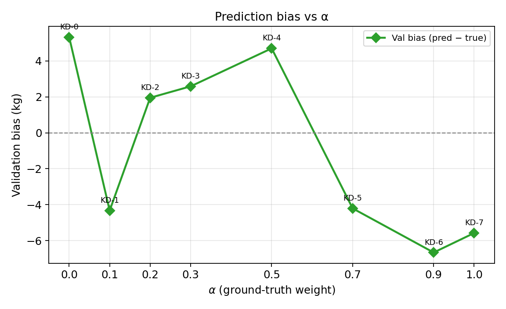
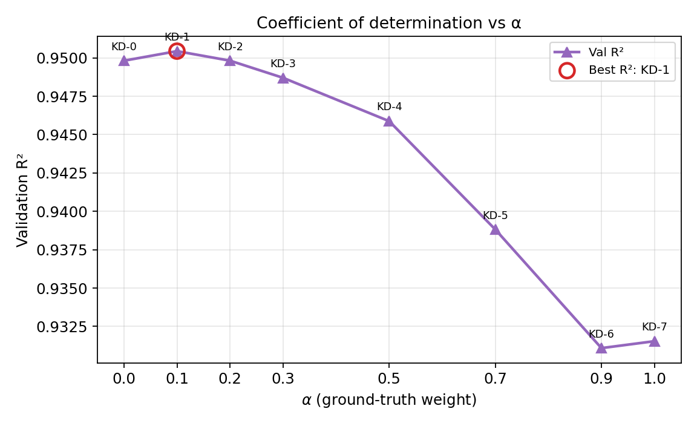
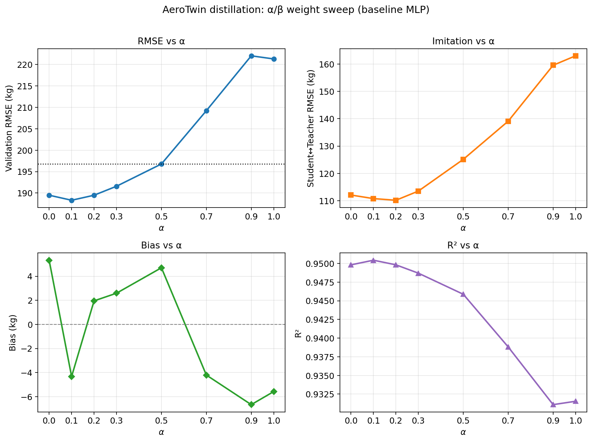

# Distillation Alpha/Beta Weight Sweep Report

**Stage:** AeroTwin Distillation - Step 3  
**Date:** 2026-07-29

Goal: determine how knowledge should be transferred from the frozen R3 teacher to neural students by varying only the KD weights alpha (ground truth) and beta (teacher).

The teacher, `distillation_dataset.parquet`, feature engineering, and data splits are **unchanged**.

---

## Methodology

### Loss

```
L = alpha * MSE(student, ground_truth) + beta * MSE(student, teacher_prediction)
```

All other training settings match Step 2 (baseline MLP). Only alpha and beta vary.

### Fixed settings

| Setting | Value |
|---------|------:|
| Student | MLP `[1024, 512]` + LayerNorm + Dropout |
| Parameters | **1,132,545** (~1.13M) |
| Input dim (after OHE + scale) | 589 |
| Seed | 42 |
| Flight-level val fraction | 0.2 |
| Train / val rows | 94,810 / 24,222 |
| Optimizer | AdamW lr=1e-3, weight_decay=1e-4 |
| Batch size | 2048 |
| Max epochs | 80 |
| Early-stopping patience | 12 |
| Scheduler | ReduceLROnPlateau (factor=0.5, patience=4) |
| Wall time (full sweep) | **40.0 min** |

### Configurations

| Experiment | alpha (GT) | beta (Teacher) |
|------------|-----------:|---------------:|
| KD-0 | 0.0 | 1.0 |
| KD-1 | 0.1 | 0.9 |
| KD-2 | 0.2 | 0.8 |
| KD-3 | 0.3 | 0.7 |
| KD-4 | 0.5 | 0.5 |
| KD-5 | 0.7 | 0.3 |
| KD-6 | 0.9 | 0.1 |
| KD-7 | 1.0 | 0.0 |

---

## Results

Teacher validation RMSE on this flight split (fixed soft labels): **196.77 kg**.

### Comparison table (sorted by val RMSE)

| Exp | alpha | beta | Val RMSE | MAE | Bias | R2 | Student-Teacher RMSE | Gap vs teacher | Epochs | Time (s) |
|-----|------:|-----:|---------:|----:|-----:|---:|---------------------:|---------------:|-------:|---------:|
| **KD-1** | **0.1** | **0.9** | **188.31** | **76.91** | **-4.33** | **0.9504** | 110.80 | **-8.47** | 80 | 439 |
| KD-2 | 0.2 | 0.8 | 189.48 | 76.91 | +1.95 | 0.9498 | **110.20** | -7.29 | 80 | 282 |
| KD-0 | 0.0 | 1.0 | 189.49 | 77.92 | +5.33 | 0.9498 | 112.11 | -7.29 | 80 | 269 |
| KD-3 | 0.3 | 0.7 | 191.58 | 76.10 | +2.59 | 0.9487 | 113.55 | -5.19 | 80 | 281 |
| KD-4 | 0.5 | 0.5 | 196.78 | 76.23 | +4.70 | 0.9459 | 125.15 | +0.01 | 80 | 280 |
| KD-5 | 0.7 | 0.3 | 209.22 | 77.49 | -4.21 | 0.9388 | 139.10 | +12.45 | 80 | 278 |
| KD-7 | 1.0 | 0.0 | 221.32 | 81.30 | -5.58 | 0.9315 | 162.99 | +24.54 | 80 | 278 |
| KD-6 | 0.9 | 0.1 | 222.04 | 80.40 | -6.67 | 0.9311 | 159.54 | +25.27 | 80 | 274 |

### Figures











---

## Analysis

Findings below use only the metrics from this fixed-architecture sweep.

### Best / worst

- **Best alpha/beta (val RMSE):** `KD-1` with alpha=0.1, beta=0.9 → val RMSE **188.31 kg** (MAE 76.91, bias -4.33, R2 0.9504).
- **Worst alpha/beta (val RMSE):** `KD-6` (alpha=0.9, beta=0.1) → **222.04 kg**.
- **Best teacher imitation (Student-Teacher RMSE):** `KD-2` (110.20 kg), with KD-1 close (110.80 kg).

### Teacher-heavy vs GT-heavy

Teacher-heavy runs (beta > alpha): KD-0, KD-1, KD-2, KD-3.  
GT-heavy runs (alpha > beta): KD-5, KD-6, KD-7.

| Group | Mean val RMSE (kg) |
|-------|-------------------:|
| Teacher-heavy | **189.71** |
| GT-heavy | **217.53** |

**Yes — teacher-heavy supervision outperforms GT-heavy** on mean validation RMSE (gap ~28 kg).

### Does adding ground truth improve teacher imitation?

Compared to pure teacher (KD-0, Student-Teacher RMSE 112.11 kg):

| Exp | alpha | Student-Teacher RMSE | Delta vs KD-0 |
|-----|------:|---------------------:|--------------:|
| KD-1 | 0.1 | 110.80 | **-1.31** |
| KD-2 | 0.2 | 110.20 | **-1.91** |
| KD-3 | 0.3 | 113.55 | +1.44 |
| KD-4+ | >=0.5 | 125–163 | worse |

**Yes, slightly.** Small ground-truth weight (alpha in {0.1, 0.2}) improves Student-Teacher RMSE vs pure teacher. Larger alpha degrades imitation.

### Does the teacher act as a label denoiser?

| Supervision | Val RMSE vs ground truth |
|-------------|-------------------------:|
| Pure teacher (KD-0, alpha=0) | **189.49** |
| Pure GT (KD-7, beta=0) | **221.32** |
| Delta (teacher − GT) | **-31.83** |

**Yes, under this metric.** Training only on teacher soft labels yields much lower validation error against ground truth than training only on ground truth. That is consistent with the frozen R3 ensemble providing a smoother / better-regularized training signal for the MLP (label denoising / regularization), not merely matching soft targets at the expense of hard labels.

Teacher-heavy students (KD-0..KD-3) also beat the teacher soft-label RMSE on ground truth (negative gap: student better than teacher on val GT). That is possible because the student is evaluated against ACARS labels while being trained largely on OOF teacher targets; it does **not** claim superiority on official Rank/Final.

### Recommended alpha/beta for future students

**KD-1: alpha = 0.1, beta = 0.9**

Reason: lowest validation RMSE among the eight fixed-architecture configs. It is teacher-dominated with a small hard-label anchor, and is competitive on teacher imitation.

Use this pair as the default supervision strategy for subsequent architectures (FT-Transformer, TabTransformer, trajectory models) unless a new sweep on that architecture contradicts it.

Secondary note: pure teacher (KD-0) is nearly as strong (189.49 vs 188.31) and remains a valid simple default if a one-target loss is preferred.

---

## Artifacts

| File | Path |
|------|------|
| Metrics | `results/distillation/alpha_beta_sweep/metrics.csv` |
| Comparison table | `results/distillation/alpha_beta_sweep/comparison_table.csv` |
| Summary | `results/distillation/alpha_beta_sweep/summary.json` |
| Best config | `results/distillation/alpha_beta_sweep/best_configuration.json` |
| Analysis | `results/distillation/alpha_beta_sweep/analysis.json` |
| Plots | `results/distillation/alpha_beta_sweep/plots/` |
| Per-run checkpoints | `results/distillation/alpha_beta_sweep/KD-*/` |
| Runner | `src/aerotwin/distillation/runner.py` |
| Sweep script | `experiments/08_distillation/03_alpha_beta_sweep.py` |
| Entry point | `experiments/08_distillation/run_distillation_experiments.py` |

### Out of scope (this step)

- Architecture changes or hyperparameter search
- Regenerating the teacher dataset
- Official Rank/Final re-evaluation of the teacher
- Advanced distillation (temperature, feature matching, multi-task)

*Generated 2026-07-29*
