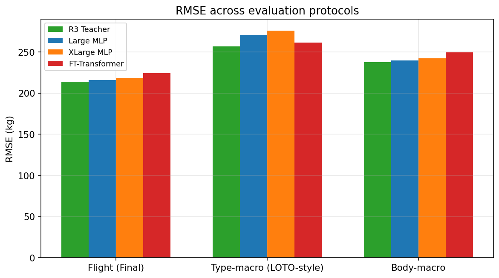
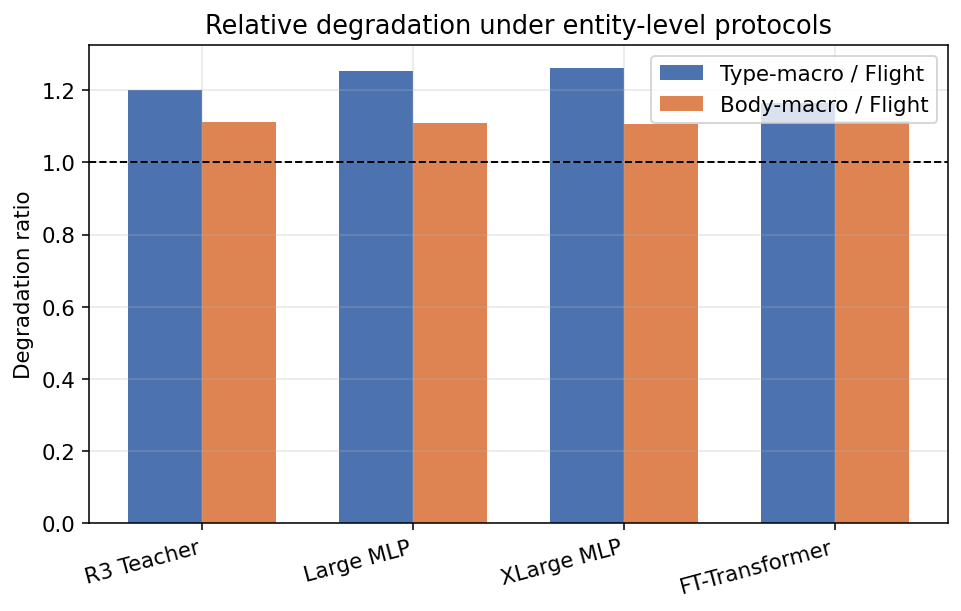
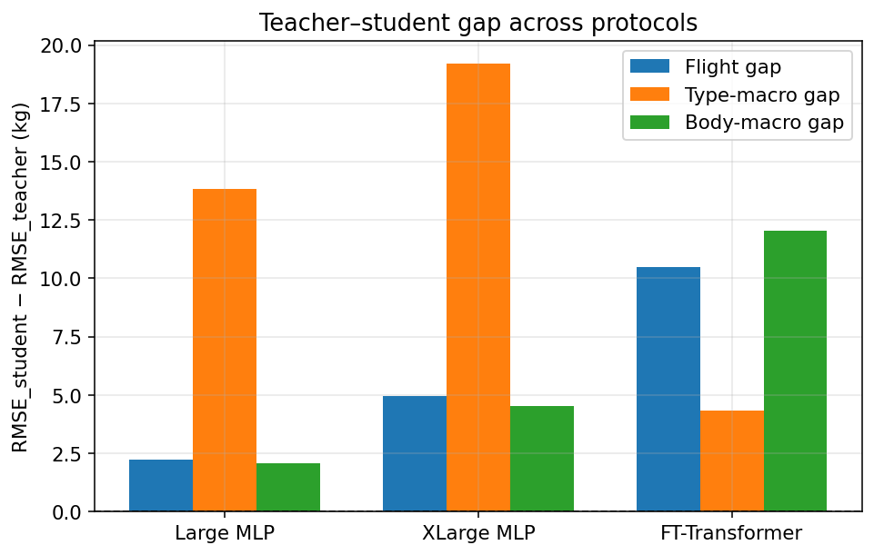
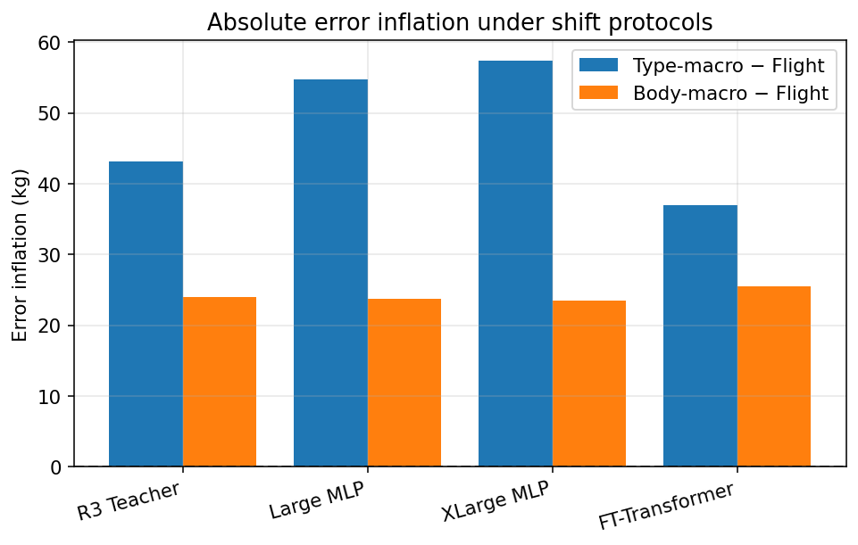
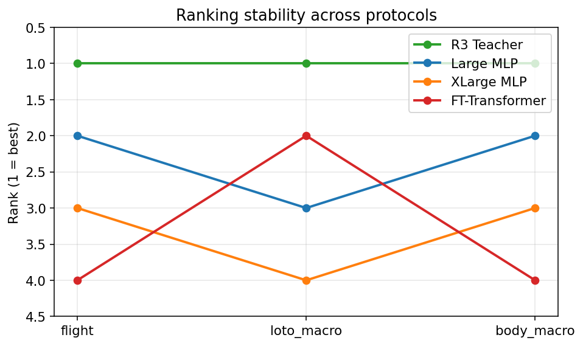
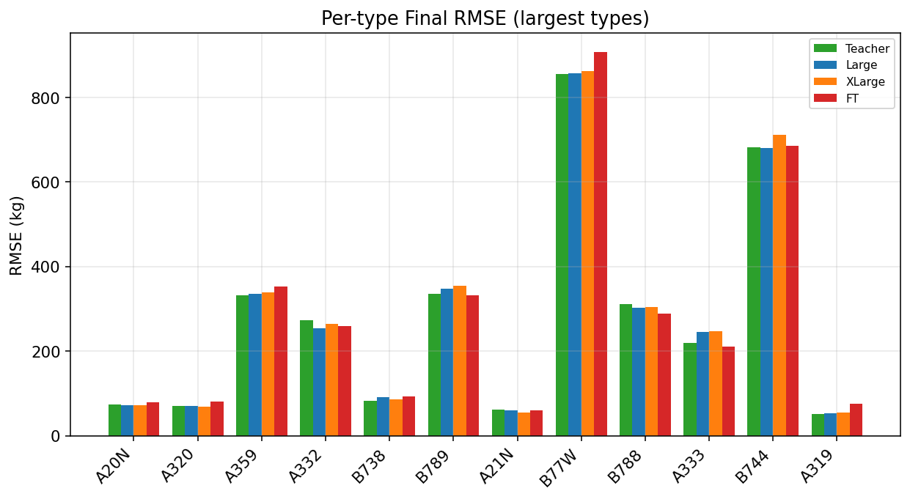

# Phase 0 — Distribution Shift Diagnosis

**Date:** 2026-07-30  
**Status:** Complete — evaluation only (frozen models; **no retrain**)

## Scientific question

> Does standard knowledge distillation introduce additional robustness loss under entity-level distribution shift compared to the teacher?

**Answer (evidence-based):** **Yes, for the official Large MLP under type-level (LOTO-style) evaluation.** The teacher–student gap widens from **+2.23 kg** (flight holdout) to **+13.82 kg** (type-macro), increase **+11.59 kg**. The type-macro gap 95% CI excludes zero. Body-class macro does **not** show the same widening. FT-Transformer **narrows** its gap under type-macro and becomes the best student on that protocol.

---

## Experimental setup

| Item | Value |
|------|------|
| Models | R3 Teacher, Large MLP, XLarge MLP, FT-Transformer |
| Retrain | **None** — frozen checkpoints only |
| Flight holdout | Final (`featured_dataset_final.parquet`, 37,170 rows / 2,824 flights) |
| Type-level (LOTO-style) | Per-type RMSE on Final; **unweighted macro** over types with **n ≥ 50** |
| Body-class | `widebody_heavy` / `narrowbody` / `regional_other`; macro over classes with n ≥ 100 |
| Bootstrap | Flight-clustered RMSE gap (n=2000); type-resample for type-macro gap |
| Teacher predictions | Audited Final artifact (`teacher_predictions.parquet`) — live bundle pickle unavailable |

### Body-class mapping

| Class | Definition |
|-------|------------|
| `narrowbody` | Project `NARROW_TYPES` (A320 family, B737 family, …) |
| `widebody_heavy` | Project `HEAVY_TYPES` (A359, B77W, B744, …) |
| `regional_other` | Remaining types (insufficient n on Final for macro; excluded from body-macro) |

### Protocol honesty

Type-level evaluation is **post-hoc LOTO-style** (entity-level metrics on held-out Final flights). Models were **trained with all types present** in the distillation train split. This is **not** re-trained leave-one-type-out. It measures relative robustness under **entity-weighted** evaluation (each type equal vote) vs overall flight holdout (frequency-weighted).

This is the appropriate no-retrain diagnostic for whether KD students lose more than the teacher when rare/hard types are up-weighted.

---

## Metrics — all protocols

| Model | Flight RMSE | Type-macro RMSE | Body-macro RMSE | Deg. ratio (type) | Deg. ratio (body) |
|-------|------------:|----------------:|----------------:|------------------:|------------------:|
| R3 Teacher | **213.62** | **256.79** | **237.55** | 1.202 | 1.112 |
| Large MLP | 215.85 | 270.61 | 239.63 | 1.254 | 1.110 |
| XLarge MLP | 218.59 | 276.01 | 242.08 | 1.263 | 1.107 |
| FT-Transformer | 224.12 | 261.15 | 249.58 | **1.165** | 1.114 |

### Error inflation (shift − flight)

| Model | Inflation type-macro | Inflation body-macro |
|-------|---------------------:|---------------------:|
| R3 Teacher | +43.17 | +23.93 |
| Large MLP | **+54.76** | +23.78 |
| XLarge MLP | +57.43 | +23.50 |
| FT-Transformer | **+37.02** | +25.46 |

Teacher inflation under type-macro: **+43 kg**. Large: **+55 kg**. FT: **+37 kg** (less inflation than teacher).

### Teacher–student gap (student − teacher RMSE)

| Student | Gap flight | Gap type-macro | Gap body-macro | Gap increase (type − flight) |
|---------|-----------:|---------------:|---------------:|-----------------------------:|
| Large MLP | +2.23 | **+13.82** | +2.08 | **+11.59** |
| XLarge MLP | +4.96 | **+19.22** | +4.53 | **+14.26** |
| FT-Transformer | +10.50 | **+4.35** | +12.03 | **−6.15** |

### Heavy-only (widebody) Final RMSE

| Model | Heavy RMSE | Gap vs teacher |
|-------|-----------:|---------------:|
| Teacher | 400.72 | — |
| Large | 404.77 | +4.06 |
| XLarge | 411.08 | +10.36 |
| FT | 418.20 | +17.48 |

Heavy-only gaps remain modest for Large; the large type-macro gap is driven by **equal weighting of rarer types**, not only the bulk heavy mass.

### Bootstrap uncertainty

#### Large vs Teacher

| Quantity | Point | 95% CI | Excludes 0? |
|----------|------:|--------|:-----------:|
| Flight gap | +2.23 | [−3.70, +8.34] | **No** |
| Type-macro gap | +13.82 | [+0.05, +35.11] | **Yes** (barely) |
| Gap increase | +11.59 | — | — |

#### FT vs Teacher

| Quantity | Point | 95% CI | Excludes 0? |
|----------|------:|--------|:-----------:|
| Flight gap | +10.50 | [+5.14, +16.51] | **Yes** |
| Type-macro gap | +4.35 | [−3.77, +14.25] | **No** |

#### XLarge vs Teacher

| Quantity | Point | 95% CI | Excludes 0? |
|----------|------:|--------|:-----------:|
| Flight gap | +4.96 | [−1.84, +11.71] | **No** |
| Type-macro gap | +19.22 | [+2.43, +45.19] | **Yes** |

---

## Ranking stability

| Protocol | Ranking (best → worst) |
|----------|------------------------|
| Flight (overall) | Teacher → **Large** → XLarge → FT |
| Type-macro | Teacher → **FT** → Large → XLarge |
| Body-macro | Teacher → **Large** → XLarge → FT |

**Change:** Under type-macro, **FT-Transformer becomes the best student**, overtaking Large and XLarge despite worse overall Final RMSE.

---

## Figures













---

## Interpretation (evidence only)

1. **Does KD lose robustness under distribution shift?**  
   **Partially yes for MLPs under type-macro.** Large and XLarge show higher type-macro degradation ratios (1.254, 1.263) than the teacher (1.202) and larger absolute inflation. FT shows **lower** type-macro degradation (1.165) than the teacher.

2. **Does the teacher degrade less than the student?**  
   **Yes vs Large/XLarge on type-macro inflation** (+43 vs +55 / +57 kg). **No vs FT** (+43 vs +37 kg). Body-macro inflation is similar across all models (~24 kg).

3. **Does the teacher–student gap increase?**  
   **Yes for Large and XLarge** under type-macro (+11.6 / +14.3 kg increase). **No for FT** (gap shrinks by 6.2 kg). **No meaningful increase for Large on body-macro** (+2.08 vs +2.23).

4. **Is Large still the most robust student?**  
   **On flight and body-macro: yes.** **On type-macro: no — FT is better.**

5. **Does FT become relatively stronger under shift?**  
   **Yes under type-macro** (rank improves from last student to first student; gap to teacher not significant).

6. **What is statistically meaningful?**  
   - Large **flight** gap: **not** significant (CI includes 0).  
   - Large **type-macro** gap: **significant** but wide CI [0.05, 35].  
   - FT **flight** gap: **significant**.  
   - FT **type-macro** gap: **not** significant.  
   Do not over-claim precision of the type-macro CI width.

---

## Decision gate

| Field | Value |
|-------|------|
| Proceed to Adaptive KD? | **YES** |
| Primary evidence | Large gap flight **+2.23** → type-macro **+13.82** (Δ **+11.59** kg); type-macro gap CI excludes 0 |
| Caveats | Post-hoc type-macro ≠ re-trained LOTO; body-class does not show same effect; FT is more type-robust without adaptive KD |
| Next phase | **Phase 1 — Adaptive / Uncertainty-Aware Knowledge Distillation** (conditional, now **UNBLOCKED**) |
| Secondary track | Keep documenting architecture-under-shift findings (FT type-macro strength) for the paper |

### Rationale (concise)

The official deployment student (Large) is nearly teacher-matched on frequency-weighted Final RMSE, but **entity-equal (type-macro) evaluation reveals a substantially larger teacher–student gap**. That is the scientific problem Adaptive KD is intended to address: **preserving teacher robustness when entity-level shift up-weights hard / rare types**.

If Adaptive KD is implemented, success criteria must include **type-macro gap** and **ranking under type-macro**, not only overall Final RMSE.

---

## Artifacts

| Path | Content |
|------|---------|
| `results/distillation/distribution_shift_diagnosis/metrics.json` | Full metrics + decision |
| `decision_gate.json` | Gate outcome |
| `metrics_all_protocols.csv` | Main table |
| `metrics_by_type.csv` | Per-type breakdown |
| `metrics_by_body.csv` | Body-class breakdown |
| `predictions_*.parquet` | Per-model Final predictions |
| `plots/` | Six publication figures |
| `docs/reports/distribution_shift_diagnosis.md` | This report |

Reproduce:

```bash
set PYTHONPATH=src
python experiments/08_distillation/10_distribution_shift_diagnosis.py
```

*Generated 2026-07-30*
