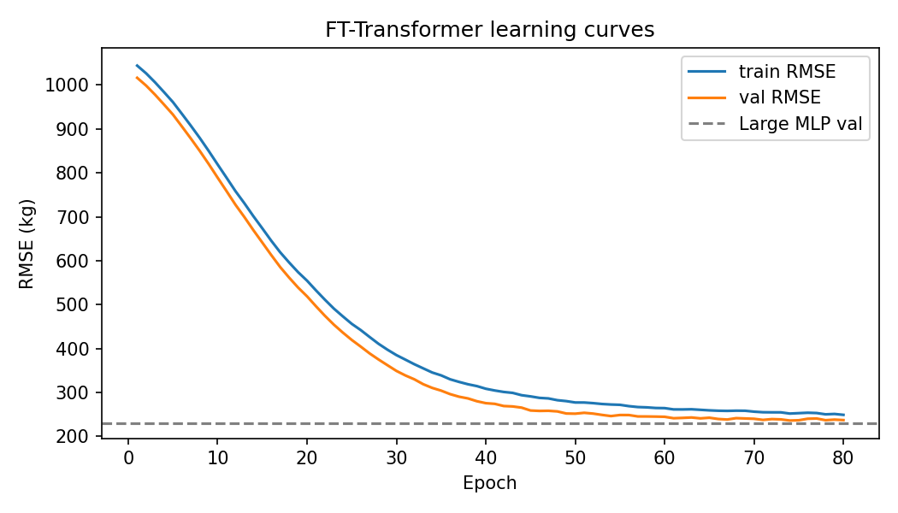
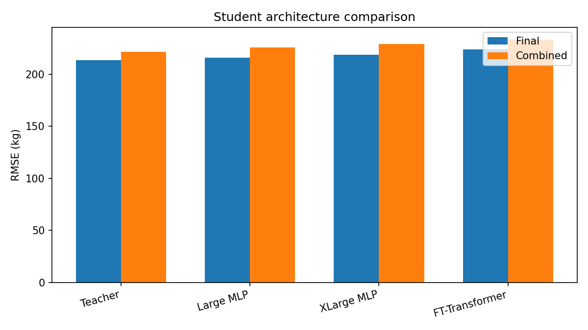
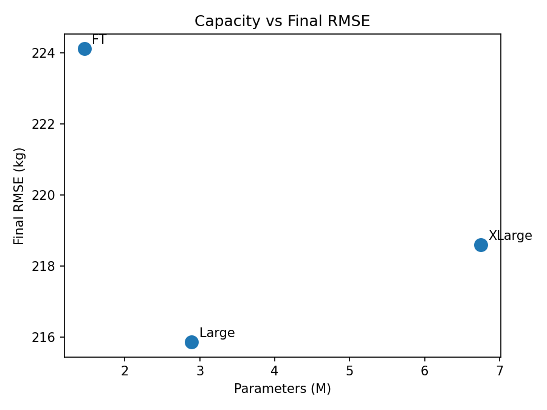
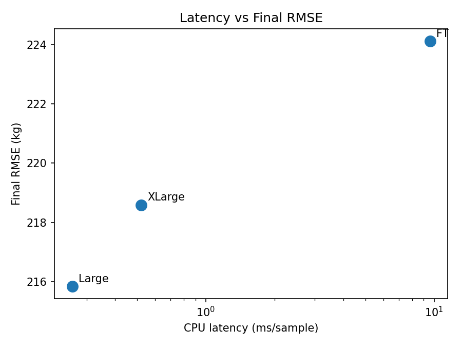
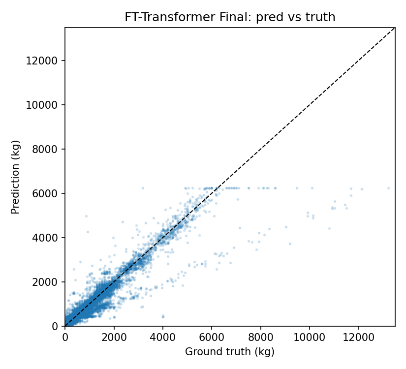
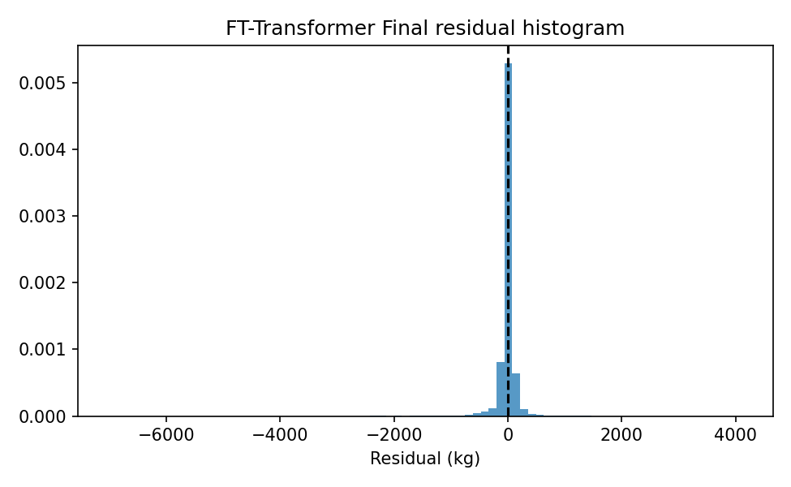

# FT-Transformer Student Experiment (Phase 2)

**Date:** 2026-07-30  
**Status:** Complete — trained, evaluated Final + Combined  
**Pipeline:** Identical KD setup to Large MLP (α=0.1, β=0.9); architecture is the only intentional variable

---

## 1. Research question

> Can a transformer-based student outperform the distilled Large MLP under the **exact same** knowledge-distillation pipeline?

---

## 2. Architecture

Implementation: `src/aerotwin/distillation/models/ft_transformer.py`  
Factory: `build_student("ft_transformer", …)` in `src/aerotwin/distillation/models/factory.py`  
Paper: Gorishniy et al., *Revisiting Deep Learning Models for Tabular Data* (NeurIPS 2021)

### Hyperparameters

| Item | Value |
|------|------:|
| Embedding dim (`d_token`) | **192** |
| Transformer layers (`n_blocks`) | **3** |
| Attention heads | **8** |
| FFN hidden (GEGLU pre-gate half) | **round(8/3 · 192) = 512** |
| Attention dropout | 0.2 |
| FFN dropout | 0.1 |
| Residual dropout | 0.0 |
| Activation (FFN) | **GEGLU** (GELU-gated) |
| Head | LayerNorm → Linear → scalar kg |
| Continuous features | 56 (scaled; train-fitted StandardScaler) |
| Categorical features | 4 embeddings (cards 26, 9, 249, 242 from train OHE) |
| Tokens per sample | **61** (CLS + 56 num + 4 cat) |

### Parameter count

| Quantity | Value |
|----------|------:|
| **Trainable parameters** | **1,458,625** (~1.46M) |
| Checkpoint size | 5.59 MB |

**Note on capacity target:** Paper-style baseline defaults yield ~1.46M params, below the informal 2–4M fairness band of Large MLP (~2.89M). Capacity is **not** matched; results should be read as “baseline FT-Transformer under fixed KD,” not a same-parameter bake-off. Scaling `d_token` / `n_blocks` is a natural follow-up.

### Input contract (preprocessing unchanged)

The frozen distillation pipeline still produces:

```text
x = [ scaled_numeric (56) | one-hot categories (~526) ]  → in_dim = 582
```

FT-Transformer **decodes** the OHE block back to category indices and uses paper-native numeric tokenizers + categorical embeddings. Scaler and OHE vocabulary are the same train-fitted artifacts as the MLP. No refit, no new features.

---

## 3. Training

| Item | Value |
|------|------:|
| Script | `experiments/08_distillation/08_train_ft_transformer.py` |
| Config | `configs/distillation/ft_transformer.yaml` |
| Dataset | `distillation_dataset.parquet` (frozen) |
| Split | Flight-level 80/20, seed **42** |
| Loss | `0.1 · MSE(gt) + 0.9 · MSE(teacher)` |
| Optimizer | AdamW, lr=1e-3, weight_decay=1e-4 |
| Scheduler | ReduceLROnPlateau (factor 0.5, patience 4) |
| Batch size | **1024** (deviation from MLP 2048 — documented below) |
| Max epochs / patience | 80 / 12, min_delta 0.05 kg |
| Grad clip | 1.0 |
| Device | CUDA |
| Wall time | ~125.6 min (80 epochs) |
| Best epoch | **74** |
| Best val RMSE | **236.08 kg** |

### Documented deviation from Large MLP training

| Knob | Large MLP | FT-Transformer | Reason |
|------|-----------|----------------|--------|
| Batch size | 2048 | **1024** | Conservative default after early OOM with dense 582-token attention; with native ~61 tokens 1024 is stable. Same optimizer/LR otherwise. |

No change to α/β, teacher, labels, split, scheduler type, early-stopping rule, or feature engineering.

### Learning curves



Val RMSE fell from ~1016 → **236** over 80 epochs; still slightly above Large MLP flight-holdout val (**229.70**).

Artifacts:

- Checkpoint: `results/distillation/ft_transformer/ft_transformer_kd1/best_model.pt`
- Curve: `results/distillation/ft_transformer/ft_transformer_kd1/training_curve.csv`
- Metrics: `results/distillation/ft_transformer/ft_transformer_kd1/metrics.json`
- Config snapshot: `…/student_config.json`

---

## 4. Official evaluation results

### Protocol A — Final

| Model | Final RMSE | MAE | Bias | R² |
|-------|-----------:|----:|-----:|---:|
| R3 Teacher | **213.62** | 74.14 | +4.87 | 0.9236 |
| **Large MLP** | **215.85** | 76.69 | +5.25 | 0.9220 |
| XLarge MLP | 218.59 | 77.36 | +6.41 | 0.9201 |
| **FT-Transformer** | **224.12** | 74.17 | −12.01 | 0.9160 |

Δ vs Large Final: **+8.27 kg** (does **not** beat Large)

### Protocol B — Combined (Rank + Final)

| Model | Rank RMSE | Final RMSE | **Combined RMSE** |
|-------|----------:|-----------:|------------------:|
| R3 Teacher | 232.53 | 213.62 | **221.33** |
| **Large MLP** | **240.66** | **215.85** | **225.95** |
| XLarge MLP | 244.40 | 218.59 | 229.10 |
| **FT-Transformer** | 246.88 | 224.12 | **233.35** |

Δ vs Large Combined: **+7.40 kg** (does **not** beat Large)

### Summary comparison

| Model | Final RMSE | Combined RMSE | Parameters | CPU latency (ms/sample) |
|-------|-----------:|--------------:|-----------:|------------------------:|
| R3 Teacher | 213.62 | **221.33** | ensemble | ~52 |
| **Large MLP (deploy)** | **215.85** | **225.95** | **2,887,425** | **0.26** |
| XLarge MLP | 218.59 | 229.10 | 6,748,673 | 0.52 |
| FT-Transformer | 224.12 | 233.35 | 1,458,625 | 9.59 |

GPU single-sample latency (FT): ~8.11 ms (same methodology as CPU loop on one row).



---

## 5. Efficiency

| Metric | FT-Transformer | Large MLP |
|--------|---------------:|----------:|
| Parameters | 1.46M | 2.89M |
| Checkpoint size | 5.59 MB | ~11.0 MB |
| CPU ms / sample | 9.59 | 0.26 |
| GPU ms / sample | 8.11 | (not re-measured here) |
| Final RMSE | 224.12 | **215.85** |

FT is smaller on disk but **much slower** on CPU single-sample inference than the MLP (~37×), due to attention over 61 tokens vs a shallow feed-forward stack.





---

## 6. Calibration / residuals (Final)





FT shows a **negative bias** (~−12 kg) on Final (underprediction), whereas Large MLP had a mild positive bias (~+5 kg).

---

## 7. Discussion

### Did FT train successfully?

**Yes.** Converged (val RMSE 236 after best epoch 74), checkpoint loads, Final/Rank/Combined inference complete.

### Does it outperform Large MLP?

**No** on either official protocol:

- Final: 224.12 vs **215.85** (+8.3 kg)
- Combined: 233.35 vs **225.95** (+7.4 kg)

Deployment baseline remains **Large MLP**.

### Likely reasons (evidence-aligned)

1. **Lower capacity** (~1.46M vs 2.89M) under paper baseline widths.
2. **Different inductive bias:** attention over ~60 feature tokens vs dense MLP on 582-dim OHE vector; OHE is still produced but collapsed to discrete embeddings — high-cardinality origin/destination (249/242) may be under-fit.
3. **Optimization dynamics:** long slow descent from val ~1000; mild underprediction bias on Final.
4. **KD pipeline tuned for MLP** (α/β, LR, batch) may not be optimal for transformers (not swept here — intentional single-variable experiment).

### What next (if exploring transformers further)

- Scale FT toward **~3M params** (`d_token=256`, `n_blocks=4–6`) for fairer capacity match.
- Light LR / batch / weight-decay retune **only for FT**, keeping α/β fixed.
- Feature ablations: drop ultra-high-cardinality airport cats; or use target encoding.
- Then TabTransformer / SAINT as separate controlled experiments via `build_student`.

Do **not** change deployment until Final **and** Combined both beat Large.

---

## 8. How to reproduce / switch architectures

```bash
set PYTHONPATH=src

# Train FT-Transformer (α=0.1, β=0.9)
python experiments/08_distillation/08_train_ft_transformer.py --config configs/distillation/ft_transformer.yaml

# Evaluate Final + Combined
python experiments/08_distillation/09_eval_ft_transformer.py

# Or via unified runner
python experiments/08_distillation/run_distillation_experiments.py ft-transformer
```

Factory API:

```python
from aerotwin.distillation.models import build_student, StudentConfig

model = build_student("large_mlp", in_dim=582)
model = build_student("xlarge_mlp", in_dim=582)
model = build_student(
    StudentConfig(
        architecture="ft_transformer",
        d_token=192,
        n_blocks=3,
        n_heads=8,
        n_num_features=56,
        cat_cardinalities=[26, 9, 249, 242],
    ),
    in_dim=582,
)
```

Supported names: `large_mlp`, `xlarge_mlp`, `ft_transformer` (+ capacity aliases `tiny_mlp` … `medium_mlp`).

---

## 9. Final answers (evidence only)

1. **Trained successfully?** Yes (80 epochs, best epoch 74).
2. **Final RMSE:** **224.12 kg**
3. **Combined RMSE:** **233.35 kg**
4. **Parameters:** **1,458,625**
5. **CPU latency:** **9.59 ms / sample**
6. **Outperforms Large MLP?** **No** (worse Final and Combined).
7. **New deployment model?** **No** — Large MLP remains official.
8. **Likely reasons:** lower param count, discrete high-card embeddings, KD schedule not tuned for transformers, residual underprediction bias.
9. **Next if pursuing transformers:** match ~3M capacity, modest FT-only hparam retune, then other tabular transformers as separate experiments.

---

## Artifacts

| Path | Content |
|------|---------|
| `results/distillation/ft_transformer/ft_transformer_kd1/` | checkpoint, metrics, curve |
| `results/distillation/ft_transformer/evaluation/` | Final/Rank/Combined preds, metrics, latency, plots |
| `configs/distillation/ft_transformer.yaml` | train config |
| `docs/reports/ft_transformer_experiment.md` | this report |

*Generated 2026-07-30*
