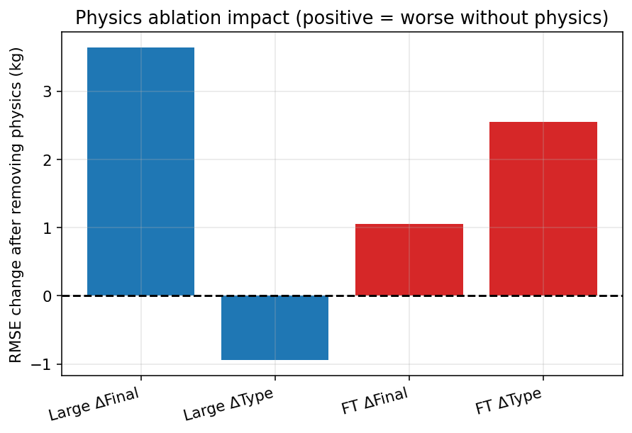
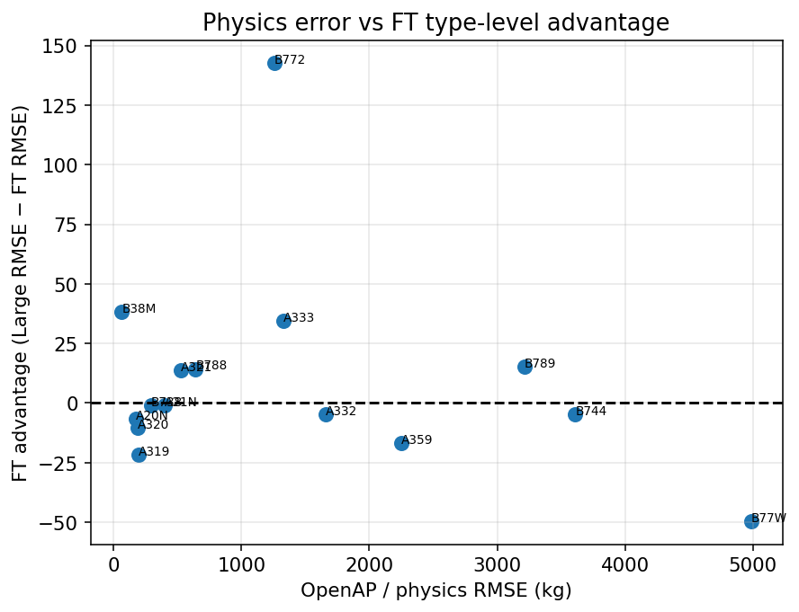
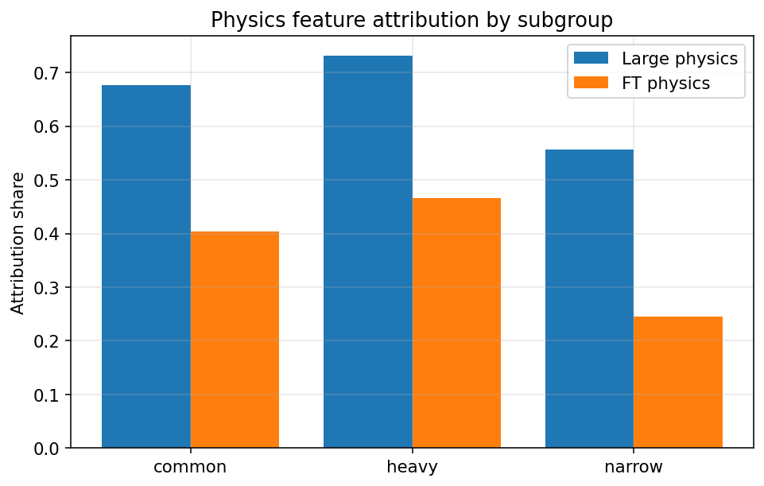
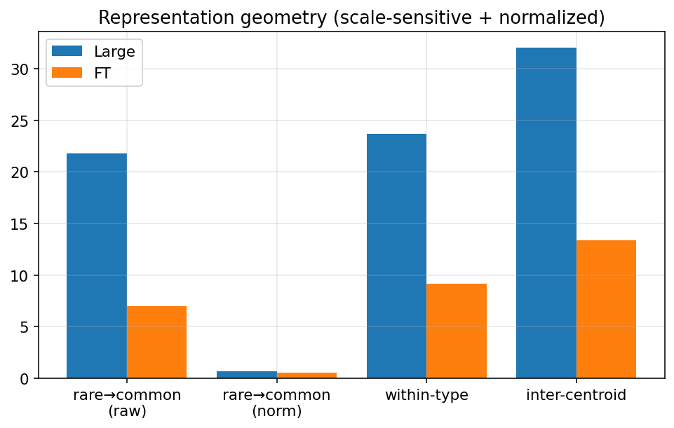
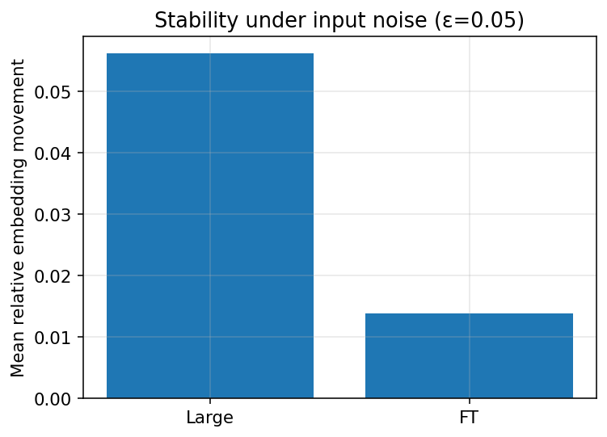

# Phase 3 — Mechanism Validation

**Date:** 2026-07-31  
**Status:** Complete  
**Scope:** Targeted physics-feature ablations + representation geometry analysis only  
**Rules:** No new architectures, no new KD methods, no representation distillation training

---

## 1. Motivation

Established facts from prior phases:

| Finding | Protocol | Evidence |
|---------|----------|----------|
| Large MLP is best deployment student | Flight Final | RMSE 215.85 kg |
| FT-Transformer is best student under type shift | Type-macro (n≥50) | FT 261.15 vs Large 270.61 |
| KD has a robustness gap under aircraft-type shift | Type-macro | Student–Teacher gaps widen for MLPs |
| Teacher uncertainty predicts difficulty | Phase 1A | Spearman ~0.43 vs \|error\| |
| Adaptive VGKD fails | Phase 1B | λ>0 worsens type-macro |
| FT places rare aircraft closer to common manifold | Phase 2 | Raw rare→common 7.0 vs 21.8 |
| FT attributes less to physics features | Phase 2 | Physics share ~0.40 vs ~0.64–0.68 |

**Scientific question:** Why does FT become the most robust student under aircraft-type distribution shift?

This phase distinguishes two competing causal explanations **before** designing any new learning algorithm.

---

## 2. Competing hypotheses

| ID | Name | Claim | Falsifiable prediction |
|----|------|-------|------------------------|
| **A** | Representation mechanism | FT learns smoother latents; rare aircraft sit closer to the common manifold → better entity-level transfer | Geometry / NN metrics predict FT’s type-macro advantage; representation differences survive after accounting for features |
| **B** | Physics-feature reliance | Large over-relies on OpenAP/mass/energy features that fail on some types; FT depends less on them | Removing physics features closes (or sharply reduces) Large’s type-macro gap; physics baseline error correlates positively with FT advantage |

**Possible outcomes:** (1) mostly A, (2) mostly B, (3) hybrid, (4) neither / inconclusive.

---

## 3. Experimental design

### Workstream A — Physics reliance

| Step | Method |
|------|--------|
| **A1** | Retrain Large MLP with identical KD (α=0.1, β=0.9, seed 42) **without** 33 physics/mass/energy features |
| **A2** | Same ablation for FT-Transformer |
| **A3** | Type-level OpenAP RMSE vs Large/FT RMSE, FT advantage, train frequency |
| **A4** | Grad×input attribution by common / heavy / narrow (physics vs trajectory share) |

**Physics features removed (33):** `physics_fuel_kg`, `ref_mass_kg`, all `r3_*` mass/energy columns, energy-state features (`mean_potential_energy_j`, `energy_change_jpkg`, efficiencies, etc.).

**Retained (27):** trajectory kinematics, weather, operational fractions, aircraft/airport categoricals.

### Workstream B — Representation

| Step | Metric |
|------|--------|
| **B1** | Rare→common centroid distance (raw + **normalized** by mean inter-type centroid distance) |
| **B2** | k-NN of rare samples in common latent space; same-body fraction |
| **B3** | Local type purity (k=10) |
| **B4** | Embedding movement under input noise (ε=0.05) |
| **B5** | Type-level centroid distance ↔ type RMSE / FT advantage |

### Workstream C — Joint

Type-level linear regression of FT advantage on standardized predictors: physics RMSE, log train frequency, heavy indicator, FT centroid distance to common types. Unique R² via leave-one-predictor drop.

### Checkpoints

| Model | Path |
|-------|------|
| Large full (frozen deploy) | `results/distillation/capacity_scaling/runs/Large_seed42/` |
| FT full | `results/distillation/ft_transformer/ft_transformer_kd1/` |
| Large nophysics | `results/distillation/mechanism_validation/physics_ablation/large_nophysics/` |
| FT nophysics | `results/distillation/mechanism_validation/physics_ablation/ft_nophysics/` |

Artifacts: `results/distillation/mechanism_validation/` · figures `docs/reports/figures/fig_m3_*.png`.

---

## 4. Physics-reliance analysis (Workstream A)

### A1 / A2 — Feature ablation (primary causal test of H-B)

| Model | Full Final | No-phys Final | Δ Final | Full type-macro | No-phys type-macro | Δ type-macro |
|-------|-----------:|--------------:|--------:|----------------:|-------------------:|-------------:|
| **Large** | 215.85 | 219.49 | **+3.64** | 270.61 | 269.67 | **−0.94** |
| **FT** | 224.12 | 225.17 | **+1.05** | 261.15 | 263.70 | **+2.55** |

Val RMSE (training): Large nophysics 230.98 · FT nophysics 238.97.

**Ranking after physics removal (type-macro):**

| Comparison | Type-macro |
|------------|-----------:|
| Large full | 270.61 |
| Large no-physics | 269.67 |
| FT full | **261.15** |
| FT no-physics | **263.70** |

FT remains better than Large on type-macro **even when both models lack physics features** (263.70 vs 269.67).

**Interpretation for H-B:**

| Prediction of H-B | Observed | Verdict |
|-------------------|----------|---------|
| Removing physics improves Large type-macro enough to close the gap | Δ ≈ −0.9 kg (noise-level); gap not closed | **Fail** |
| Large more sensitive than FT to physics removal | Large Δtype −0.9; FT Δtype +2.6 | **Fail** (FT slightly more sensitive) |
| Physics features are necessary for Large’s type-level failure mode | Ranking preserved without them | **Fail** |

Final IID degrades modestly without physics (+3.6 Large, +1.1 FT): physics features help overall accuracy slightly, but they are **not** the driver of the type-macro robustness gap.



### A3 — Physics reliability correlations (n = 15 types with n≥50)

| Relation | Pearson | Spearman | p (Spearman) |
|----------|--------:|---------:|-------------:|
| Physics RMSE → **FT advantage** | −0.246 | **−0.100** | **0.723** |
| Physics RMSE → Large RMSE | **0.932** | **0.850** | **6×10⁻⁵** |
| Physics RMSE → FT RMSE | **0.942** | **0.907** | **3×10⁻⁶** |
| Physics RMSE → log train n | −0.130 | −0.107 | 0.704 |
| log train n → FT advantage | −0.289 | −0.321 | 0.243 |



**Reading:**

1. OpenAP error is a strong predictor of **absolute difficulty** for *both* students (Spearman ≥ 0.85). Hard physics types are hard for everyone.
2. OpenAP error does **not** predict **relative** FT advantage (Spearman −0.10, p=0.72). H-B requires a positive correlation (physics fails → FT gains more). That correlation is absent.
3. Largest FT advantages appear on B772 (+142.6 kg) and B38M (+38.2 kg), not systematically on the worst OpenAP types (B77W physics RMSE ~4987 but FT advantage −49.6).

### A4 — Attribution shift (grad×input, numeric features)

| Subgroup | n | Large physics | FT physics | Large traj | FT traj |
|----------|--:|--------------:|-----------:|-----------:|--------:|
| all | 37170 | **0.676** | **0.405** | 0.228 | 0.498 |
| common | 37030 | 0.677 | 0.404 | 0.228 | 0.497 |
| heavy | 9614 | **0.732** | 0.466 | 0.191 | 0.457 |
| narrow | 27547 | 0.556 | 0.245 | 0.299 | **0.611** |



**Descriptive fact confirmed:** Large attributes more to physics (especially on heavy); FT attributes more to trajectory.

**Causal status:** A1/A2 show that *removing* those physics features does **not** reverse Large’s type-macro disadvantage. Attribution difference is real but **not sufficient** as the causal mechanism of the robustness gap.

*Note:* Rare-type intervals on Final are few (n=140 under the 33rd-percentile train-frequency threshold), so rare-specific attribution was not estimated separately.

### Workstream A summary

| Evidence piece | Supports H-B? |
|----------------|---------------|
| Physics ablation (A1/A2) | **No** — type-macro gap persists; Large not more sensitive |
| Physics error ↔ FT advantage (A3) | **No** — null correlation |
| Physics error ↔ absolute RMSE (A3) | Difficulty only — both models |
| Attribution physics share (A4) | Descriptive yes; causal no after ablation |

**Hypothesis B is not supported as the primary cause of FT’s type-macro robustness.**

---

## 5. Representation analysis (Workstream B)

### B1 — Geometry (raw + scale-normalized)

Embeddings L2-normalized via `StandardScaler` per model, then centroid distances computed. Normalized metrics divide by mean inter-type centroid distance (removes global embedding scale).

| Metric | Large | FT | Ratio (FT/Large) |
|--------|------:|---:|-----------------:|
| Rare→common centroid (raw) | 21.80 | 7.02 | 0.32 |
| Rare→common (**normalized**) | **0.681** | **0.524** | **0.77** |
| Common↔common (norm) | 0.773 | 0.831 | 1.08 |
| Within-type proxy | 23.68 | 9.18 | 0.39 |
| Inter-type centroid mean | 32.01 | 13.41 | 0.42 |



**Raw** rare→common difference is large (Phase 2 finding). After **normalization**, FT still places rare samples closer to common centroids (0.52 vs 0.68, ~23% lower), but the gap is **moderate**, not order-of-magnitude. Much of the raw gap is embedding-scale.

### B2 — Nearest-neighbor transfer (rare → common, k=5)

| Metric | Large | FT |
|--------|------:|---:|
| Mean NN distance | 7.691 | **1.940** |
| Median NN distance | 6.027 | 1.670 |
| Neighbor same-body fraction | **0.887** | 0.694 |
| n rare / n common | 140 / 37030 | same |

FT rare points sit closer to the common cloud. Large retrieves **more body-class-matched** neighbors (0.89 vs 0.69) — so FT’s nearer neighbors are not systematically more aerodynamically “correct” by body class.

### B3 — Local neighborhood (k=10, n=8000 subsample)

| Metric | Large | FT |
|--------|------:|---:|
| Type purity | 0.929 | 0.923 |
| Mean NN dist | 2.861 | 0.688 |

Type purity is nearly identical. FT is **not** forming tighter type clusters (consistent with Phase 2 silhouette). Robustness is not “better type separation.”

### B4 — Representation stability (ε=0.05 Gaussian noise)

| Metric | Large | FT |
|--------|------:|---:|
| Mean relative embedding move | 0.0562 | **0.0139** |
| Median relative move | 0.0492 | 0.0109 |



FT embeddings move ~**4× less** under the same input perturbation → smoother local geometry.

### B5 — Geometry vs robustness (type-level)

| Relation | Spearman | p |
|----------|---------:|--:|
| FT centroid dist → FT type RMSE | **0.600** | **0.018** |
| FT centroid dist → **FT advantage** | 0.086 | 0.761 |
| log train n → FT advantage | −0.321 | 0.243 |
| physics RMSE → FT advantage | −0.100 | 0.723 |

Geometry predicts **how hard a type is for FT**, not **how much better FT is than Large**. Frequency alone also fails to explain advantage.

### Workstream B summary

| Evidence piece | Supports H-A? |
|----------------|---------------|
| Normalized rare→common closer for FT | Partial (moderate) |
| NN distance to common cloud | Yes (distance) / mixed (body match) |
| Type purity / clustering | Neutral–weak (no tighter clusters) |
| Stability under noise | Yes |
| Geometry → FT advantage | **Weak** (Spearman 0.09) |
| Geometry → FT absolute RMSE | Yes |

**Hypothesis A is partially supported:** FT’s latent geometry is smoother and rarer types sit closer to the common manifold, but geometry alone does not fully predict type-level FT *advantage*.

---

## 6. Joint statistical analysis (Workstream C)

### C1 — Variance decomposition of FT advantage

Linear model (n=15 types), predictors standardized:

```
FT_advantage ~ physics_rmse + log_train_n + is_heavy + centroid_dist
```

| Item | Value |
|------|------:|
| Full R² | **0.654** |

**Standardized coefficients:**

| Predictor | Coef | Unique R² drop |
|-----------|-----:|---------------:|
| physics_rmse | **−46.96** | **0.511** |
| log_train_n | −6.05 | 0.017 |
| is_heavy | +26.24 | 0.180 |
| centroid_dist | +26.83 | 0.195 |

**Critical interpretation of the physics coefficient:**

- Bivariate Spearman(physics, FT advantage) = **−0.10** (null).
- Multivariate unique R² for physics is large (0.51) with a **negative** coefficient: after controlling for body class and geometry, higher OpenAP error associates with *smaller* FT advantage.
- That is the **opposite** of H-B’s causal story (H-B wants positive: bad physics → FT wins more).
- Heavy types have both high physics error and distinctive geometry → multicollinearity. Unique R² for physics must **not** be read as “physics reliance causes FT robustness.”

**Useful joint facts:**

- `is_heavy` and `centroid_dist` each explain unique variance (~0.18–0.20).
- Frequency (`log_train_n`) is nearly redundant (unique R² 0.017).
- ~35% of FT-advantage variance remains unexplained.

### C2 — Competing hypothesis table

| Mechanism | Supporting evidence | Contradicting evidence | Net |
|-----------|---------------------|------------------------|-----|
| **A — Representation** | Rare→common NN closer (1.94 vs 7.69); FT 4× more stable under noise; raw rare→common gap (7.0 vs 21.8); normalized rare→common still lower (0.52 vs 0.68); geometry predicts FT type RMSE (ρ=0.60) | Normalized gap only moderate; geometry ↛ FT advantage (ρ=0.09); same-body NN lower for FT (0.69 vs 0.89); type purity almost identical | **Partial support** |
| **B — Physics reliance** | Large attributes more to physics (0.68 vs 0.40); especially on heavy (0.73) | Ablation: Large type-macro Δ ≈ −0.9 kg; FT not less sensitive; ranking preserved without physics; Spearman(physics, FT adv)=−0.10; multivariate physics coef **negative** | **Not supported** |

### C3 — Decision criteria (pre-registered)

| Criterion | Result |
|-----------|--------|
| Representation evidence dominates | Representation wins on descriptive geometry; weak on predicting advantage |
| Feature-reliance evidence dominates | **Rejected** by ablation |
| Both contribute | Physics contributes to absolute difficulty for both models; not to relative FT advantage |
| Neither sufficiently explains | Residual unexplained type-level advantage variance remains |

---

## 7. Scientific conclusion

### Most likely mechanism

**Mostly representation (Hypothesis A), with low–medium confidence. Physics-feature reliance (Hypothesis B) is rejected as the primary cause of FT’s type-macro robustness.**

| Statement | Evidence |
|-----------|----------|
| H-B is falsified by the targeted ablation | Large type-macro unchanged (−0.9 kg); FT still wins type-macro without physics |
| Physics features help IID slightly | Final +3.6 (Large) / +1.1 (FT) when removed |
| Differential attribution is real but non-causal for the gap | A4 yes; A1/A2 no |
| FT has smoother, more transfer-friendly latents | B2, B4; B1 normalized moderate |
| Geometry does not fully explain type-level *advantage* | B5 Spearman 0.09; residual ~35% |
| Body class is an important co-factor | C1 unique R²(is_heavy)=0.18; Phase 2 heavy MAE gains |

### Quantitative anchors

| Quantity | Large | FT |
|----------|------:|---:|
| Final RMSE (full) | **215.85** | 224.12 |
| Type-macro (full) | 270.61 | **261.15** |
| Type-macro (no physics) | 269.67 | **263.70** |
| Rare→common (norm) | 0.681 | **0.524** |
| Mean rel embedding move | 0.056 | **0.014** |
| Physics attr share (all) | 0.676 | 0.405 |

### Label for decision gate

```
most_likely_mechanism = mostly_representation
confidence            = low-to-medium
physics_hypothesis    = rejected
```

---

## 8. Limitations

1. **Ablation stochasticity:** One seed (42); ±1–3 kg type-macro noise is plausible. Directionally stable ranking is the robust claim.
2. **Feature definition:** Physics set is explicit OpenAP/mass/energy columns. Trajectory features can still correlate with mass via aircraft type categorical.
3. **Attribution:** Grad×input on numeric features only; OHE categoricals not attributed.
4. **Rare sample mass:** Final holdout has few rare-type intervals (n=140) under the frequency threshold.
5. **Combined PRC:** Ablations evaluated on Final + type/body-macro; Rank+Final Combined not re-scored for nophysics models.
6. **Type-level n=15:** Correlations and regression are under-powered; treat C1 as exploratory.
7. **Scale normalization:** StandardScaler + inter-centroid norm remove global scale but not all geometric confounds.
8. **No causal intervention on geometry:** Representation evidence is observational (except stability under noise).

---

## 9. Recommendation for Phase 4 (Decision Gate)

| If… | Then… | This study |
|-----|-------|------------|
| Representation evidence dominates | Representation distillation | **Primary recommendation** |
| Feature-reliance dominates | Physics-reliability-aware MLP | **Not recommended** (H-B rejected) |
| Both contribute | Hybrid method | Secondary only if rep methods plateau |
| Neither supported | Return to hypothesis generation | Residual variance exists, but H-B is not “neither”—it is rejected |

### Phase 4 direction

**Proceed toward representation-aligned learning**, e.g.:

1. Representation / feature distillation that pulls MLP latents toward FT-like geometry (smoothness, rare–common proximity).
2. Optionally regularize local Lipschitz / stability of student embeddings (motivated by B4).
3. **Do not** prioritize physics-feature reweighting or OpenAP-reliability gating as the main fix for type-macro robustness.
4. Keep Large full-feature KD as the frozen **deployment** baseline until a method beats it on Final **and** type-macro under agreed criteria.

### What Phase 4 should *not* do

- Invent a new architecture before testing representation transfer.
- Re-open VGKD-style uncertainty reweighting as the main path (already negative).
- Assume physics ablation “almost worked” — the causal test failed cleanly.

---

## 10. Artifact index

| Artifact | Path |
|----------|------|
| This report | `docs/reports/mechanism_validation.md` |
| Metrics JSON | `results/distillation/mechanism_validation/metrics.json` |
| Decision JSON | `results/distillation/mechanism_validation/decision.json` |
| Type-level table | `results/distillation/mechanism_validation/type_level_physics_table.csv` |
| Geometry vs robust. | `results/distillation/mechanism_validation/geometry_vs_robustness.csv` |
| Ablation training | `results/distillation/mechanism_validation/physics_ablation/` |
| Physics feature defs | `src/aerotwin/distillation/physics_features.py` |
| Train script | `experiments/08_distillation/15_train_physics_ablation.py` |
| Analysis script | `experiments/08_distillation/16_mechanism_validation.py` |

---

*Phase 3 complete. Do not begin Phase 4 method implementation until this conclusion is accepted by the project owner.*
