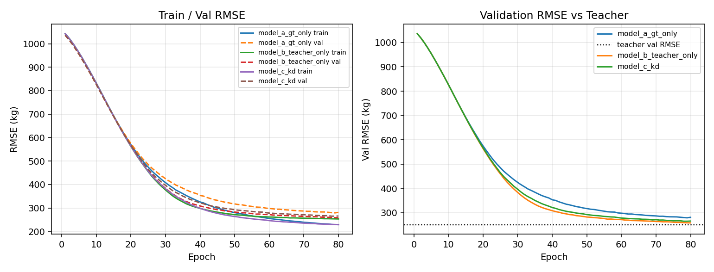

# MLP Student Distillation Report

**Stage:** AeroTwin Distillation - Step 2 (baseline MLP student)

Question: *Can a small neural network absorb the knowledge of the frozen AeroTwin R3 ensemble?*

The teacher distillation dataset is **frozen** and was not regenerated.

---

## Setup

| Item | Value |
|------|------:|
| Dataset | `distillation_dataset.parquet` |
| Samples | 119,032 |
| Flights | 10,000 |
| Raw features | 60 |
| Model input dim (after OHE + scale) | 587 |
| Train rows / Val rows | 95,465 / 23,567 |
| Val fraction (flight-level) | 0.2 |
| Seed | 42 |
| Device | `cuda` |
| Total wall time (A+B+C) | 22.8 min (1369s) |

### Architecture

```
Input (587)
  -> Linear -> ReLU -> LayerNorm -> Dropout
  -> Linear -> ReLU -> LayerNorm -> Dropout   # hidden = [1024, 512]
  -> Linear -> scalar (kg)
```

- Hidden dims: `[1024, 512]`
- Dropout: `0.1`
- Parameters: **1,130,497** (~1.13M)
- Optimizer: AdamW (lr=1e-3, weight_decay=1e-4)
- Scheduler: ReduceLROnPlateau on val RMSE
- Early stopping: patience on val RMSE
- KD weights (Model C): alpha=0.5, beta=0.5

### Preprocessing (train-fit only)

- Numeric: median impute + `StandardScaler`
- Categorical (`aircraft_type`, `method`, `origin_icao`, `destination_icao`): `OneHotEncoder`
- Split: Group by `flight_id` (80/20 train/val)

---

## Experiments

| Model | Loss |
|-------|------|
| A | MSE(student, ground_truth) |
| B | MSE(student, teacher_prediction) |
| C | 0.5·MSE(gt) + 0.5·MSE(teacher) |

---

## Final metrics

### Validation (primary)

| Model | Student RMSE | Student MAE | Bias | R² | Teacher RMSE | Student−Teacher gap | Student↔Teacher RMSE | Best epoch | Train time (s) |
|-------|-------------:|------------:|-----:|---:|-------------:|--------------------:|---------------------:|-----------:|---------------:|
| A | 279.00 | 86.40 | -10.58 | 0.9016 | 250.61 | +28.39 | 130.86 | 79 | 265 |
| B | 258.11 | 83.87 | -4.89 | 0.9158 | 250.61 | +7.51 | 78.24 | 80 | 379 |
| C | 264.97 | 82.94 | -1.46 | 0.9112 | 250.61 | +14.36 | 99.51 | 78 | 717 |

### Train set

| Model | Student RMSE | Teacher RMSE | Gap | R² |
|-------|-------------:|-------------:|----:|---:|
| A | 228.91 | 250.19 | -21.28 | 0.9346 |
| B | 253.01 | 250.19 | +2.83 | 0.9201 |
| C | 229.58 | 250.19 | -20.60 | 0.9342 |

### Learning curves



---

## Comparison and observations

1. **Teacher val RMSE** on this flight split is **250.61 kg** (train-OOF soft labels from the frozen R3 path; not Rank/Final).
2. **Best student vs ground truth** on val: **Model B** (RMSE 258.11 kg).
3. **Closest imitation of the teacher** (Student↔Teacher RMSE): **Model B** (78.24 kg).
4. **Teacher→Student RMSE gaps** (student_rmse − teacher_rmse): A +28.39, B +7.51, C +14.36 kg.

5. Model B (teacher-only) demonstrates that the MLP can **track the frozen teacher** soft labels; a lower Student↔Teacher RMSE than Model A supports knowledge absorption.
6. Model C improves over pure GT (A) but does not dominate teacher-only (B) — α/β may need tuning in a later step (not done here).

### Answer (this stage only)

**Yes, partially.** A ~1.1M MLP reaches val RMSE **258.1 kg** vs teacher **250.6 kg** (gap +7.5 kg) and can imitate the teacher (best Student↔Teacher RMSE 78.2 kg). It absorbs a large fraction of the ensemble signal under a simple tabular MLP, with remaining gap expected vs a 6-base GBDT + Ridge + P1E stack.

---

## Artifacts

| Kind | Path pattern |
|------|--------------|
| Checkpoints | `models/distillation/<run>/best_model.pt` |
| Metrics | `results/distillation/<run>/metrics.json` |
| Predictions | `results/distillation/<run>/predictions.parquet` |
| Curves | `results/distillation/<run>/training_curve.csv` |
| Logs | `logs/distillation/<run>/` |
| Comparison | `results/distillation/comparison.json` |

### Out of scope (intentionally)

- FT-Transformer / TabTransformer / Trajectory Transformer
- Multi-task heads, temperature scaling, hidden-state matching
- Feature ablations, architecture search, hyperparameter optimization

*Generated 2026-07-29 19:55:20*
