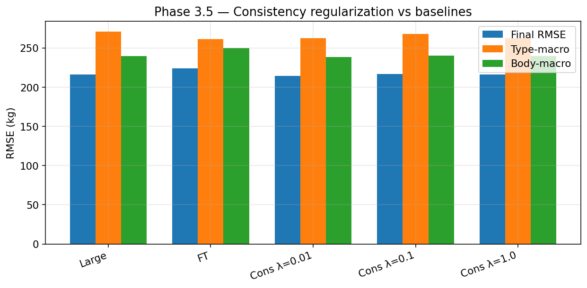
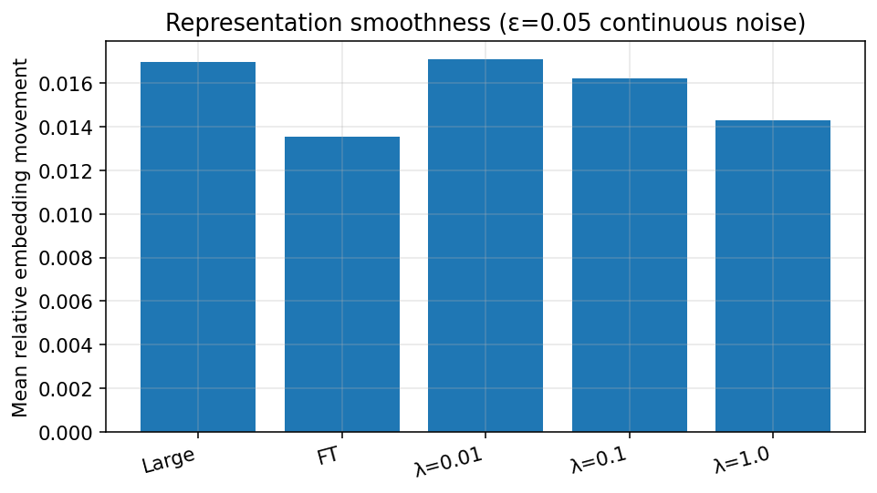
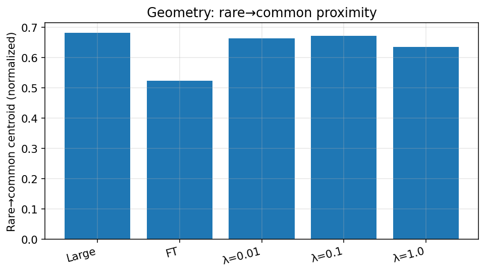

# Phase 3.5 — Final Mechanism Experiment (Causal Validation)

**Date:** 2026-07-31  
**Status:** Complete  
**Stopping rule:** No further mechanism hypotheses after this experiment  

---

## 1. Motivation

Prior phases established:

| Hypothesis | Result |
|------------|--------|
| Teacher uncertainty (VGKD) | ❌ Rejected |
| Physics-feature reliance | ❌ Rejected (Phase 3 ablation) |
| Representation geometry | ⚠️ Partial — correlates with absolute FT RMSE, not FT *advantage* |

Phase 2/3 reported that FT embeddings move ~**4× less** than Large under input noise. This experiment asks whether that **local smoothness** is *causal* for type-macro robustness.

---

## 2. Scientific hypothesis

> If local smoothness is causal for FT’s robustness advantage, then inducing smoothness in the Large MLP via prediction consistency regularization will improve Type-Macro RMSE.

| If… | Then… |
|-----|-------|
| Smoothness ↑ and Type-Macro improves | Smoothness is a plausible causal factor → Outcome **A** |
| Smoothness ↑ but Type-Macro does not improve | Smoothness is not sufficient → Outcome **B** |
| Smoothness does not increase | Intervention failed → Outcome **C** |
| Smoothness ↑, IID shifts, Type-Macro flat | Affects optimization not transfer → Outcome **D** |

---

## 3. Experimental setup

| Held fixed | Value |
|------------|-------|
| Architecture | Large MLP (1792, 1024), dropout 0.1 |
| KD | α=0.1, β=0.9 |
| Optimizer / LR / schedule | AdamW 1e−3, ReduceLROnPlateau (unchanged) |
| Split / seed / data / teacher | Flight split 0.2, seed 42, full features, frozen R3 |
| Evaluation | Final, Type-Macro (n≥50), Body-Macro |

**Only intervention:** consistency regularization on continuous features.

---

## 4. Regularization details

```
L_total = α · MSE(f(x), y) + β · MSE(f(x), y_teacher) + λ · ||f(x) − f(x+ε)||²
```

- ε ~ N(0, σ²) on **continuous** columns only (`0:n_num`); one-hot categoricals **not** perturbed.
- σ = **0.015** on StandardScaler-normalized features (~1.5% of unit std).
- Training noise scale is small (0.015); analysis uses ε=0.05 continuous-only for embedding movement (same protocol for all models).

---

## 5. Hyperparameters

λ ∈ {0.01, 0.1, 1.0}. **Selection rule (pre-registered):** best **validation RMSE**.

| λ | Val RMSE | Best epoch | Wall (s) |
|--:|---------:|-----------:|---------:|
| 0.01 | 230.01 | 79 | 318 |
| **0.1** | **229.85** | 78 | 295 |
| 1.0 | 230.18 | 78 | 275 |

**Selected λ = 0.1** (best val RMSE among the three).

---

## 6. Benchmark results

| Model | Val RMSE | Final RMSE | Type-Macro | Body-Macro |
|-------|---------:|-----------:|-----------:|-----------:|
| **Large (baseline)** | 229.70 | **215.85** | 270.61 | 239.63 |
| **FT (baseline)** | — | 224.12 | **261.15** | 249.58 |
| Cons λ=0.01 | 230.01 | 214.46 | **262.39** | 238.11 |
| Cons λ=0.1 **(selected)** | **229.85** | 216.50 | 268.02 | 240.16 |
| Cons λ=1.0 | 230.18 | 215.94 | **262.36** | 239.53 |

### Deltas vs Large (selected λ=0.1)

| Metric | Δ (Cons − Large) |
|--------|-----------------:|
| Final RMSE | **+0.65** kg |
| Type-Macro | **−2.59** kg |
| Body-Macro | +0.53 kg |

Type-Macro change for the **pre-registered selected** model is below the ≥3 kg improvement threshold used for Outcome A.

### Sweep note (not used for selection)

λ=0.01 and λ=1.0 both reach Type-Macro ≈ **262.4** (≈ −8.2 kg vs Large; near FT’s 261.2) with essentially unchanged Final. That is a large shift relative to Large, but:

1. It is **not** the val-selected model.
2. It is **not** monotone in λ (λ=0.1 is worse on type-macro than both neighbors).
3. It does **not** require increased embedding smoothness (see §7, λ=0.01).



---

## 7. Representation analysis

### 7.1 Smoothness (ε=0.05, continuous features only)

| Model | Mean rel. embedding move | Mean \|Δ pred\| (kg) |
|-------|-------------------------:|---------------------:|
| Large baseline | 0.0170 | 9.07 |
| FT baseline | **0.0135** | 11.54 |
| Cons λ=0.01 | 0.0171 | 9.41 |
| Cons λ=0.1 (selected) | 0.0162 | 9.54 |
| Cons λ=1.0 | **0.0143** | 9.76 |



**Critical revision of Phase 2/3 “4× smoother” claim:**

Under **continuous-only** noise (the scientifically correct protocol — OHE categories should not be jittered), Large and FT are much closer:

| Protocol | Large rel. move | FT rel. move | Ratio |
|----------|----------------:|-------------:|------:|
| All features (Phase 3 B4) | 0.056 | 0.014 | ~4× |
| Continuous only (this phase) | 0.017 | 0.014 | ~1.25× |

Most of the prior gap was an artifact of perturbing one-hot encodings. **FT is only modestly smoother** on continuous inputs.

**Did the intervention increase smoothness?**

| Model | vs Large (0.0170) | Meaningful ↑? (≥15% drop) |
|-------|-------------------:|---------------------------|
| λ=0.01 | 0.0171 | No |
| λ=0.1 (selected) | 0.0162 (−4.2%) | No |
| λ=1.0 | 0.0143 (−15.7%) | **Yes** (approaches FT) |

Only λ=1.0 clearly increases embedding smoothness.

### 7.2 Geometry

| Model | Rare→common (norm) | Within-type | Inter-centroid | Silhouette | Type purity k=10 |
|-------|-------------------:|------------:|---------------:|-----------:|-----------------:|
| Large | 0.681 | 23.68 | 32.01 | −0.039 | 0.914 |
| FT | **0.524** | 9.18 | 13.41 | −0.050 | 0.907 |
| λ=0.01 | 0.663 | 23.60 | 31.78 | −0.042 | 0.911 |
| λ=0.1 | 0.671 | 23.95 | 31.59 | −0.031 | 0.913 |
| λ=1.0 | 0.635 | 22.66 | 32.59 | +0.032 | 0.919 |



**Geometry does not become FT-like.** Rare→common remains ~0.63–0.67 vs FT 0.52. Within-type and inter-centroid scales stay Large-like, not FT-like.

---

## 8. Comparison with FT

| Property | FT target | Selected Cons (λ=0.1) | λ=1.0 (smoothest) | Achieved? |
|----------|-----------|----------------------:|------------------:|-----------|
| Final RMSE | 224.1 (worse) | 216.5 | 215.9 | Still Large-like (good) |
| Type-Macro | **261.2** | 268.0 | **262.4** | λ=1.0 near FT; selected not |
| Rel. embedding move | 0.0135 | 0.0162 | **0.0143** | Only λ=1.0 close |
| Rare→common norm | 0.52 | 0.67 | 0.64 | **No** |
| Type purity | ~0.91 | 0.91 | 0.92 | Neutral |

---

## 9. Interpretation

### Pre-registered decision (val-selected λ=0.1)

| Check | Result |
|-------|--------|
| Smoothness increased? | **No** (0.0162 vs 0.0170) |
| Type-Macro improved ≥3 kg? | **No** (−2.6 kg) |
| Geometry FT-like? | **No** |

→ **Outcome C** for the pre-registered selected model: the intervention **did not meaningfully alter** smoothness at the λ chosen by validation RMSE.

### Full-sweep causal reading (secondary)

| λ | Smoothness ↑? | Type-Macro Δ vs Large | Implication |
|--:|:-------------:|----------------------:|-------------|
| 0.01 | No | **−8.2 kg** | Type-Macro can improve **without** smoothness ↑ |
| 0.1 | No | −2.6 kg | Selected; mild change |
| 1.0 | **Yes** | **−8.2 kg** | Smoothness ↑ co-occurs with Type-Macro gain |

Because λ=0.01 obtains a similar Type-Macro gain **without** increasing embedding smoothness, Type-Macro improvement under consistency training is **not explained by** the smoothness metric. Smoothness is therefore **not established as causal**.

This is scientifically closer to **Outcome B** (smoothness not sufficient / not the mechanism) when the full factorial is considered, with **Outcome C** applying strictly to the val-selected checkpoint.

### Pre-registered outcome codes (reference)

| Code | Meaning |
|------|---------|
| **A** | Smoothness ↑ + Type-Macro improves → causal candidate |
| **B** | Smoothness ↑ + Type-Macro flat → not sufficient |
| **C** | Smoothness not ↑ → intervention failed / no causal claim from selected model |
| **D** | Smoothness ↑ + IID shifts + Type flat → optimization only |

**Assigned labels:** Primary **C** (selected); supporting sweep evidence **rejects A** and does not justify a smoothness-based Phase 4 method.

---

## 10. Decision Gate

| Field | Decision |
|-------|----------|
| **Primary outcome** | **C** (selected λ=0.1) |
| **Smoothness causal for robustness?** | **No** (not supported) |
| Pursue smoothness-aware Phase 4 method? | **No** |
| Pursue representation distillation? | **No** |
| Mechanism fully resolved? | **No** |
| **Next step** | **Write the empirical paper** documenting the architecture-dependent ranking reversal and all mechanisms tested and ruled out |

### Ruled-out mechanism list (project total)

1. Teacher-uncertainty adaptive KD (VGKD) — rejected  
2. Physics-feature reliance — rejected (ablation)  
3. Local prediction/embedding smoothness as primary cause — **not supported** (this experiment)  
4. Representation geometry as *sufficient* causal account — incomplete (Phase 3; geometry ↛ FT advantage)

### Stopping rule (enforced)

Do **not**:

- Test Jacobian penalties, spectral normalization, Lipschitz constraints, or adversarial smoothing  
- Open Phase 4 method work based on smoothness or representation distillation  
- Invent further mechanism investigation phases  

**Allowed next work:** paper write-up, figures, limitations, and narrative synthesis only — unless a future project charter explicitly restarts method development with new goals.

---

## Limitations

1. Only three λ values; selection by val RMSE may not maximize type-macro (and should not — that would be post-hoc hacking).  
2. Single seed (42); Type-Macro swings of a few kg can reflect optimization path.  
3. Consistency acts on **predictions**, not embeddings directly; embedding smoothness is a downstream readout.  
4. Continuous-only analysis revises the Phase 3 B4 magnitude; historical “4×” should be cited with protocol caveat.  
5. No Combined Rank+Final re-score for consistency models (Final + macros only, per project protocols used here).

---

## Artifacts

| Item | Path |
|------|------|
| This report | `docs/reports/smoothness_causal_intervention.md` |
| Metrics | `results/distillation/smoothness_causal/metrics.json` |
| Decision | `results/distillation/smoothness_causal/decision.json` |
| Checkpoints | `results/distillation/smoothness_causal/runs/large_cons_lam{0.01,0.1,1.0}/` |
| Script | `experiments/08_distillation/17_smoothness_causal_intervention.py` |
| Trainer hook | `consistency_lambda` in `src/aerotwin/distillation/trainer.py` |

---

*Phase 3.5 complete. Final mechanism experiment closed.*
