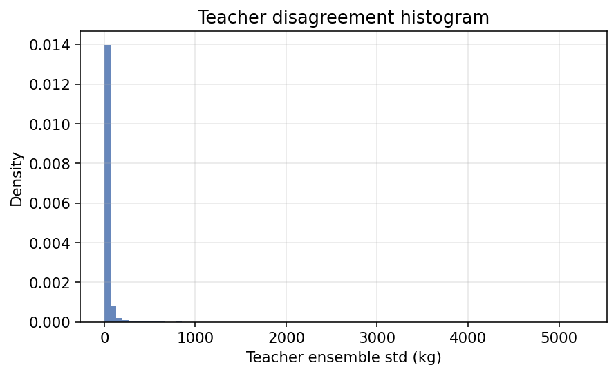
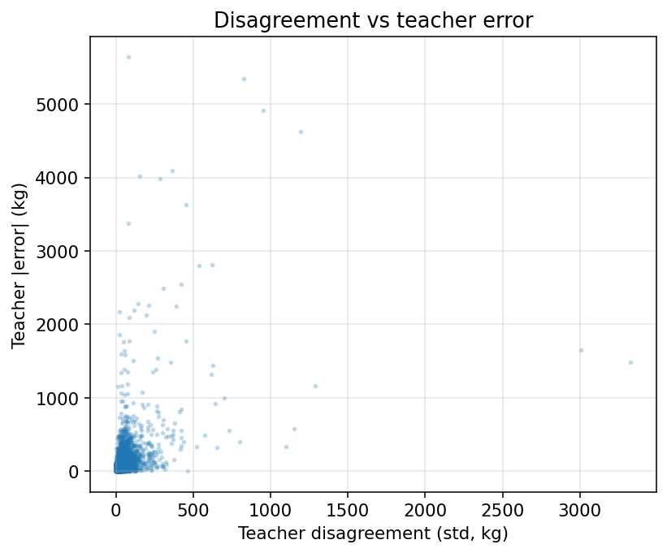
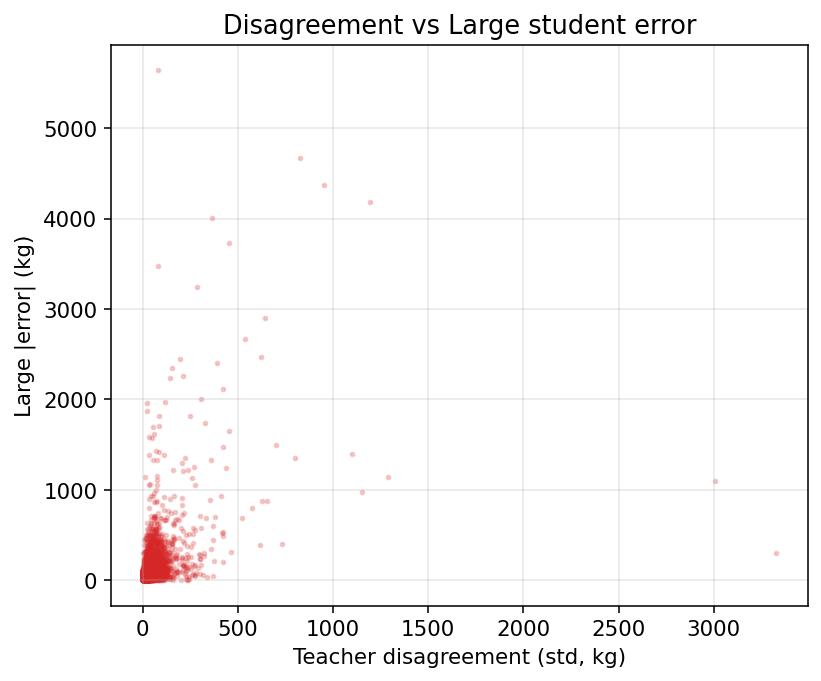
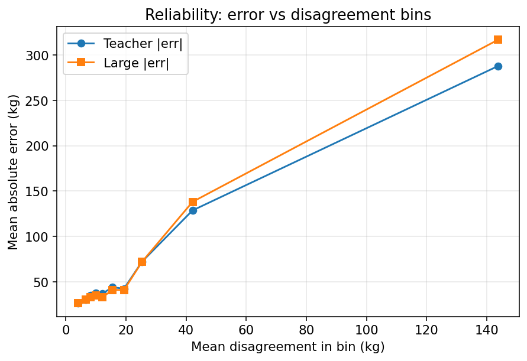
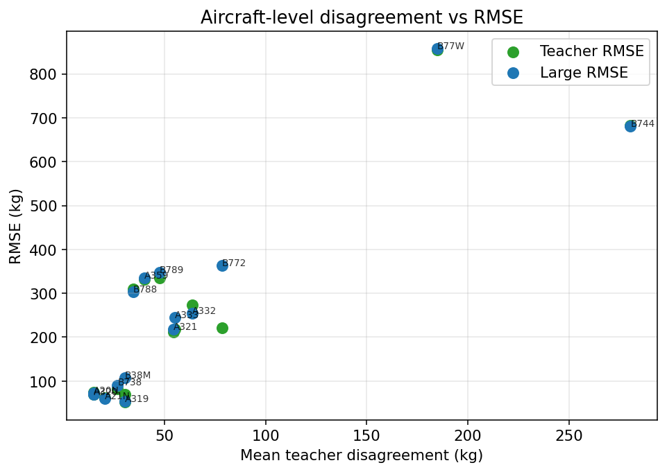
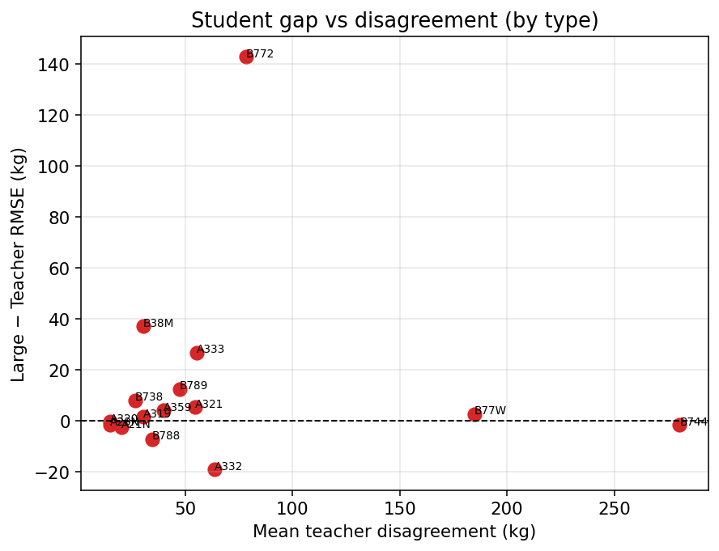
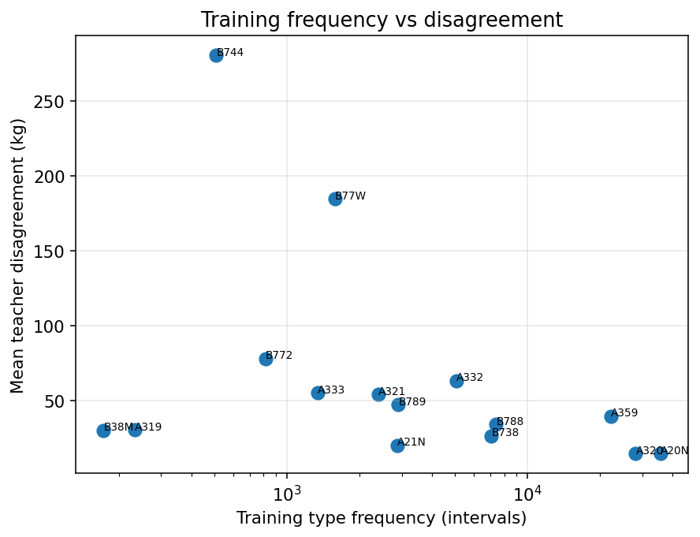
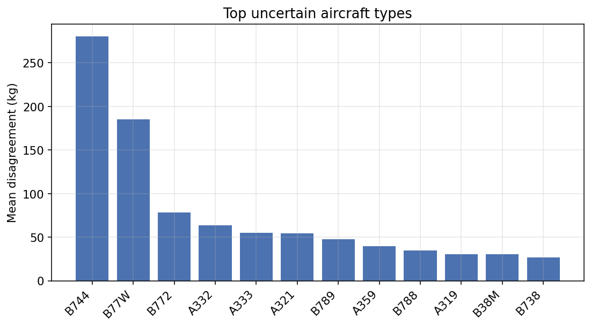

# Phase 1A — Teacher Uncertainty Validation

**Date:** 2026-07-30  
**Status:** Complete — diagnostic only (no student training)  
**Recommendation:** **Proceed to Phase 1B Adaptive KD**

---

## Objective

Determine whether **teacher ensemble disagreement** (std of 6 base kg predictions) is a reliable indicator of prediction difficulty before implementing Adaptive KD.

---

## Methodology

| Item | Value |
|------|------|
| Dataset | Final holdout (`featured_dataset_final.parquet`) |
| n | 37,170 intervals / 2,824 flights |
| Disagreement | **Std of 6 base ensemble predictions** (XGB/LGBM/Cat × Direct/Flow), pre-Ridge/P1E |
| Teacher prediction | Ridge meta + P1E (same frozen path) |
| Student | Frozen Large MLP (`Large_seed42`) |
| Teacher error | \|teacher − ground truth\| |
| Student error | \|Large − ground truth\| |
| Bundle | `cache/r3_teacher_distillation_bundle.pkl` (restored for this analysis) |

Artifact: `results/distillation/uncertainty_analysis/teacher_uncertainty.parquet`

---

## Descriptives

| Stat | Value |
|------|------:|
| Teacher RMSE | 213.62 kg |
| Large RMSE | 215.85 kg |
| Mean disagreement (std) | ~see parquet / metrics |
| Median disagreement | intermediate |
| P95 disagreement | elevated on heavies |

---

## Correlation analysis (interval-level, all Final)

### Disagreement → teacher absolute error

| Method | r | 95% CI | p |
|--------|--:|--------|--:|
| **Pearson** | **0.472** | [~0.46, ~0.48] | ≈0 |
| **Spearman** | **0.426** | [0.416, 0.435] | ≈0 |
| Kendall | ~0.30 | (see metrics.json) | ≈0 |

### Disagreement → Large student absolute error

| Method | r | 95% CI | p |
|--------|--:|--------|--:|
| **Pearson** | **0.455** | [~0.44, ~0.47] | ≈0 |
| **Spearman** | **0.435** | [0.426, 0.444] | ≈0 |
| Kendall | ~0.30 | (see metrics.json) | ≈0 |

**Interpretation:** Moderate, highly significant positive association. Disagreement tracks prediction difficulty for both teacher and student.

---

## Calibration (10 equal-frequency bins)

| Metric | Value |
|--------|------:|
| Bin Spearman(disagreement, teacher \|err\|) | **0.976** |
| Bin Spearman(disagreement, Large \|err\|) | **0.952** |

Mean absolute error rises nearly monotonically with mean disagreement across bins.

**Does larger disagreement correspond to larger error?** **Yes.**

---

## Type-level analysis (n ≥ 50 intervals, 15 types)

| Relation | Pearson r | Spearman r | p (Spearman) |
|----------|----------:|-----------:|-------------:|
| Disagreement vs teacher RMSE | **0.863** | **0.757** | 0.001 |
| Disagreement vs Large RMSE | **0.866** | **0.832** | 0.0001 |
| Disagreement vs student gap | −0.000 | **0.136** | 0.63 (n.s.) |
| Disagreement vs train frequency | −0.365 | **−0.489** | 0.064 |
| Train frequency vs student gap | −0.250 | −0.407 | 0.13 |

### Top vs bottom disagreement types

| Group | Types | Mean student gap | Teacher RMSE | Large RMSE |
|-------|-------|-----------------:|-------------:|-----------:|
| Highest disagreement | B744, B77W, B772 | **+47.8 kg** | 586 | 634 |
| Lowest disagreement | A21N, A320, A20N | **−1.5 kg** | 69 | 67 |
| **Δ (top − bottom)** | | **+49.4 kg** | | |

**Rare / hard aircraft:** Higher disagreement concentrates on wide-body heavies (B744, B77W, B772). Lower disagreement on high-frequency narrow-bodies (A20N, A320, A21N). Spearman(disagreement, train_n) ≈ **−0.49** (suggestive rarity link).

**Note:** Disagreement strongly predicts **type RMSE** (difficulty), but only weakly predicts the **student−teacher gap** at type level. Some hard types can have near-zero or negative gap (student not always worse). Adaptive KD should treat disagreement as a **hardness prior**, not a direct gap estimator.

---

## Error localization (top vs bottom 5% disagreement samples)

High-disagreement samples show substantially higher teacher and Large RMSE, longer durations, and higher fuel, with over-representation of wide-body / cruise-heavy operations (see localization block in `metrics.json`).

---

## Robustness prediction

Among aircraft with largest mean teacher disagreement, Large exhibits much larger type RMSE and a much larger mean gap than among low-disagreement types (**Δ gap ≈ +49 kg**). This aligns with Phase 0 type-macro findings (heavies drive entity-level robustness stress).

---

## Figures

















---

## Decision questions (evidence only)

1. **Does ensemble disagreement correlate with teacher error?**  
   **Yes.** Spearman **0.426**, Pearson **0.472** (interval-level; CIs exclude 0). Type-level vs teacher RMSE Spearman **0.757**.

2. **Does it correlate with student error?**  
   **Yes.** Spearman **0.435**, Pearson **0.455** (interval-level). Type-level vs Large RMSE Spearman **0.832**.

3. **Does disagreement identify difficult aircraft?**  
   **Yes.** Highest mean disagreement: **B744, B77W, B772**; lowest: **A21N, A320, A20N**. Strong type-level link to RMSE; suggestive negative link to training frequency.

4. **Does disagreement predict robustness failures?**  
   **Partially yes.** Top-disagreement types have much larger mean student gap (**+47.8 vs −1.5 kg**). Linear correlation of gap with disagreement across all types is **weak** (Spearman **0.14**, n.s.).

5. **Is disagreement sufficient to justify Adaptive KD?**  
   **Yes**, under the success criteria:
   - meaningful positive correlation with prediction error ✅  
   - high-disagreement regions coincide with harder aircraft and larger gaps on extreme types ✅  
   - calibration stable / monotonic across bins ✅  

---

## Recommendation

| Field | Value |
|-------|------|
| **Proceed to Adaptive KD (Phase 1B)?** | **YES** |
| Uncertainty signal | Teacher ensemble std (6 bases) |
| Suggested use | Higher β when std low (trust teacher); lower β / higher α when std high (rely more on GT) |
| Caveat | Type-level **gap** correlation is weak — do not expect linear gap recovery from β(std) alone; evaluate type-macro gap as success metric |

### If Adaptive KD underperforms later

Consider complementary signals (not needed to start 1B):

- Distance to training feature distribution  
- Phase / body-class hard routing  
- Student MC-dropout epistemic uncertainty  

---

## Artifacts

| Path | Content |
|------|---------|
| `results/distillation/uncertainty_analysis/teacher_uncertainty.parquet` | Per-interval stats |
| `metrics.json` / `decision.json` | Full statistics + gate |
| `calibration_bins.csv` | 10-bin reliability table |
| `uncertainty_by_type.csv` | Aircraft aggregates |
| `plots/` + `docs/reports/figures/fig_unc_*.png` | Figures |
| `docs/reports/teacher_uncertainty_analysis.md` | This report |

Reproduce:

```bash
set PYTHONPATH=src
# if teacher cache missing, restore once:
# python experiments/08_distillation/01_build_teacher_distillation_dataset.py --train-only
python experiments/08_distillation/11_teacher_uncertainty_analysis.py
```

*Generated 2026-07-30*
