# Official Held-Out Final Test Evaluation — Distilled MLP Baseline

**Stage:** AeroTwin Distillation Step 5 (evaluation only)  
**Date:** 2026-07-30  
**Status:** Complete — permanent MLP held-out baseline established

Frozen Step-4 checkpoints. **No training, no hyperparameter changes, no preprocessing refits of model weights.**  
Training KD weights were **α=0.1, β=0.9**.

---

## Methodology

| Item | Value |
|------|------:|
| Test features | `featured_dataset_final.parquet` (from `fuel_final.parquet`) |
| Test rows / flights | **37,170** / **2,824** |
| Models | Large_seed42, XLarge_seed42 (α=0.1, β=0.9) |
| Preprocessing | Train-fitted StandardScaler + OHE (`DistillationData`, seed 42, 20% flight val); **transform-only** on Final |
| Input dimension | 582 (matches training) |
| Inference | Checkpoint `model_state_dict` load; batch size 4096; no fine-tune |
| Teacher comparison | Frozen R3 ensemble cache (`cache/r3_teacher_distillation_bundle.pkl`) |
| Script | `experiments/08_distillation/05_test_evaluation.py` |

This is **strictly evaluation**. Checkpoints under `results/distillation/capacity_scaling/runs/{Large,XLarge}_seed42/` were loaded as saved.

---

## Models evaluated

| Model | Params | Hidden dims | Checkpoint |
|-------|-------:|-------------|------------|
| Large | 2,887,425 | (1792, 1024) | `results/distillation/capacity_scaling/runs/Large_seed42/best_model.pt` |
| XLarge | 6,748,673 | (2560, 2048) | `results/distillation/capacity_scaling/runs/XLarge_seed42/best_model.pt` |

---

## Dataset summary

| Quantity | Value |
|----------|------:|
| Featured Final rows | 37,170 |
| Unique flights | 2,824 |
| Mean ground-truth fuel | 414.23 kg |
| Ground-truth variance | 597,633 |
| Feature engineering | Same pipeline as distillation training (no regeneration during eval) |

---

## Overall metrics (Final test)

| Model | Params | RMSE | MAE | Bias | R² | MAPE % | P95 \|err\| | Max \|err\| |
|-------|-------:|-----:|----:|-----:|---:|-------:|----------:|----------:|
| **Large** | 2,887,425 | **215.85** | **76.69** | +5.25 | **0.9220** | 39.43 | 280.69 | 6,154 |
| XLarge | 6,748,673 | 218.59 | 77.36 | +6.41 | 0.9201 | 38.71 | 279.45 | 6,466 |

### Residual / prediction statistics

| Model | Mean res | Median res | Std res | Mean pred | Mean truth | Var pred | Var truth | % over | % under |
|-------|---------:|-----------:|--------:|----------:|-----------:|---------:|---------:|-------:|--------:|
| Large | +5.25 | +7.24 | 215.79 | 419.48 | 414.23 | 561,078 | 597,633 | 60.4 | 39.6 |
| XLarge | +6.41 | +5.92 | 218.49 | 420.64 | 414.23 | 575,542 | 597,633 | 59.0 | 41.0 |

MAPE is high relative to RMSE because many short intervals have small absolute fuel (denominator effect). Prefer RMSE/MAE for primary comparison.

---

## Validation vs Test comparison

| Model | Val RMSE | Test RMSE | Gap (test − val) | % change |
|-------|---------:|----------:|-----------------:|---------:|
| Large | 229.70 | **215.85** | **−13.85** | **−6.0%** |
| XLarge | 228.14 | 218.59 | −9.55 | −4.2% |

- Validation ranking: **XLarge** better (−1.56 kg vs Large)
- Test ranking: **Large** better (−2.73 kg vs XLarge)
- Ranking consistent: **No** (reversed on held-out)
- Neither model shows a positive generalization gap (test worse than val). Both **improved** on Final relative to the internal flight holdout used during capacity scaling.

Interpretation: the internal val set was a harder flight sample than Final; there is **no evidence of classical overfitting** (val ≪ train / test ≫ val). The small val advantage of XLarge did **not** transfer to Final.

---

## Generalization analysis

| Question | Evidence |
|----------|----------|
| Did ranking Large vs XLarge stay the same? | **No.** Val: XLarge; Test: Large. |
| Did XLarge justify +~3.9M parameters? | **No on Final.** Test RMSE +2.73 kg worse; +2× CPU latency; +2.3× model size. |
| Did either model overfit? | **No evidence.** Test RMSE better than val for both. |
| How close is Large to the frozen teacher on Final? | Teacher Final RMSE **213.62** vs Large **215.85** → **+2.23 kg** student gap. |

---

## Aircraft breakdown (Final test)

Primary table: `results/distillation/test_evaluation/metrics_by_aircraft.csv`

### Easiest aircraft (XLarge RMSE)

| Type | n | Large RMSE | XLarge RMSE |
|------|--:|-----------:|------------:|
| A21N | 792 | 59.7 | **54.7** |
| A319 | 221 | **53.5** | 55.5 |
| A320 | 7,948 | 70.0 | **68.3** |
| A20N | 17,056 | 72.1 | **71.3** |
| B738 | 1,266 | 91.0 | **85.2** |

### Hardest aircraft (XLarge RMSE)

| Type | n | Large RMSE | XLarge RMSE |
|------|--:|-----------:|------------:|
| **B77W** | 713 | **857.2** | 861.4 |
| **B744** | 334 | **680.2** | 712.1 |
| B772 | 122 | **363.7** | 400.1 |
| B789 | 805 | **347.9** | 354.5 |
| A359 | 5,545 | **335.4** | 338.1 |

Narrow-body types remain easy (RMSE ~55–90 kg). Heavy wide-bodies dominate residual error. On most hard types, **Large is equal or better** than XLarge on Final.

---

## Phase breakdown

| Phase | n | Large RMSE | XLarge RMSE |
|-------|--:|-----------:|------------:|
| Descent | 5,658 | **115.9** | 119.2 |
| Climb | 4,216 | 166.8 | **166.0** |
| Cruise | 27,296 | **237.4** | 240.5 |

Cruise dominates both sample count and absolute error mass.

---

## Duration breakdown

| Duration bin | n | Large RMSE | XLarge RMSE |
|--------------|--:|-----------:|------------:|
| short &lt;2h | 1,046 | 109.2 | **106.7** |
| medium 2–5h | 19,457 | 87.6 | **86.7** |
| long 5–8h | 8,147 | **92.3** | 95.3 |
| ultralong ≥8h | 8,520 | **419.7** | 425.7 |

Ultra-long-haul intervals are the dominant duration failure mode (~4–5× medium-haul RMSE).

---

## Error analysis

Automated case lists: `results/distillation/test_evaluation/case_analysis.json`.

| Category | Finding |
|----------|---------|
| Top failures | Extreme absolute errors on long/heavy intervals (max \|err\| ~6–6.5 t) |
| Both models fail (\|err\|&gt;500) | **1.82%** of intervals |
| Overprediction tendency | Large ~60% over; mild positive bias (+5–6 kg) |
| Easiest types | A21N, A319, A320, A20N, B738 |
| Hardest types | B77W, B744, B772, B789, A359 |
| Longest / highest-fuel | Ultra-long and high-fuel bins drive RMSE (see duration/fuel figures) |

---

## Large vs XLarge comparison

| Metric | Value |
|--------|------:|
| Mean \|err\| delta (XLarge − Large) | **+0.67 kg** (Large better on average) |
| Fraction XLarge better by &gt;1 kg | 40.8% |
| Fraction Large better by &gt;1 kg | **43.1%** |
| Max XLarge improvement | 813 kg |
| Max XLarge regression | 940 kg |
| Test RMSE delta (XLarge − Large) | **+2.73 kg** |
| Both fail \|err\|&gt;500 | 1.82% |

**Conclusion:** Extra capacity helps some individual intervals but **does not deliver a consistent Final-test benefit**. Benefits are not systematic by aircraft family in a way that would justify deploying XLarge as the official baseline.

**Deployment recommendation: Large (~3M).**

---

## Baseline comparison (Final held-out)

| Model | Parameters | RMSE | MAE | Bias | R² | CPU latency | Model size | Status |
|-------|------------|-----:|----:|-----:|---:|-------------|------------|--------|
| **Large MLP** | 2.89M | **215.85** | 76.69 | +5.25 | 0.9220 | **0.26 ms** | 11.0 MB | evaluated |
| XLarge MLP | 6.75M | 218.59 | 77.36 | +6.41 | 0.9201 | 0.52 ms | 25.7 MB | evaluated |
| R3 Teacher | ensemble | **213.62** | 74.14 | +4.87 | 0.9236 | ~52 ms (Step 4) | 16.8 MB | evaluated |
| OpenAP baseline | — | 1,315.65 | 485.40 | +465.51 | −1.90 | n/a | n/a | evaluated |
| Best LightGBM (standalone) | n/a | — | — | — | — | — | — | unavailable |

### Teacher metric protocol note (audit-verified)

Project docs also cite teacher **Combined RMSE ≈ 221.33 kg**. That is **not** a contradiction with **213.62**:

| Protocol | Teacher RMSE | Meaning |
|----------|-------------:|---------|
| **Combined** (Rank + Final) | **221.33** | Official PRC-style aggregate (`r3_ensemble_summary.json`) |
| **Final-only** (official R3 run) | **213.73** | Final component of that same run |
| **Final held-out** (Step 5 / audit, `featured_dataset_final`) | **213.62** | Same frozen distillation bundle; student-comparable |

Teacher audit (reproducible, no training): `docs/reports/teacher_evaluation_report.md` · `results/distillation/teacher_audit/`.

Student–teacher Final gap (Large): **+2.23 kg RMSE** at **~200×** lower single-sample CPU latency.

---

## Calibration analysis

Publication figures (also under `results/distillation/test_evaluation/plots/`):

| Plot | Path |
|------|------|
| Prediction vs ground truth | `figures/fig_test_pred_vs_truth.png` |
| Residual histogram | `figures/fig_test_residual_hist.png` |
| Residual distribution | `figures/fig_test_residual_distribution.png` |
| Residual vs truth | `figures/fig_test_residual_vs_truth.png` |
| QQ residuals | `figures/fig_test_residual_qq.png` |
| Calibration curve | `figures/fig_test_calibration.png` |
| Absolute error hist | `figures/fig_test_abs_error_hist.png` |
| Error by aircraft | `figures/fig_test_error_by_aircraft.png` |
| Error by duration | `figures/fig_test_error_by_duration.png` |
| Error by fuel | `figures/fig_test_error_by_fuel.png` |
| Large vs XLarge | `figures/fig_test_large_vs_xlarge.png` |
| Val vs test | `figures/fig_test_val_vs_test.png` |
| Generalization gap | `figures/fig_test_generalization_gap.png` |
| Top failures | `figures/fig_test_top_failures.png` |

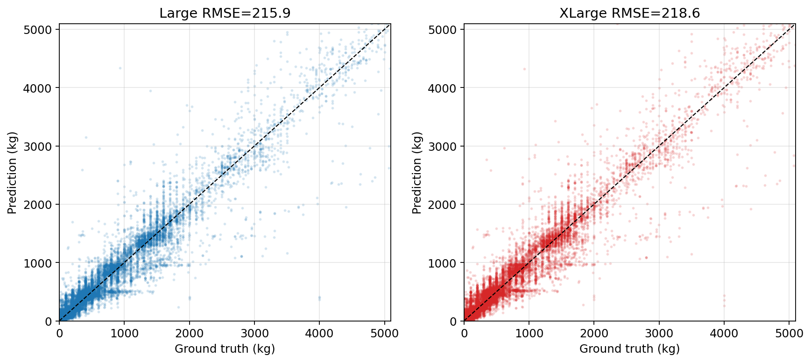

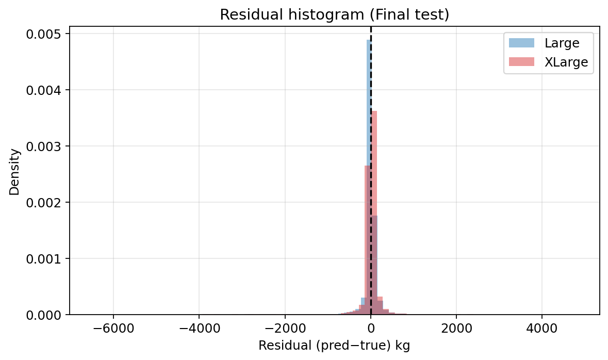

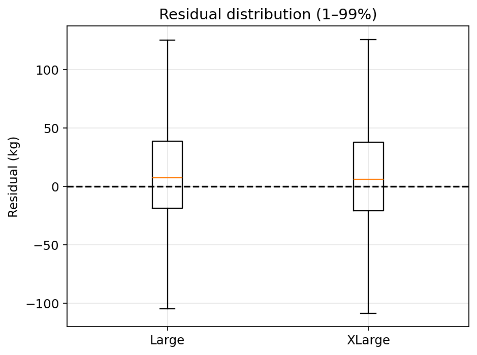

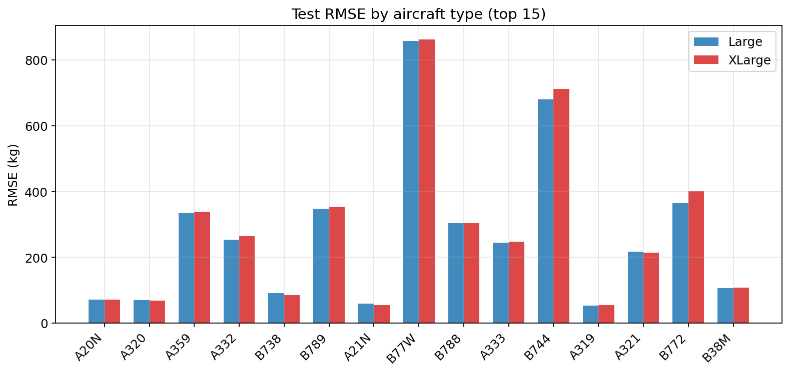

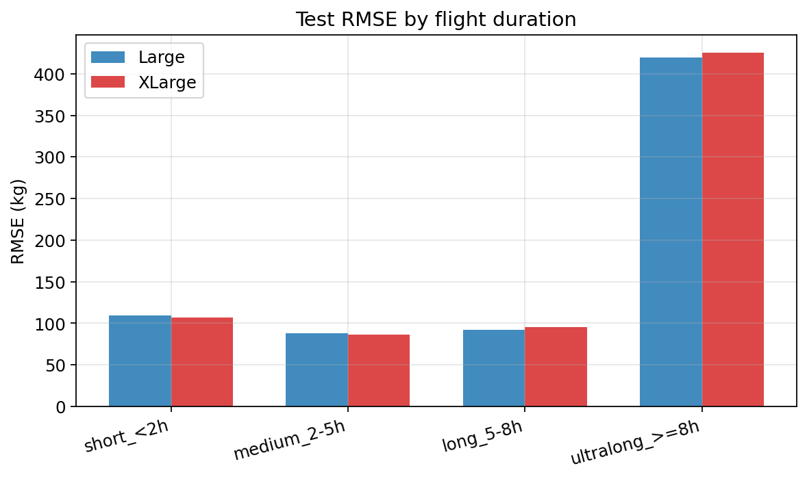

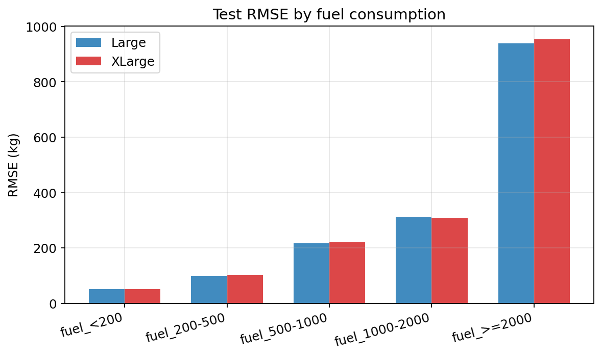

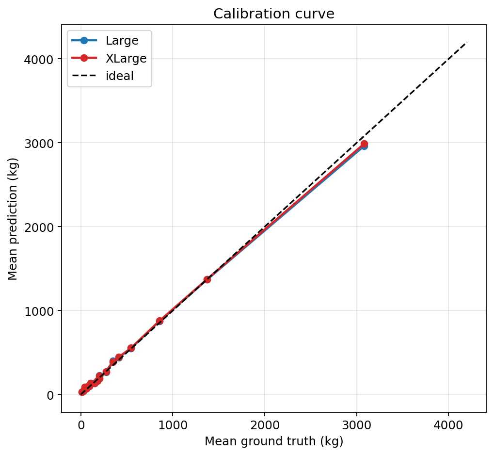

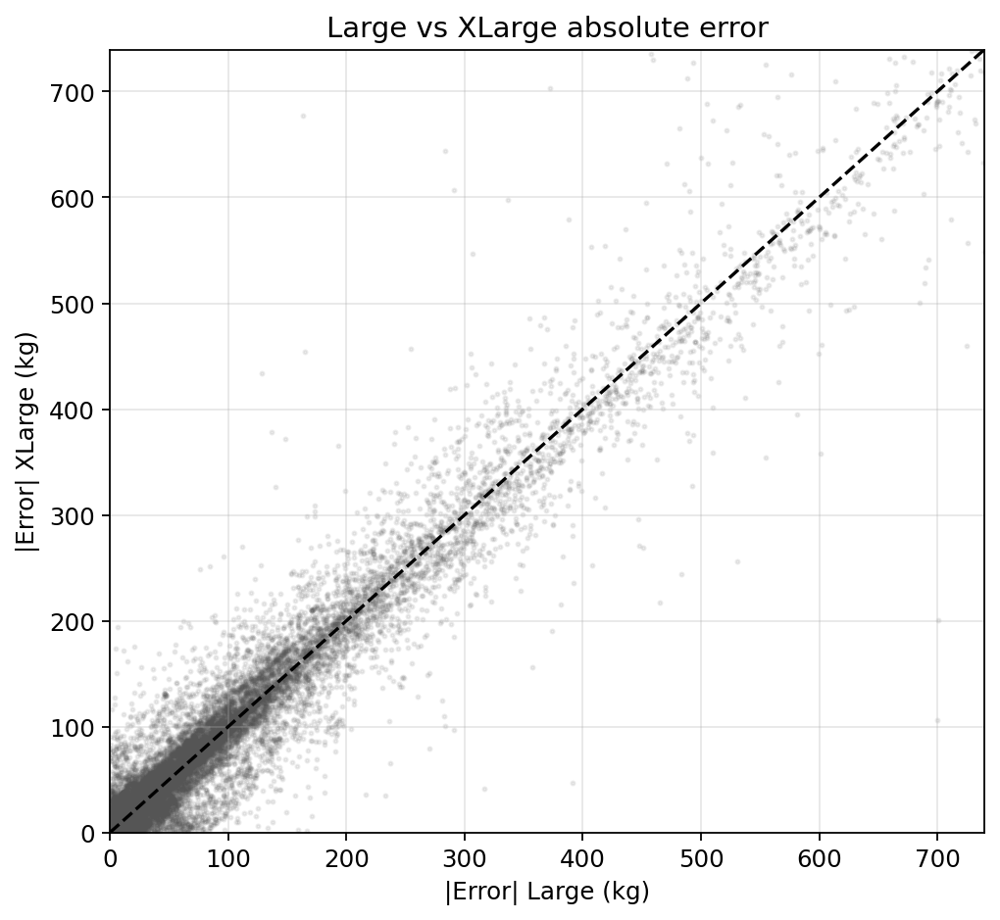

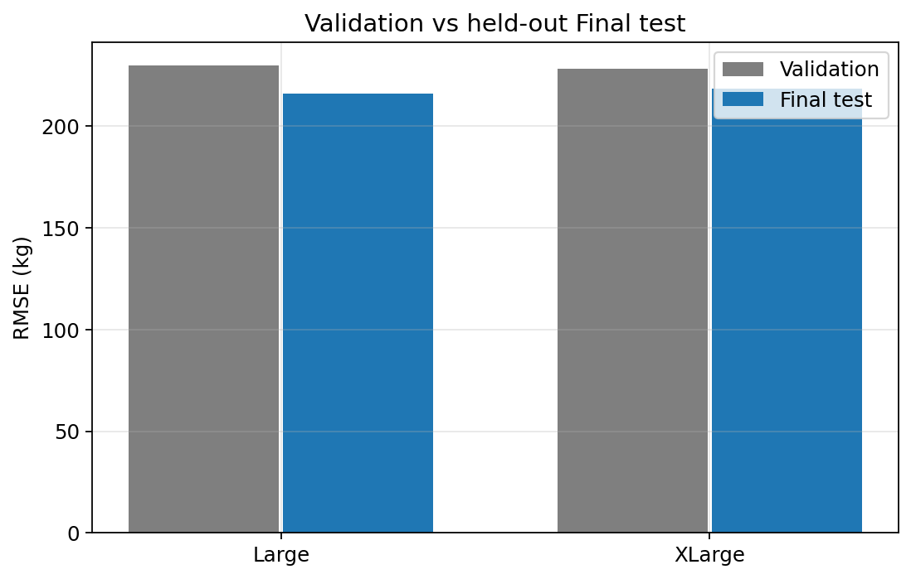

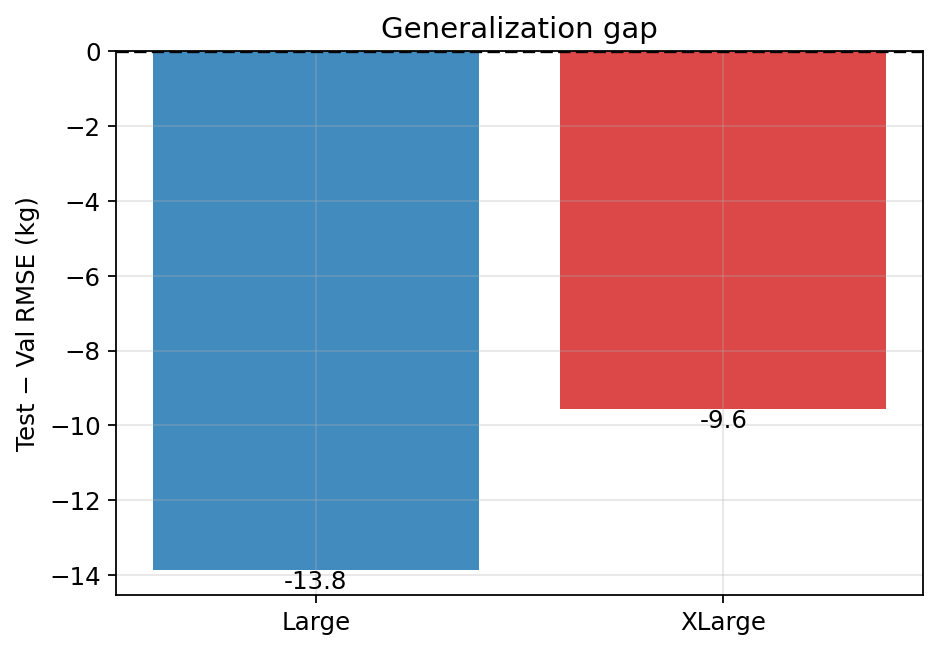

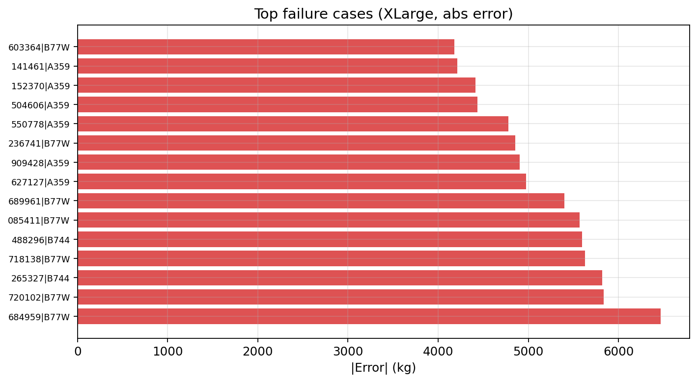

---

## Deployment considerations

| Factor | Large | XLarge |
|--------|------:|-------:|
| Final test RMSE | **215.85** | 218.59 |
| Params | 2.89M | 6.75M |
| Checkpoint size | 11.0 MB | 25.7 MB |
| CPU ms / sample | **0.26** | 0.52 |
| Distance to R3 teacher (Final) | +2.23 kg | +4.96 kg |

**Official deployment / baseline student: Large MLP (~3M, α=0.1, β=0.9).**

---

## Reproducibility

See `results/distillation/test_evaluation/evaluation_metadata.json` for:

- Checkpoint paths + partial SHA-256
- Featured Final path + checksum tag
- Git commit (if available)
- Evaluation UTC timestamp
- Python / package versions
- Wall-clock duration

Reproduce:

```bash
set PYTHONPATH=src
python experiments/08_distillation/05_test_evaluation.py --final-featured featured_dataset_final.parquet
```

---

## Final conclusions (evidence only)

1. **Official AeroTwin MLP baseline:** **Large** (~2.89M, α=0.1, β=0.9). Final test RMSE **215.85 kg**, better than XLarge (218.59).

2. **Does XLarge justify extra parameters?** **No.** On Final it is **+2.73 kg** worse RMSE, roughly **2×** CPU latency, and **2.3×** disk size, with only 40.8% of intervals improved by &gt;1 kg abs error.

3. **Generalization gap (val → test):** Large **−13.85 kg (−6.0%)**; XLarge **−9.55 kg (−4.2%)**. Negative gap = test better than internal val; **no overfitting signal**.

4. **Dominant remaining failure modes:** Ultra-long flights (≥8 h, RMSE ~420 kg), cruise phase bulk error, extreme absolute outliers (max \|err\| multi-tonne), mild positive bias.

5. **Challenging aircraft categories:** **B77W, B744, B772, B789, A359** (heavy / long-haul families). Narrow-bodies (A20N/A320/A21N/A319/B738) remain easy.

6. **Strong enough as future baseline?** **Yes.** Large is within **~2.2 kg** of the frozen R3 teacher on Final while remaining ~**200×** faster on single-sample CPU. These frozen Final metrics are the permanent MLP reference for FT-Transformer / TabTransformer comparisons.

7. **Most promising next directions (from results so far):**
   - Architecture change (FT-Transformer / TabTransformer) under **fixed α=0.1 / β=0.9**, starting near **Large (~3M)** capacity.
   - Hard-subgroup focus (heavies, ultra-long, cruise SSE) rather than more MLP width.
   - Optional Rank featured evaluation for Combined-score student reporting.
   - Do **not** invest further in MLP width beyond Large without subgroup-specific gains.

---

## Artifacts

`results/distillation/test_evaluation/`:

| File | Description |
|------|-------------|
| `metrics.json` | Full metrics + generalization + pairwise |
| `comparison_table.csv` | Baseline comparison table |
| `predictions_large.parquet` / `predictions_xlarge.parquet` | Per-interval predictions |
| `residuals_large.parquet` / `residuals_xlarge.parquet` | Residual tables |
| `metrics_by_aircraft.csv` | Aircraft breakdown |
| `metrics_by_phase.csv` | Phase breakdown |
| `metrics_by_duration.csv` | Duration breakdown |
| `case_analysis.json` | Top best/worst / over/under cases |
| `evaluation_metadata.json` | Reproducibility metadata |
| `plots/` | All evaluation figures |

*Generated 2026-07-30 05:46:36 · evaluation-only milestone*
