# Phase 2 — Understanding Transformer Robustness

**Date:** 2026-07-31
**Status:** Analysis only — no training; frozen Large MLP + FT-Transformer + Teacher

## Central question

Why does architecture ranking reverse?

| Protocol | Ranking |
|----------|---------|
| Flight Holdout | Teacher > Large MLP > XLarge > FT |
| Type-macro | Teacher > **FT** > Large MLP > XLarge |

---

## Overall metrics (this re-run on Final)

| Model | Final RMSE | Type-macro | Body-macro |
|-------|-----------:|-----------:|-----------:|
| Large MLP | 215.85 | 270.61 | 239.63 |
| FT-Transformer | 224.12 | 261.15 | 249.58 |

Fraction of intervals with lower |error| for FT: **0.514**

Mean |err| FT − Large: overall **-2.52**, rare **-16.55**, common **-2.47**, heavy **-11.49**, narrow **+0.57**

---

## Study A — Representation geometry

| Metric | Large MLP | FT-Transformer |
|--------|----------:|---------------:|
| Silhouette (type) | 0.0375 | -0.0141 |
| Davies–Bouldin (↓ better) | 4.8309 | 5.1902 |
| Mean intra-type dist | 35.1882 | 14.0303 |
| Mean inter-type dist | 44.6179 | 18.3604 |
| Inter/intra ratio | 1.2680 | 1.3086 |
| Local type consistency (5-NN) | 0.9407 | 0.9368 |
| Mean dist (rare → common centroids) | 21.7952 | 7.0180 |
| PCA var explained (PC1, PC2) | [0.6377311746142104, 0.1279358537151526] | [0.7030922452317864, 0.2422722218219421] |

Embeddings: penultimate layer (MLP backbone; FT CLS after LayerNorm). Metrics on standardized embeddings; silhouette uses up to 5k subsample.

### Figures (geometry)

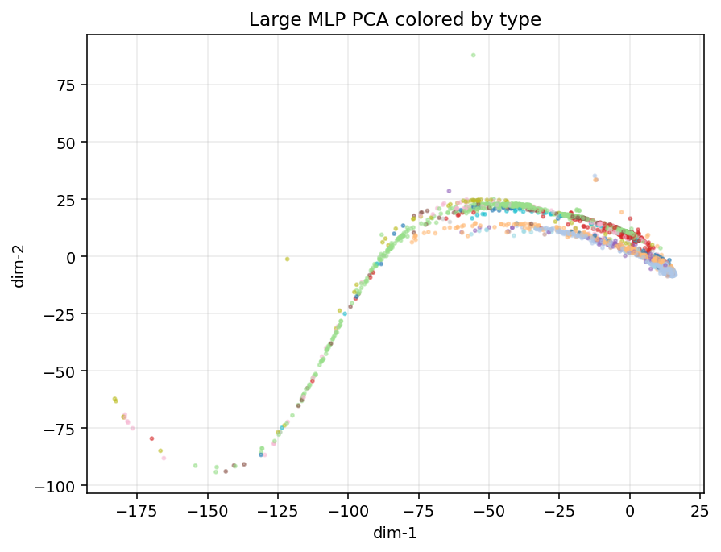

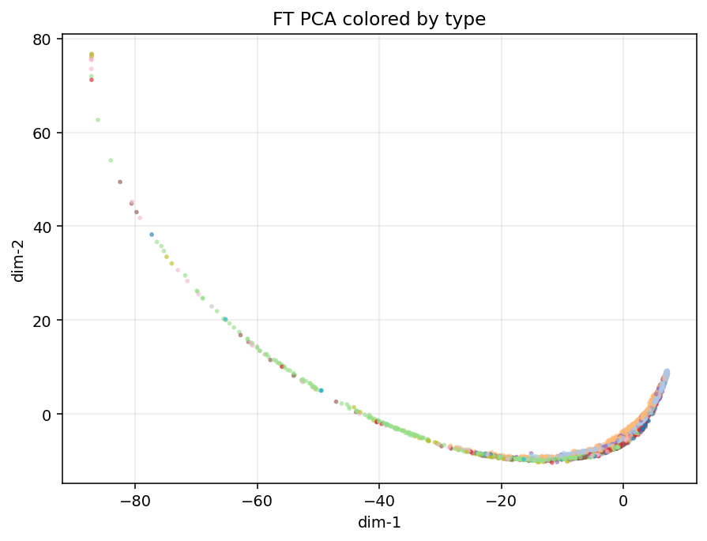

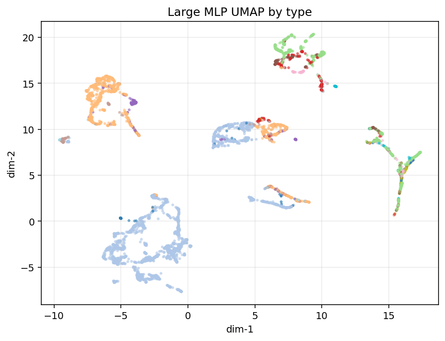

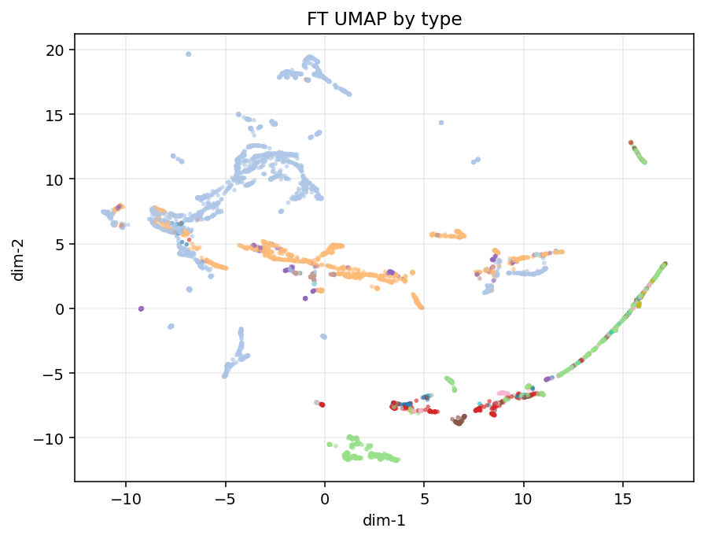

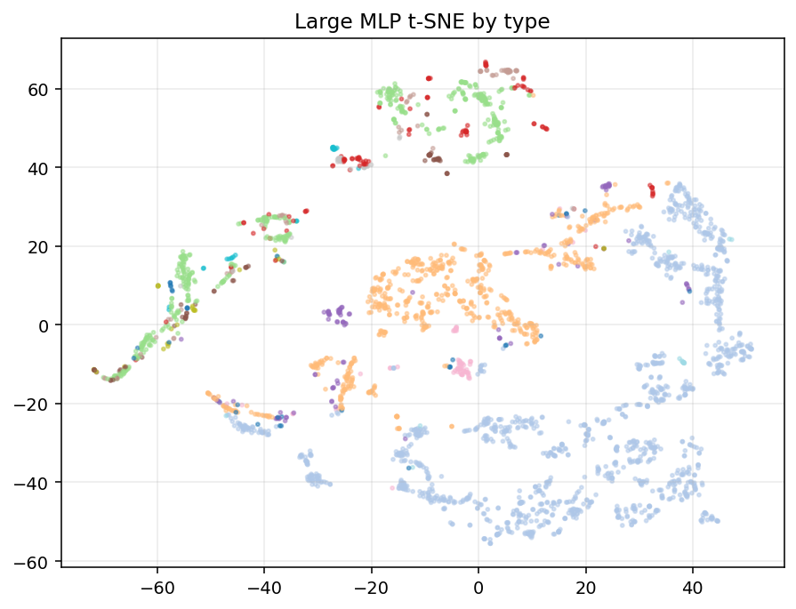

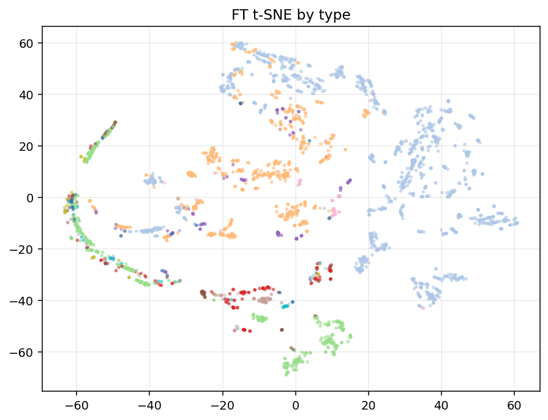

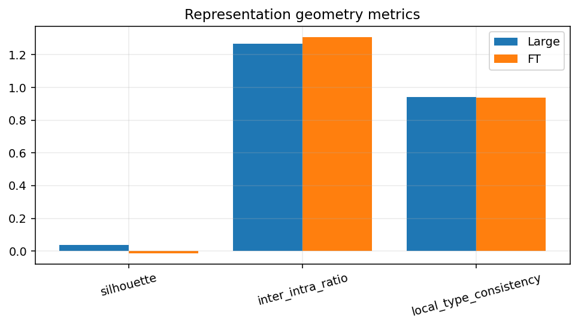

---

## Study B — Error localization

### Types where FT has lower type-RMSE

`B772`, `B38M`, `A333`, `B789`, `B788`, `A321`

### Types where Large has lower type-RMSE

`A21N`, `B738`, `B744`, `A332`, `A20N`, `A320`, `A359`, `A319`, `B77W`

Full tables: `results/distillation/transformer_robustness/error_by_*.csv`

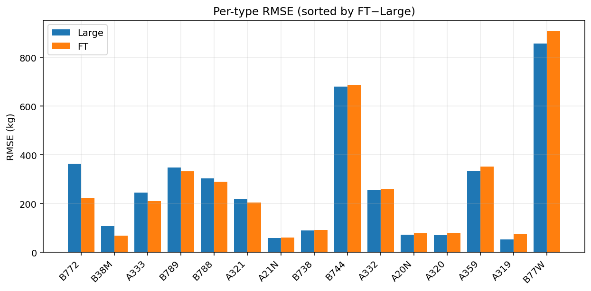

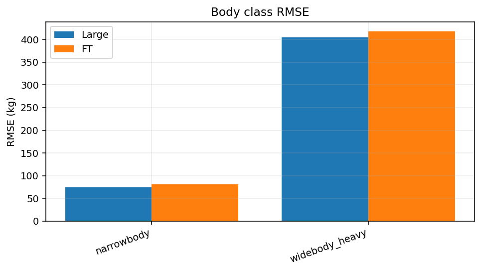

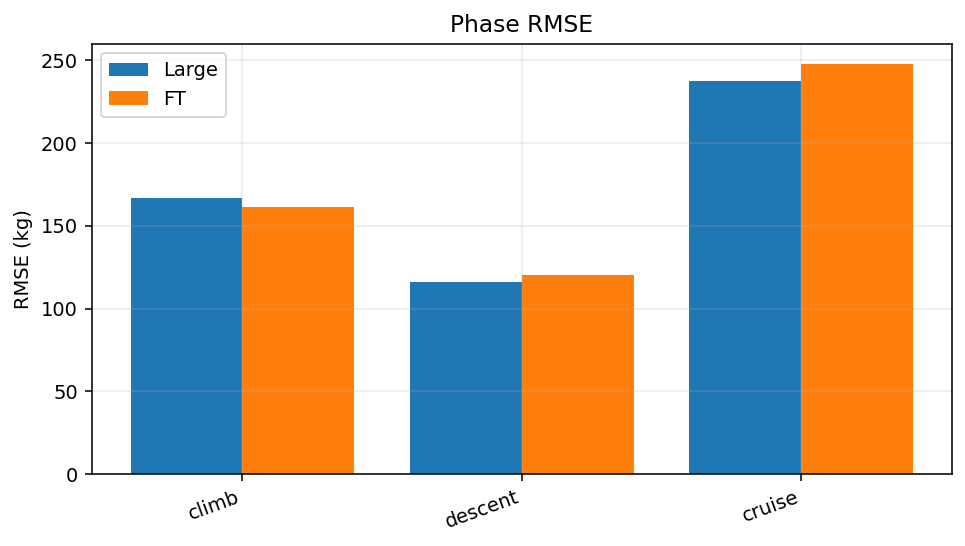

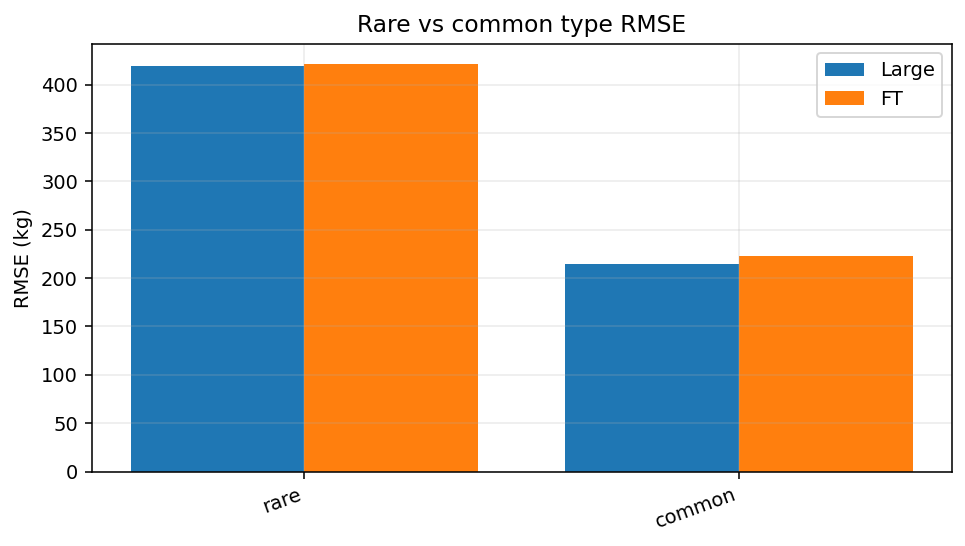

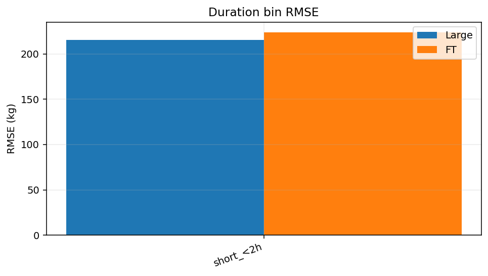

---

## Study C — Feature utilization

Method: mean |grad × input| on numeric features (n≈2500 samples), L1-normalized.

| Stability / agreement | Value |
|----------------------|------:|
| Large half-split Spearman | 0.989 |
| FT half-split Spearman | 0.991 |
| Cross-model Spearman | 0.554 |
| Large physics-like share | 0.642 |
| FT physics-like share | 0.380 |

Top features by |Large−FT| attribution:

| Feature | Large | FT | |diff| |
|---------|------:|---:|------:|
| duration_s | 0.1462 | 0.4055 | 0.2593 |
| r3_tow_kg | 0.0090 | 0.0627 | 0.0537 |
| r3_mass_consumed_kg | 0.0765 | 0.0308 | 0.0457 |
| r3_mass_rate_kgps | 0.0494 | 0.0054 | 0.0441 |
| physics_fuel_kg | 0.0479 | 0.0051 | 0.0428 |
| r3_fuel_fraction | 0.0756 | 0.0338 | 0.0419 |
| end_fraction_of_flight | 0.0073 | 0.0478 | 0.0405 |
| ref_mass_kg | 0.0292 | 0.0033 | 0.0259 |
| r3_tow_mtow_ratio | 0.0314 | 0.0059 | 0.0255 |
| median_altitude | 0.0124 | 0.0373 | 0.0249 |
| r3_mass_std_kg | 0.0769 | 0.0571 | 0.0198 |
| r3_cruise_mass_fuel_ratio | 0.0196 | 0.0009 | 0.0187 |

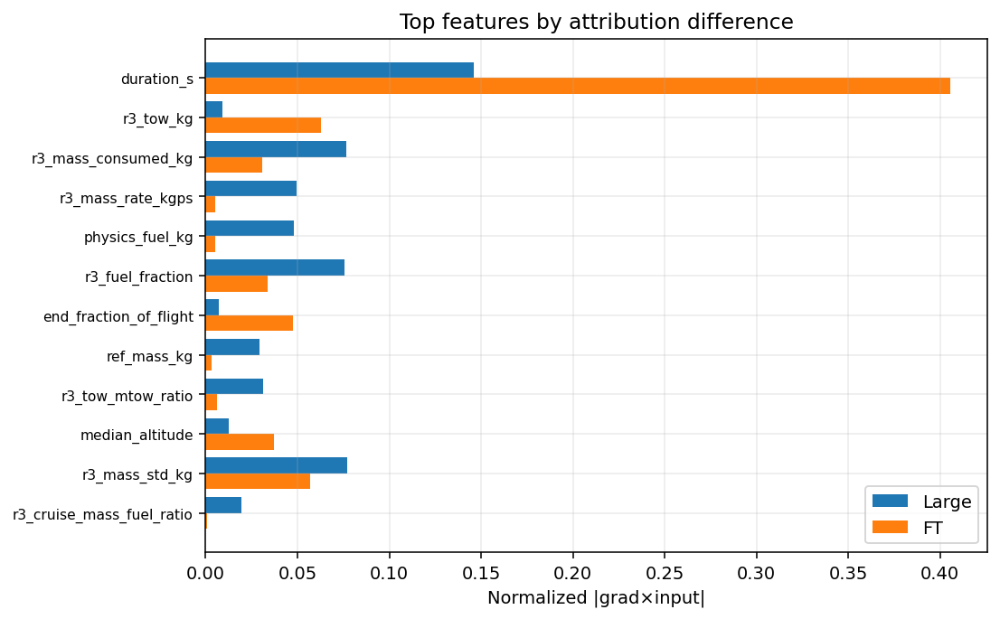

---

## Evidence-supported hypotheses

### H1_type_clustered_ft — **not_supported**

**Claim:** FT embeddings are more type-separated than Large.

**Evidence:** silhouette FT=-0.014 vs Large=0.038

### H2_smoother_geometry — **supported**

**Claim:** FT has higher inter/intra type distance ratio (more separable types).

**Evidence:** inter/intra FT=1.309 Large=1.268

### H3_ft_helps_rare_or_heavy — **supported**

**Claim:** FT reduces error more on rare and/or heavy types than on common/narrow.

**Evidence:** Δ|err| FT-Large rare=-16.55 common=-2.47 heavy=-11.49 narrow=+0.57

### H4_type_macro_from_hard_types — **supported**

**Claim:** FT type-macro gain comes from improving a subset of hard aircraft types.

**Evidence:** types FT better type-RMSE: [np.str_('B772'), np.str_('B38M'), np.str_('A333'), np.str_('B789'), np.str_('B788'), np.str_('A321')]

### H5_feature_use_differs — **supported**

**Claim:** MLP and FT emphasize different numeric features (attribution rank correlation < 0.7).

**Evidence:** Spearman attr Large vs FT=0.554; physics share L=0.642 FT=0.380

---

## Synthesis: why the ranking reverses

Evidence-supported mechanism (measured only):

### 1. Metric definition, not “FT is better everywhere”

- **Final RMSE** weights every interval equally → dominated by high-frequency **narrow-bodies** (A20N, A320, …).
- **Type-macro** weights each aircraft type equally → rare / medium types count as much as A20N.

Large is better on the dominant types (A20N, A320, A319, A21N, B738, …) → wins Flight.  
FT is better on a subset of types (`B772`, `B38M`, `A333`, `B789`, `B788`, `A321`) → can win type-macro even while losing overall RMSE.

### 2. FT gains concentrate on rare / heavy *intervals* (MAE)

| Subset | Mean (\|err\|_FT − \|err\|_Large) |
|--------|--------------------------------:|
| Rare types (train-freq bottom third) | **−16.55 kg** (FT better) |
| Common types | −2.47 kg |
| Widebody heavy | **−11.49 kg** |
| Narrowbody | **+0.57 kg** (Large slightly better) |

So FT’s relative strength is **not** uniform; it is concentrated where entity-level shift hurts most.

**Caveat:** Some hard heavies still favor Large on type-RMSE (`B744`, `B77W`, `A359`). Type-macro win is a **mix** of gains on specific types + equal type weighting, not “FT wins all hard aircraft.”

### 3. Representation geometry is *not* “tighter type clusters”

| Finding | Large | FT |
|---------|------:|---:|
| Type silhouette | **0.038** | −0.014 |
| Rare→common centroid distance | 21.80 | **7.02** |

FT is **less** type-clustered (silhouette), but rare-type embeddings sit **much closer** to common-type centroids. That supports a **shared manifold / transfer** story rather than “FT isolates each type.”

Local 5-NN type consistency is high for both (~0.94); inter/intra ratio is only slightly higher for FT.

### 4. Feature utilization differs

- Cross-model attribution Spearman ≈ **0.55** (shared but not identical emphasis).
- **FT** places far more weight on **`duration_s`** (~0.41 vs ~0.15).
- **Large** places more mass on **physics/mass** features (physics-like share **0.64 vs 0.38**).

Different inductive use of duration vs physics-mass features is consistent with different error patterns by duration/haul and type mix.

### 5. Body-macro does *not* reverse

Body-macro: Large **239.6** vs FT **249.6** — same direction as Flight. Ranking reversal is **type-equal (entity)** specific, not “any shift metric.”

### 6. Same supervision

Both are frozen KD students (α=0.1, β=0.9) on the same data. Ranking differences are **architectural**, not different teachers or α/β.

---

## Open questions & limitations

- Post-hoc type-macro ≠ re-trained leave-one-type-out.
- Grad×input is a local linearization; not causal feature importance.
- Attention maps not fully dissected (FT token attention avg left for follow-up).
- Embedding metrics are sensitive to standardization and class imbalance handling.
- XLarge not re-analyzed (ranking already known from Phase 0).
- No new models trained; mechanisms are descriptive.

---

## Artifacts

`results/distillation/transformer_robustness/`

*Generated 2026-07-31T01:34:50.795633+00:00*
