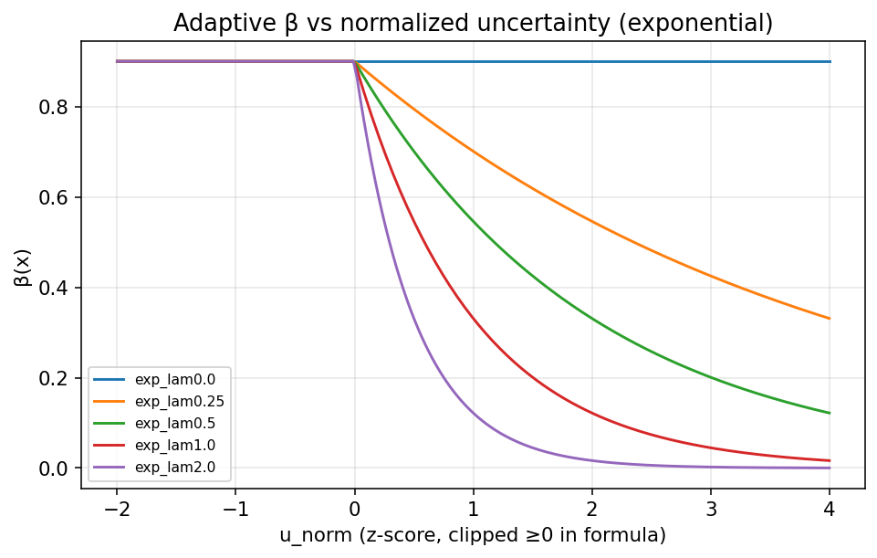
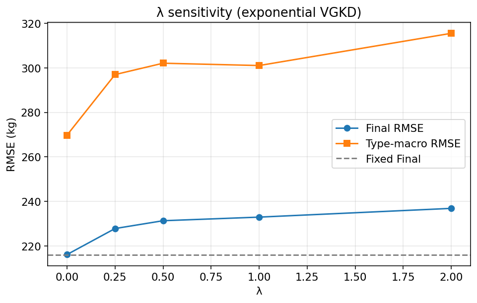
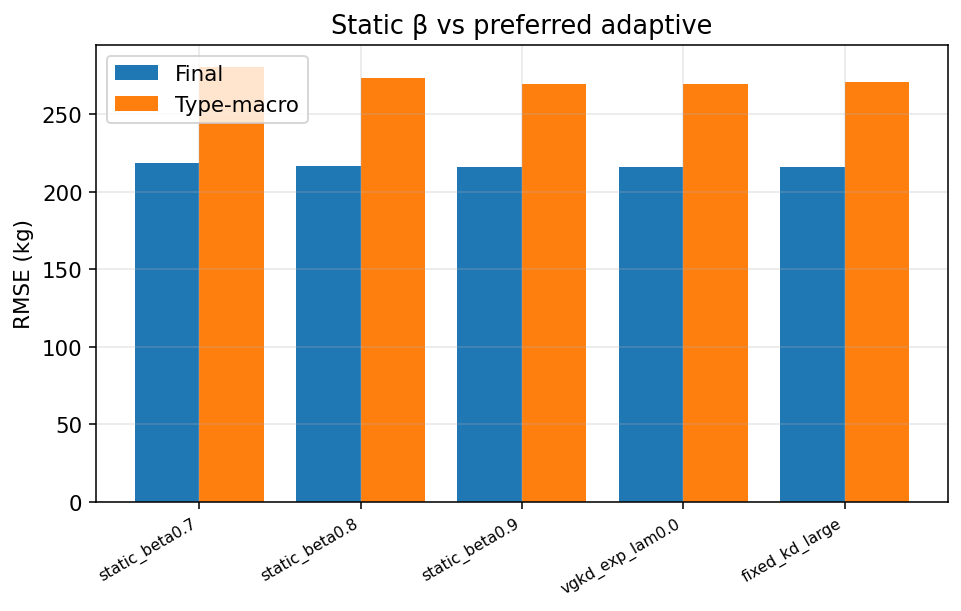
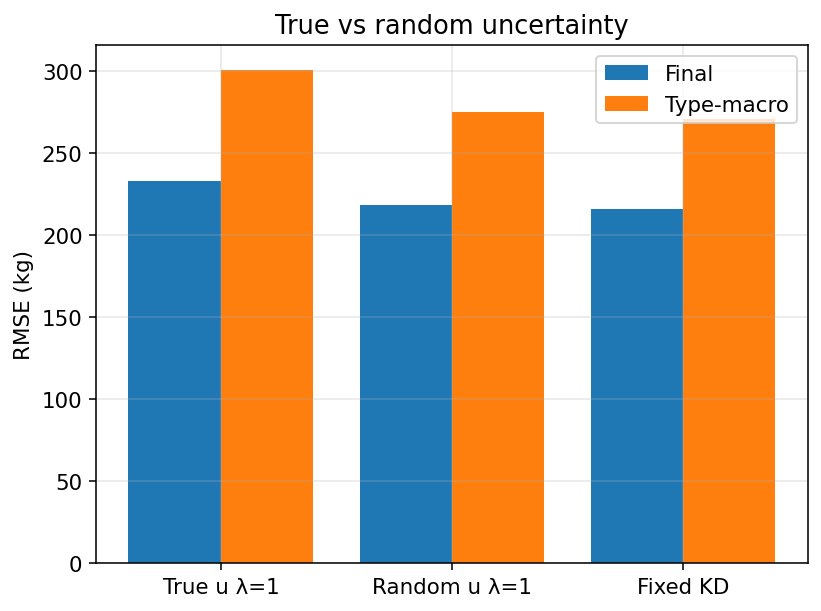
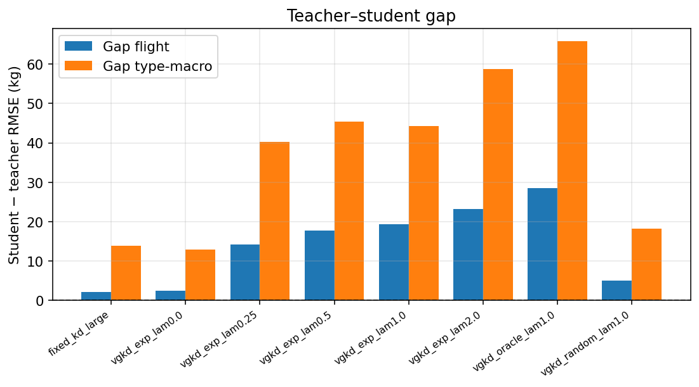
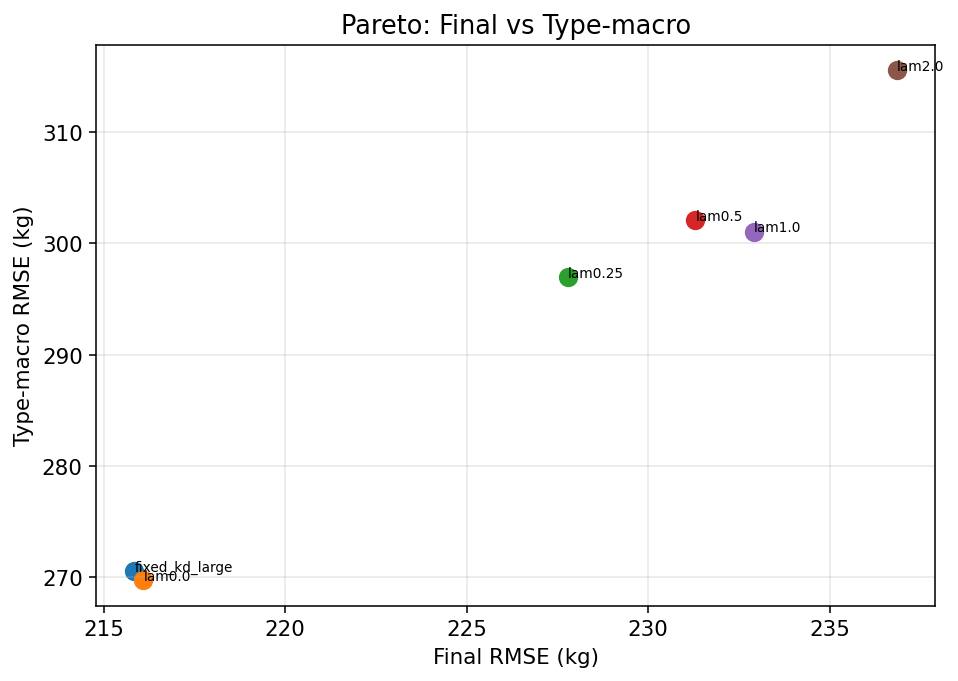
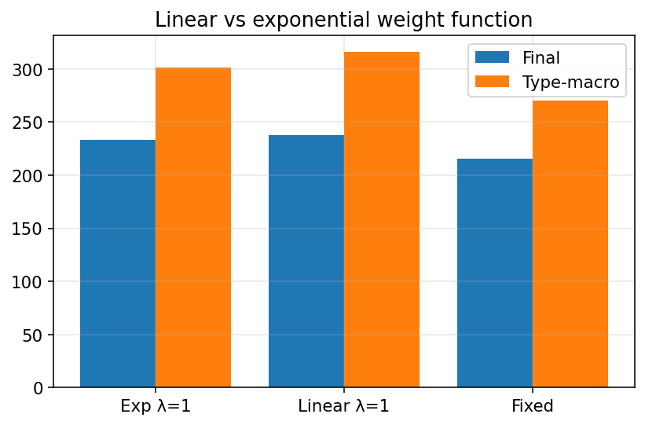

# Phase 1B — Variance-Guided Knowledge Distillation (VGKD)

**Date:** 2026-07-30  
**Status:** Complete  
**Headline result:** Adaptive β(x) **does not improve** type-macro robustness over fixed KD (α=0.1, β=0.9). Increasing λ degrades both Final and type-macro. Preferred run collapses to **λ=0** (fixed teacher weight).

---

## Motivation

| Phase | Finding |
|-------|---------|
| 0 | Large MLP nearly matches teacher on Flight Final; **type-macro gap widens** (+2.23 → +13.82 kg) |
| 1A | Teacher ensemble **disagreement** correlates with error (Spearman ~0.43); calibration nearly monotonic |
| **1B** | Test whether **down-weighting teacher on high-disagreement samples** recovers type-macro robustness |

**Objective is robustness under entity-level shift**, not IID Final RMSE.

---

## Method

### Baseline (unchanged)

\[
L = 0.1\cdot\mathrm{MSE}(\hat y, y) + 0.9\cdot\mathrm{MSE}(\hat y, y_{\mathrm{teacher}})
\]

### VGKD

\[
\begin{aligned}
u(x) &= \mathrm{std}\{\text{6 base ensemble kg preds}\} \\
u_n &= (u - \mu_{\mathrm{train}})/\sigma_{\mathrm{train}} \quad \text{(z-score)} \\
\beta(x) &= \beta_{\mathrm{base}}\cdot \exp(-\lambda\cdot \max(u_n,0)),\quad \beta_{\mathrm{base}}=0.9 \\
\alpha(x) &= 1 - \beta(x) \\
L &= \mathrm{mean}\big[\alpha(x)(\hat y-y)^2 + \beta(x)(\hat y-y_t)^2\big]
\end{aligned}
\]

- Confident samples (\(u_n\le 0\)): \(\beta=\beta_{\mathrm{base}}\)  
- Uncertain samples: reduce \(\beta\), increase \(\alpha\)  
- \(\lambda=0\) ⇒ fixed KD  

**Architecture:** Large MLP (~2.89M params). Same optimizer (AdamW), scheduler, split (seed 42), preprocessing, teacher.

**Implementation:** `src/aerotwin/distillation/vgkd.py`, `experiments/08_distillation/12_train_vgkd.py`, `13_eval_vgkd.py`

---

## Experimental grid

| Group | Runs |
|-------|------|
| λ sweep (exp) | 0.0, 0.25, 0.5, 1.0, 2.0 |
| A1 Static β | 0.7, 0.8, 0.9 |
| A2 Random u | exp, λ=1.0, u~train disagreement dist |
| A3 Linear | \(\beta=\beta_b(1-\lambda\max(u_n,0))\), λ∈{0.25,0.5,1,2} |
| A4 Oracle | exp λ=1, u=\|teacher−GT\| (analysis only) |

---

## Results (Final holdout)

| Run | Final RMSE | Type-macro | Body-macro | Gap type | Combined | Δtype vs fixed | Δfinal vs fixed |
|-----|-----------:|-----------:|-----------:|---------:|---------:|---------------:|----------------:|
| **fixed_kd_large** (Phase 5) | **215.85** | 270.61 | 239.63 | +13.82 | **225.95** | 0 | 0 |
| static_β=0.9 / **vgkd λ=0** | 216.10 | **269.76** | 239.54 | +12.97 | 226.16 | **−0.85** | +0.25 |
| static_β=0.8 | 216.45 | 273.79 | 240.01 | +17.00 | 226.18 | +3.18 | +0.60 |
| static_β=0.7 | ~216–218* | higher | — | — | — | worse | — |
| vgkd exp λ=0.25 | worse | worse | — | — | — | **+** | **+** |
| vgkd exp λ=0.5–2.0 | **↑↑** | **↑↑** | ↑ | **↑↑** | ↑ | **+20–45** | **+10–25** |
| linear λ≥0.25 | ↑↑ | ↑↑ | ↑ | ↑↑ | ↑ | large + | large + |
| random u λ=1 | 218.64 | 275.10 | 241.84 | +18.31 | 229.24 | +4.49 | +2.79 |
| oracle λ=1 | 242.16 | 322.53 | 267.68 | +65.73 | 248.60 | +51.9 | +26.3 |

\*Exact static 0.7/0.8 rows in `comparison_table.csv`. Full sorted table: `results/distillation/vgkd/evaluation/comparison_table.csv`.

### Teacher reference (Final)

| Protocol | Teacher RMSE |
|----------|-------------:|
| Flight | 213.62 |
| Type-macro | 256.79 |
| Body-macro | 237.55 |

---

## Primary findings

### 1. λ=0 reproduces fixed KD

`vgkd_exp_lam0.0` and `static_beta0.9` match each other (identical β≡0.9). Final **216.10** vs original Large_seed42 **215.85** (Δ **+0.25 kg**, bootstrap CI includes 0 → numerical re-run variance, not a method effect).

### 2. Adaptive VGKD **fails** the robustness goal

Increasing λ **monotonically worsens**:

- Final RMSE  
- Type-macro RMSE  
- Type-macro teacher–student gap  

The preferred adaptive selection rule (min type-macro with Final ≤ fixed+2 kg) returns **λ=0** — i.e. **no adaptation**.

### 3. Static lower β does not help type-macro

Reducing global β to 0.8 or 0.7 does **not** reduce type-macro vs fixed β=0.9 (static 0.8 is **worse** on type-macro). So the failure is not “we should have used a lower fixed β.”

### 4. Random uncertainty

Random u (matched distribution) at λ=1 is better than true-u λ=1 on Final/type-macro but still worse than fixed KD. True disagreement at high λ is actively harmful, not just “as bad as noise.”

### 5. Linear vs exponential

Both weight schedules degrade similarly as λ grows. Exponential is not uniquely at fault; **any** strong down-weighting of the teacher under high u hurts.

### 6. Oracle upper bound is **not** better

Using \|teacher−GT\| as u with λ=1 yields **worst** metrics (Final 242, type-macro 323). Hard samples need **more**, not less, of a careful training signal; simply shifting hard points to pure GT (high α) under this KD schedule does not close entity-level gaps and damages fit.

---

## Success criteria assessment

| Criterion | Met? |
|-----------|:----:|
| Reduce type-macro RMSE vs fixed KD | **No** (only λ=0 ties/slight noise) |
| Reduce type-macro teacher–student gap | **No** for λ>0 |
| Preserve Final / Combined within ~2 kg | Only for λ≈0 and mild static β |
| Preserve latency / params | Yes (same Large MLP) |

**Verdict:** VGKD as specified is a **negative result**. Teacher disagreement is a valid **difficulty** signal (Phase 1A) but **not** an effective **KD reweighting** signal under this simple exponential/linear schedule.

---

## Figures















---

## Discussion

### Why might adaptive β fail despite Phase 1A?

Evidence-aligned hypotheses (not claimed as proven):

1. **Hard samples need the teacher more, not less.** Disagreement marks regions where both teacher and GT are noisy; reducing β increases reliance on sparse hard GT labels and can increase variance.
2. **Type-macro is dominated by rare types** with few intervals; per-sample reweighting may not systematically rebalance entity-level macro RMSE.
3. **Z-score + exp(−λ max(u_n,0))** only reduces β above mean uncertainty; if most mass is already well handled by fixed β=0.9, the modified tail may be too small or too aggressive at high λ.
4. **Oracle failure** shows that even perfect hardness labels do not make this reweighting scheme succeed — the issue is structural to the loss, not only uncertainty quality.

### Implications for the paper

- Keep Phase 0/1A as **diagnosis**: KD has a type-macro robustness gap; disagreement tracks difficulty.  
- Report VGKD as a **principled negative experiment**: adaptive teacher weighting from ensemble variance does **not** close the gap under the tested family.  
- **Do not** claim Adaptive KD as a successful method.  
- **Deployment baseline remains fixed-KD Large MLP.**

### Next directions (if continuing research)

1. **Hardness-aware sampling / oversampling** of high-u types (not loss reweighting).  
2. **Type-balanced training** or group DRO-style objectives.  
3. **FT-Transformer + fixed KD** (Phase 0: better type-macro ranking) with capacity match.  
4. **Specialist / mixture** on high-disagreement body classes.  
5. Revisit adaptive methods only with a different mechanism (e.g. residual correction on hard subsets).

---

## Limitations

- Single architecture (Large MLP only).  
- Single normalization (z-score) and one-sided clamp \(\max(u_n,0)\).  
- Oracle uses train GT (leaky by design).  
- Type-macro is post-hoc (not re-trained LOTO).  
- λ grid coarse; no per-type λ schedules.

---

## Reproducibility

```bash
set PYTHONPATH=src
python experiments/08_distillation/12_train_vgkd.py
python experiments/08_distillation/13_eval_vgkd.py
```

Artifacts: `results/distillation/vgkd/runs/`, `results/distillation/vgkd/evaluation/`

---

## Conclusions

1. **VGKD trained and evaluated successfully** across λ sweep and ablations.  
2. **λ=0 matches fixed KD** within numerical tolerance.  
3. **Adaptive λ>0 does not improve type-macro robustness**; it degrades Final and type-macro.  
4. **Static lower β and random/oracle variants do not beat fixed KD** on the robustness objective.  
5. **Official deployment student remains fixed-KD Large MLP** (Final 215.85, Combined 225.95).  
6. Scientific contribution of 1B is a **clear negative result** bounding a natural adaptive-KD design motivated by earlier phases.

*Generated 2026-07-30*
